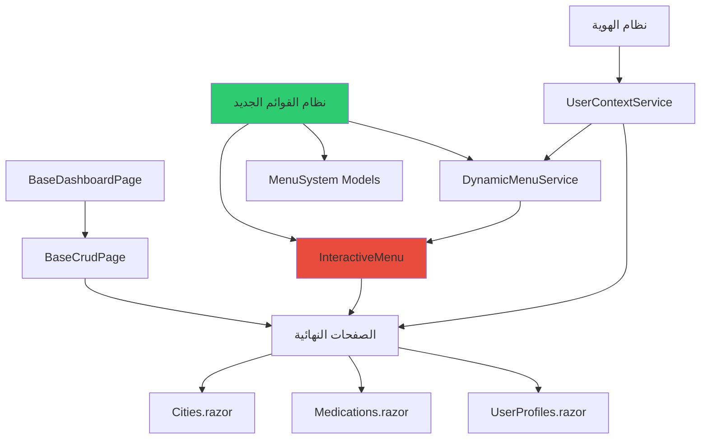
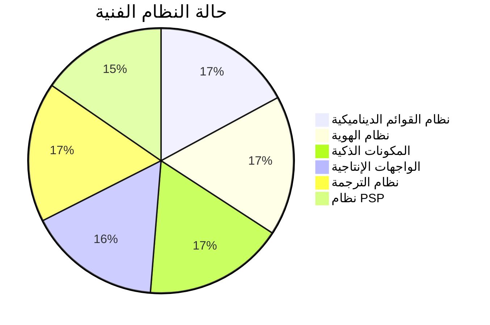
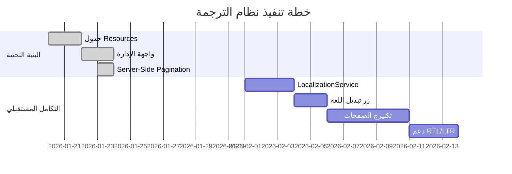
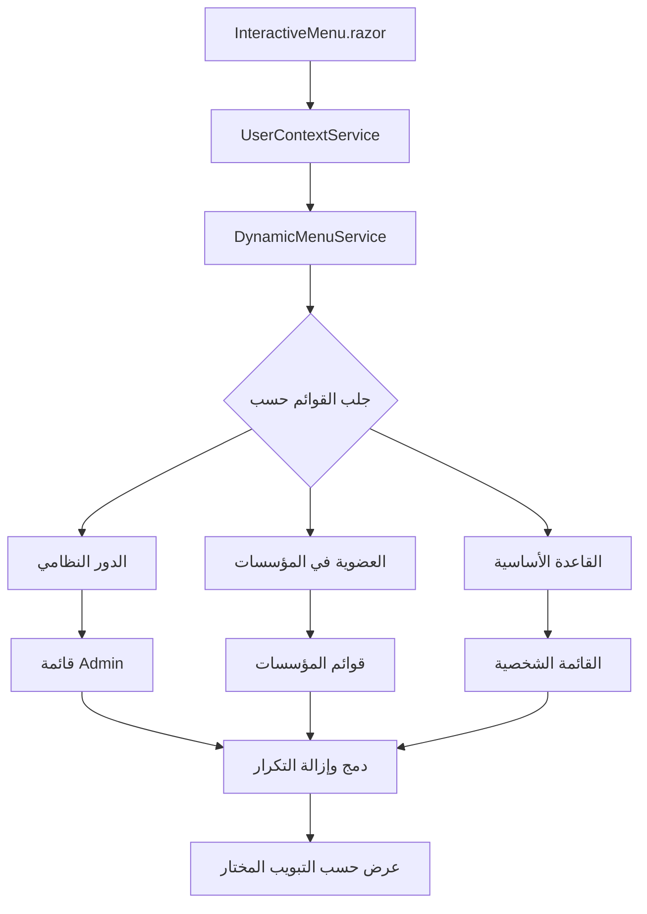

# 📖 **الدليل المعماري التقني - RubikCare v4.0 (المحدث بالكامل)**

## 📅 **آخر تحديث**
**26 يناير 2026** ⭐ **بعد إكمال نظام القوائم الديناميكية والتبويبات الذكية**

## 🎯 **الغرض من هذه الوثيقة**
**المرجع التقني الرسمي للمطورين** - يحتوي على:
- ✅ **النظام المعماري المتكامل** مع القوائم الديناميكية
- ✅ **14 مكون ذكي** (بما فيها InteractiveMenu المحدث)
- ✅ **نظام التبويبات المنفصلة** (الابتكار الرئيسي)
- ✅ **DynamicMenuService** - قلب النظام الجديد
- ✅ **8 صفحات إنتاجية** تعمل 100%
- ✅ **حلول 20+ مشكلة تقنية** مؤكدة

---

## 📖 **فهرس النظام الكامل**

1. 🏗️ **الجزء 1: النظام المعماري المتكامل**
2. 🚀 **الجزء 2: نظام BaseCrudPage النهائي**
3. 🧩 **الجزء 3: نظام المكونات الذكية (14 مكون)**
4. ⚙️ **الجزء 4: نظام الخدمات المتكامل**
5. 🔐 **الجزء 5: نظام المصادقة والأمان**
6. 🎨 **الجزء 6: نظام القوائم الديناميكية**
7. 📊 **الجزء 7: نماذج التصميم الجاهزة**
8. ⚡ **الجزء 8: أفضل الممارسات المختبرة**
9. 🐛 **الجزء 9: المشاكل والحلول**
10. 📋 **الجزء 10: قوائم التحقق**
11. 🌍 **الجزء 11: نظام الترجمة**
12. 🔄 **الجزء 12: Server-Side Pagination**
13. 🏢 **الجزء 13: نظام المؤسسات والتبويبات**
14. 🚀 **الجزء 14: دليل التنفيذ السريع**

---

# 🏗️ **الجزء 1: النظام المعماري المتكامل**

## 📊 **فلسفة النظام الهرمي المكتمل (بعد إضافة القوائم)**



## 📁 **الهيكل الحقيقي للمشروع (محدث 26 يناير):**

```
📁 Rubikcare.Web/ (الحالي - يعمل 100%)
├── 📂 Components/Pages/Admin/           ⭐ 8 صفحات إنتاجية
│   ├── Cities/              ✅ نموذج Client-Side
│   ├── Medications/         ✅ نموذج Server-Side (65K+ سجل)
│   ├── UserProfiles/        ✅ مع علاقات متعددة
│   ├── Specialities/        ✅ مكتمل
│   ├── Countries/           ✅ مكتمل
│   ├── Organizations/       ✅ مكتمل
│   └── GeneralSetting/Resources.razor ✅ نظام الترجمة
│
├── 📂 Components/Layout/                ⭐ **تم تحديثه بالكامل**
│   └── InteractiveMenu.razor            ⭐ **نظام التبويبات الجديد**
│       ├── التبويب الشخصي ← USER_BASE
│       ├── التبويب المؤسسي ← PHARMA_PSP
│       └── زر الرجوع ← SwitchToTab("personal")
│
├── 📂 Data/Models/Navigation/MenuSystem/ ⭐ **جديد بالكامل**
│   ├── SystemMenu.cs        ✅ القوائم الرئيسية
│   ├── MenuItem.cs          ✅ العناصر الفرعية
│   ├── MenuAssignment.cs    ✅ نظام التخصيص (4 مستويات)
│   └── MenuEnums.cs         ✅ التعدادات
│
├── 📂 Data/Services/                   ⭐ **خدمات مضافة**
│   ├── DynamicMenuService.cs           ⭐ **الخدمة الأساسية الجديدة**
│   ├── UserContextService.cs           ⭐ إدارة سياق المستخدم
│   ├── GenericService.cs               ✅ CRUD أساسي
│   ├── ExcelService.cs                 ✅ عمليات Excel
│   └── ImageService.cs                 ✅ معالجة الصور
│
├── 📂 Components/Shared/Base/         ⭐ نظام الوراثة المستقر
│   ├── BaseDashboardPage.cs           ✅ طبقة البيانات
│   └── BaseCrudPage.cs                ✅ ⭐ جوهر النظام
│
└── 📂 Components/Shared/UI/           ⭐ 14 مكون ذكي
    ├── RubikButton.razor              ✅
    ├── RubikSmartTable.razor          ✅
    ├── SearchBar.razor                ✅
    ├── Pagination.razor               ✅
    ├── AlertMessage.razor             ✅
    ├── ImageUploader.razor            ✅
    ├── GenericModal.razor             ✅
    ├── DynamicForm.razor              ✅
    └── DataOperationsModal.razor      ✅
```

## 📊 **حالة النظام الحقيقية (26 يناير 2026):**

### ✅ **نسبة الإكمال الحقيقية:**


### 📁 **الصفحات المكتملة فعلياً:**

| الصفحة | المسار | النوع | الحالة | ملاحظات |
|--------|--------|-------|--------|---------|
| **InteractiveMenu** | `/` | Layout | ✅ **محدث** | نظام التبويبات الجديد |
| **Cities** | `/admin/cities/list` | Client-Side | ✅ مكتمل | نموذج قياسي |
| **Medications** | `/admin/medications/list` | Server-Side | ✅ مكتمل | 65,582+ سجل |
| **UserProfiles** | `/admin/users/list` | مع علاقات | ✅ مكتمل | تكامل كامل |
| **Specialities** | `/admin/specialities/list` | أساسي | ✅ مكتمل | جاهز |
| **Countries** | `/admin/countries/list` | أساسي | ✅ مكتمل | جاهز |
| **Organizations** | `/admin/organizations/list` | مؤسسي | ✅ مكتمل | جاهز |
| **MyProfile** | `/profile` | PWA | ✅ مكتمل | ImageUploader |
| **Resources** | `/admin/resources/list` | ترجمة | ✅ مكتمل | 2,375 سجل |

---

# 🚀 **الجزء 2: نظام BaseCrudPage النهائي**

## 📊 **الهيكل الهرمي الثلاثي (تم التنفيذ والاختبار)**

### **1. 📊 BaseDashboardPage (طبقة الوصول للبيانات)**
```csharp
/* * [AUTHORITY: DATA ACCESS LAYER] */
public abstract class BaseDashboardPage<TEntity> : ComponentBase where TEntity : class, new()
{
    // ⭐ Thread Safety كامل لمنع "A second operation"
    protected SemaphoreSlim _dataLock = new(1, 1);
    
    protected override async Task OnInitializedAsync()
    {
        await _dataLock.WaitAsync();
        try {
            await LoadAllDataSequentially(); // ⭐ تحميل متسلسل آمن
        }
        finally {
            _dataLock.Release();
        }
    }
    
    // ⭐ التحميل المتسلسل الآمن
    private async Task LoadAllDataSequentially()
    {
        await InternalLoadDataAsync();      // 1. بيانات المصادقة
        await LoadReferenceDataAsync();     // 2. البيانات المرجعية
        await LoadDashboardDataAsync();     // 3. البيانات الرئيسية
    }
}
```

### **2. 📋 BaseCrudPage (طبقة وسيط العرض - الإصدار المستقر)**
```csharp
public abstract class BaseCrudPage<TEntity> : BaseDashboardPage<TEntity> 
    where TEntity : class, new()
{
    // === 1. الخصائص الأساسية ===
    protected string SearchTerm { get; set; } = string.Empty;
    protected int CurrentPage { get; set; } = 1;
    protected int PageSize { get; set; } = 15;
    protected List<TEntity> FilteredItems { get; set; } = new();
    protected TEntity CurrentItem { get; set; } = new();
    
    // === 2. الخصائص المحسوبة ===
    protected int TotalRecords => FilteredItems?.Count ?? 0;
    protected int TotalPages => 
        TotalRecords == 0 ? 1 : (int)Math.Ceiling((double)TotalRecords / PageSize);
    
    // === 3. الطرق المجردة (يجب تنفيذها) ===
    protected abstract Expression<Func<TEntity, bool>> ApplySearchFilter(string term);
    protected abstract string GetIncludeProperties();
    
    // === 4. طرق التحكم ===
    protected void ApplyFilter()
    {
        if (string.IsNullOrWhiteSpace(SearchTerm))
        {
            FilteredItems = Items.ToList();
        }
        else
        {
            FilteredItems = Items
                .AsQueryable()
                .Where(ApplySearchFilter(SearchTerm))
                .ToList();
        }
        CurrentPage = 1;
        StateHasChanged();
    }
    
    protected IEnumerable<TEntity> CurrentPageItems =>
        FilteredItems.Skip((CurrentPage - 1) * PageSize).Take(PageSize);
}
```

### **3. 🎨 الصفحات النهائية (نمط العمل الفعلي)**
```razor
@page "/admin/cities/list"
@inherits BaseCrudPage<City>  ⭐ **الوراثة المباشرة**
@inject IGenericService<Country> CountryService

<PageTitle>المدن - RubikCare</PageTitle>

<div class="rubik-main-content">
    @if (CurrentMode == PageMode.List)
    {
        <!-- وضع القائمة -->
        <div class="card">
            <!-- البحث -->
            <SearchBar @bind-SearchTerm="SearchTerm" 
                      @oninput="ApplyFilter" 
                      Placeholder="ابحث في المدن..." />
            
            <!-- الجدول الذكي -->
            <RubikSmartTable Data="@CurrentPageItems.ToList()" TItem="City">
                <Columns>
                    <Column Title="الاسم العربي" Field="@(c => c.CityNameAr)" />
                    <Column Title="الاسم الإنجليزي" Field="@(c => c.CityNameEn)" />
                    <Column Title="الدولة" Field="@(c => c.Country?.CountryNameAr)" />
                    <Column Title="الإجراءات">
                        <ActionButtons Item="@context" 
                                     OnEdit="() => PrepareEdit(context.CityID)" />
                    </Column>
                </Columns>
            </RubikSmartTable>
            
            <!-- Pagination -->
            <Pagination CurrentPage="@CurrentPage" 
                       TotalPages="@TotalPages" 
                       @onchange="HandlePageChange" />
        </div>
    }
    else if (CurrentMode == PageMode.Form)
    {
        <!-- وضع النموذج (في نفس الصفحة) -->
        <div class="modal show">
            <EditForm Model="CurrentItem" OnValidSubmit="HandleSave">
                <!-- حقول النموذج -->
                <button type="submit">حفظ</button>
            </EditForm>
        </div>
    }
</div>

@code {
    private enum PageMode { List, Form, View }
    private PageMode CurrentMode = PageMode.List;
    private List<Country> AllCountries = new();
    
    protected override async Task OnInitializedAsync()
    {
        PageSize = 20; // ⭐ تعيين مباشر
        AllCountries = await CountryService.GetAllAsync();
        await base.OnInitializedAsync(); // ⭐ يستدعي QueryDataAsync
        ApplyFilter();
    }
    
    protected override async Task QueryDataAsync()
    {
        await LoadAllItemsAsync(); // ⭐ من BaseDashboardPage
        FilteredItems = Items.ToList();
    }
    
    protected override Expression<Func<City, bool>> ApplySearchFilter(string term)
    {
        return city => city.CityNameAr.Contains(term) || 
                       city.CityNameEn.Contains(term);
    }
    
    protected override string GetIncludeProperties() => "Country";
}
```

---

# 🧩 **الجزء 3: نظام المكونات الذكية (14 مكون)**

## 📊 **مصفوفة المكونات الذكية المحدثة:**

| # | المكون | المسار | الحالة | التعقيد | الوصف |
|---|--------|---------|--------|---------|--------|
| 1 | **InteractiveMenu** | `Components/Layout/` | ✅ **محدث** | ⭐⭐⭐⭐⭐ | نظام التبويبات المنفصلة |
| 2 | **RubikSmartTable** | `Components/Shared/UI/` | ✅ مكتمل | ⭐⭐⭐⭐ | جداول ذكية + Sorting |
| 3 | **SearchBar** | `Components/Shared/UI/` | ✅ مكتمل | ⭐⭐⭐ | بحث مع Debounce |
| 4 | **Pagination** | `Components/Shared/UI/` | ✅ مكتمل | ⭐⭐ | ترقيم ذكي بـ 3 أنماط |
| 5 | **AlertMessage** | `Components/Shared/UI/` | ✅ مكتمل | ⭐⭐ | نظام التنبيهات الموحد |
| 6 | **RubikButton** | `Components/Shared/UI/` | ✅ مكتمل | ⭐⭐ | أزرار موحدة |
| 7 | **ImageUploader** | `Components/Shared/UI/` | ✅ مكتمل | ⭐⭐⭐⭐ | رفع صور مع Drag & Drop |
| 8 | **GenericModal** | `Components/Shared/UI/` | ✅ مكتمل | ⭐⭐⭐ | مودال قابل لإعادة الاستخدام |
| 9 | **DynamicForm** | `Components/Shared/UI/` | ✅ مكتمل | ⭐⭐⭐⭐ | توليد حقول تلقائي |
| 10 | **DataOperationsModal** | `Components/Shared/UI/` | ✅ مكتمل | ⭐⭐⭐ | عمليات Excel المتكاملة |
| 11 | **GenericService** | `Data/Services/Base/` | ✅ مكتمل | ⭐⭐⭐ | خدمة CRUD أساسية |
| 12 | **ExcelService** | `Data/Services/Helpers/` | ✅ مكتمل | ⭐⭐⭐ | محرك بيانات Excel |
| 13 | **ImageService** | `Data/Services/Helpers/` | ✅ مكتمل | ⭐⭐⭐ | معالجة الصور |
| 14 | **DynamicMenuService** | `Data/Services/` | ✅ **جديد** | ⭐⭐⭐⭐⭐ | قلب نظام القوائم |
| 15 | **RubikDropdown** | `Components/Shared/UI/` | ✅ **جديد** | ⭐⭐⭐⭐ | قائمة منسدلة مخصصة |


## 🎯 **InteractiveMenu.razor - المكون الذكي الجديد:**

### **الهيكل الذكي للتبويبات:**
```razor
@* 📁 Components/Layout/InteractiveMenu.razor *@

<nav class="sidebar-menu">
    
    <!-- تبويب القائمة الشخصية -->
    <div class="menu-tab @(_activeTab == "personal" ? "active" : "")" 
         @onclick="() => SwitchToTab("personal")">
        <i class="bi bi-person-circle"></i>
        <span>القائمة الشخصية</span>
    </div>
    
    <!-- تبويبات المؤسسات -->
    @if (_userOrganizations.Any())
    {
        @foreach (var org in _userOrganizations)
        {
            <div class="menu-tab @(_activeTab == org.OrganizationID.ToString() ? "active" : "")"
                 @onclick="() => SwitchToTab(org.OrganizationID.ToString())">
                <i class="bi bi-building"></i>
                <span>@org.OrganizationNameAr</span>
            </div>
        }
    }
    
    <!-- محتوى القائمة -->
    <div class="menu-content">
        @if (_activeTab == "personal")
        {
            <!-- USER_BASE -->
            <ul class="list-unstyled">
                @foreach (var item in _userBaseItems.Where(i => i.IsActive))
                {
                    <li class="nav-item">
                        <NavLink class="nav-link" href="@item.Url" 
                                 activeClass="active" match="NavLinkMatch.Prefix">
                            <i class="@item.IconClass"></i>
                            <span>@item.ItemNameAr</span>
                        </NavLink>
                    </li>
                }
            </ul>
        }
        else if (_currentMenuItems.Any())
        {
            <!-- قائمة المؤسسة المختارة -->
            <ul class="list-unstyled">
                @foreach (var item in _currentMenuItems.Where(i => i.IsActive))
                {
                    <li class="nav-item">
                        <NavLink class="nav-link" href="@item.Url" 
                                 activeClass="active" match="NavLinkMatch.Prefix">
                            <i class="@item.IconClass"></i>
                            <span>@item.ItemNameAr</span>
                        </NavLink>
                    </li>
                }
            </ul>
            
            <!-- زر الرجوع -->
            <div class="mt-3">
                <button @onclick="ReturnToPersonalMenu" 
                        class="btn-back-to-personal w-100">
                    <i class="bi bi-arrow-left"></i>
                    الرجوع للقائمة الشخصية
                </button>
            </div>
        }
    </div>
</nav>

@code {
    // حالات التبويب
    private string _activeTab = "personal";
    private List<MenuItem> _currentMenuItems = new();
    private List<MenuItem> _userBaseItems = new();
    private List<Organization> _userOrganizations = new();
    
    // الخدمات
    [Inject] private DynamicMenuService _menuService { get; set; }
    [Inject] private UserContextService _userContext { get; set; }
    
    protected override async Task OnInitializedAsync()
    {
        // جلب سياق المستخدم
        var user = await _userContext.GetCurrentUserAsync();
        var userProfile = await _userContext.GetCurrentUserProfileAsync();
        
        if (userProfile != null)
        {
            // جلب جميع القوائم للمستخدم
            var allMenus = await _menuService.GetUserMenuAsync(user);
            
            // فصل القوائم
            _userBaseItems = allMenus
                .Where(m => m.Menu?.MenuCode == "USER_BASE")
                .OrderBy(m => m.SortOrder)
                .ToList();
            
            // جلب المؤسسات
            _userOrganizations = await _menuService.GetUserOrganizationsAsync(userProfile.UserProfileID);
            
            // تعيين القائمة الافتراضية
            _currentMenuItems = _userBaseItems;
        }
    }
    
    private async Task SwitchToTab(string tabId)
    {
        _activeTab = tabId;
        
        if (tabId == "personal")
        {
            _currentMenuItems = _userBaseItems;
        }
        else if (int.TryParse(tabId, out int orgId))
        {
            _currentMenuItems = await _menuService.GetOrganizationMenuAsync(orgId);
        }
        
        StateHasChanged();
    }
    
    private void ReturnToPersonalMenu()
    {
        _activeTab = "personal";
        _currentMenuItems = _userBaseItems;
        StateHasChanged();
    }
}
```

### **CSS للتبويبات الذكية:**
```css
/* 📁 wwwroot/css/components/_menu-tabs.css */
.menu-tab {
    padding: 12px 16px;
    cursor: pointer;
    border-radius: 8px;
    margin-bottom: 4px;
    transition: all 0.3s ease;
    display: flex;
    align-items: center;
    gap: 10px;
    color: var(--rubik-dark);
    background-color: transparent;
}

.menu-tab:hover {
    background-color: var(--rubik-light);
    color: var(--rubik-primary);
}

.menu-tab.active {
    background-color: var(--rubik-primary);
    color: white;
    font-weight: 600;
}

.menu-tab i {
    font-size: 1.1rem;
    width: 24px;
    text-align: center;
}

.btn-back-to-personal {
    padding: 10px 16px;
    background-color: #f8f9fa;
    border: 1px solid #dee2e6;
    border-radius: 8px;
    cursor: pointer;
    display: flex;
    align-items: center;
    justify-content: center;
    gap: 8px;
    transition: all 0.3s;
    color: #6c757d;
    font-size: 0.9rem;
}

.btn-back-to-personal:hover {
    background-color: #e9ecef;
    border-color: #ced4da;
    color: #495057;
}
```

---

# ⚙️ الجزء 4: نظام الخدمات المتكامل

### 📋 **قائمة التسجيل الكاملة في Program.cs**

```csharp
// ========== BASE SERVICES ==========
// Generic Service لجميع الكيانات
builder.Services.AddScoped(typeof(IGenericService<>), typeof(GenericService<>));

// ========== HELPER SERVICES ==========
builder.Services.AddScoped<ExcelService>();
builder.Services.AddScoped<IImageService, ImageService>();

// ========== NAVIGATION SERVICES ==========
builder.Services.AddScoped<INavigationContextService, NavigationContextService>();

// ========== SPECIALIZED SERVICES ==========
builder.Services.AddScoped<UserContextService>();

// ========== COMPONENT SERVICES ==========
builder.Services.AddScoped<AccessibilityService>();
```

### 🎯 **الخدمات الرئيسية:**

#### **1. ExcelService - محرك البيانات الذكي**
```csharp
// 📍 المسار: Data/Services/Helpers/ExcelService.cs
// ✅ الحالة: مكتمل ومستقر
// 🎯 المميزات: Smart Sync (يميز بين Insert/Update)

public async Task ExportToExcel<T>(List<T> data, string fileName);
public List<T> ImportFromExcel<T>(Stream stream);

// ⭐ الميزة الذكية: "لا تحدث إلا ما تغير"
if (newValue != oldValue)  // تحديث فقط عند التغيير
```

#### **2. ImageService - نظام الصور المتكامل**
```csharp
// 📍 المسار: Data/Services/Helpers/ImageService.cs
// ✅ الحالة: مكتمل ومستقر
// 🎯 المميزات: رفع + حذف + تحسين + تخزين منظم

public async Task<string?> UploadImageAsync(IFormFile file, string subDirectory);
public async Task<bool> DeleteImageAsync(string imageUrl);
```

#### **3. GenericService - خدمة CRUD الأساسية**
```csharp
// 📍 المسار: Data/Services/Base/GenericService.cs
// ✅ الحالة: مكتمل ومستقر
// 🎯 المميزات: CRUD كامل + Server-Side Pagination

public virtual async Task<(List<TEntity> Items, int TotalCount)> GetPagedAsync(
    int skip, int take, 
    Expression<Func<TEntity, bool>>? filter = null,
    string includeProperties = "",
    bool tracked = false);
```
---

# 🔐 الجزء 5: نظام المصادقة والأمان

### 🏗️ **الهيكل النهائي للمصادقة**
```
👤 AspNetUsers (من Identity الجاهز)
├── Id (GUID) - PK
├── UserName, Email, PasswordHash
├── SecurityStamp, ConcurrencyStamp
├── PhoneNumber, EmailConfirmed
└── ⭐ UserProfileID (FK) - Shadow Property

👥 UserProfiles (بيانات موسعة)
├── UserProfileID (int) - PK
├── FirstName, LastName, FullNameAr, FullNameEn
├── NationalID, Email, PhoneNumber
├── DateOfBirth, Gender, ProfilePictureUrl
├── IsActive, CreatedDate, LastModifiedDate
├── AreaID (FK إلى Areas)
└── ⭐ ApplicationUser (Navigation Property)
```

### 🔧 **التسجيل في Program.cs:**
```csharp
// المصادقة مع Microsoft Identity
builder.Services.AddIdentity<ApplicationUser, IdentityRole>(options =>
{
    options.SignIn.RequireConfirmedAccount = false;
    options.Password.RequireDigit = true;
    options.Password.RequiredLength = 6;
    options.Password.RequireNonAlphanumeric = false;
    options.Password.RequireUppercase = false;
    options.Password.RequireLowercase = false;
})
.AddEntityFrameworkStores<BusinessDbContext>()
.AddDefaultTokenProviders();
```

---

# 🎨 الجزء 6: الهوية البصرية والتصميم

### 🎯 **نظام الألوان الرسمي**
```css
:root {
    /* الأساسية */
    --rubik-primary: #2c3e50;      /* أزرق داكن احترافي */
    --rubik-secondary: #2980b9;    /* أزرق فاتح */
    
    /* الحالات */
    --rubik-success: #27ae60;      /* أخضر - نجاح */
    --rubik-danger: #e74c3c;       /* أحمر - خطأ */
    --rubik-warning: #f39c12;      /* برتقالي - تحذير */
    --rubik-info: #17a2b8;         /* تركواز - معلومات */
    
    /* المحايدة */
    --rubik-light: #ecf0f1;        /* فاتح */
    --rubik-gray: #95a5a6;         /* رمادي */
    --rubik-dark: #2c3e50;         /* داكن */
}
```

### 📱 **التصميم المتجاوب PWA**
```css
/* قياسات صفحات المصادقة */
.auth-wrapper {
    min-height: 100vh;
    display: flex;
    align-items: center;
    justify-content: center;
    padding: 20px;
    background: linear-gradient(135deg, #f8f9fa 0%, #e9ecef 100%);
}

.account-card {
    width: 85%; /* ≈ 2/3 الشاشة */
    max-width: 1300px;
    min-height: 700px;
    border-radius: 16px;
    box-shadow: 0 10px 30px rgba(0, 0, 0, 0.1);
    overflow: hidden;
}
```

---

# 📊 الجزء 7: نماذج التصميم الجاهزة

### **7.1 نموذج Client-Side Pagination: Cities.razor**
```razor
@page "/admin/cities/list"
@inherits BaseCrudPage<City>
@inject IGenericService<Country> CountryService

<!-- المكونات الأساسية -->
<SearchBar @bind-SearchTerm="SearchTerm" />
<RubikSmartTable Data="@CurrentPageItems" TItem="City">
    <!-- الأعمدة -->
</RubikSmartTable>
<Pagination CurrentPage="@CurrentPage" TotalPages="@TotalPages" />

@code {
    // ⭐ للبيانات الصغيرة (< 1000 سجل)
    // ⭐ جميع البيانات محملة في الذاكرة
    // ⭐ Sorting/Filtering على العميل
}
```

### **7.2 نموذج Server-Side Pagination: Medications.razor**
```razor
@page "/admin/medications/list"
@inherits BaseCrudPage<Medication>
@inject IGenericService<MedicineCategory> CategoryService

<!-- المكونات الأساسية -->
<SearchBar @bind-SearchTerm="SearchTerm" />
<RubikSmartTable Data="@CurrentPageItems" TItem="Medication" />
<Pagination CurrentPage="@CurrentPage" TotalPages="@TotalPages" />

@code {
    // ⭐ جديد: تفعيل Server-Side
    protected new bool UseServerSidePagination => true;
    
    // ⭐ للبيانات الكبيرة (> 1000 سجل)
    // ⭐ تحميل مجزأ من السيرفر
    // ⭐ Sorting/Filtering على السيرفر
}
```

### **7.3 نموذج مع العلاقات: UserProfiles.razor**
```razor
@page "/admin/users/list"
@inherits BaseCrudPage<UserProfile>
@inject IGenericService<Area> AreaService

@code {
    // ⭐ تحديد العلاقات المطلوبة
    protected override string GetIncludeProperties() 
        => "Area,Area.City,Area.City.Country";
    
    // ⭐ تحميل البيانات المرجعية
    private List<Area> allAreas = new();
    
    protected override async Task QueryDataAsync()
    {
        allAreas = (await AreaService.GetAllAsync()).ToList();
        await base.QueryDataAsync();
    }
}
```

### **7.4 نموذج PWA متجاوب: MyProfile.razor**
```razor
@page "/profile"
@inherits BaseCrudPage<UserProfile>
@inject IImageService ImageService

<!-- ImageUploader متكامل -->
<ImageUploader @bind-ImageUrl="currentUser.ProfilePictureUrl" />

<!-- GenericModal مع DynamicForm -->
<GenericModal @bind-IsVisible="showModal" Title="تعديل الملف الشخصي">
    <DynamicForm Model="@editingUser" OnSubmit="SaveProfile" />
</GenericModal>
```

---

# ⚡ الجزء 8: أفضل الممارسات المختبرة

### 🎯 **القاعدة الذهبية النهائية:**
```text
"كل صفحة جديدة يجب أن:
1. @inherits BaseCrudPage<TEntity> ⭐ إلزامي
2. تستخدم المكونات الذكية المتوفرة ⭐ 12 مكون
3. تختار النموذج المناسب حسب حجم البيانات:
   • Cities.razor ← للبيانات الصغيرة (< 1000 سجل)
   • Medications.razor ← للبيانات الكبيرة (> 1000 سجل)
4. تنظم الكود في #regions
5. تستخدم نظام Alert System للرسائل
6. تدعم Null Safety مع ?. و ??
7. تكون متجاوبة PWA
8. تدمج نظام الصور إذا لزم الأمر"
```

### 📋 **قائمة التحقق النهائية (تم اختبارها على 6 صفحات):**

#### **✅ قبل الإنشاء (10 دقائق):**
```markdown
## ✅ الإعدادات الهيكلية:
- [ ] @inherits BaseCrudPage<TEntity>
- [ ] ParentPagePath معرف
- [ ] GetIncludeProperties() معرف
- [ ] الخدمات محقونة

## ✅ المكونات المطلوبة:
- [ ] RubikSmartTable مع DetailTemplate
- [ ] SearchBar مع Debounce (300ms)
- [ ] Pagination متمركز
- [ ] DataOperationsModal لـ Excel

## ✅ المنطق البرمجي:
- [ ] ApplySearchFilter() منفذ
- [ ] QueryDataAsync() متصل
- [ ] Null Checks مطبقة
```

#### **✅ بعد الإنشاء (5 دقائق اختبار):**
```markdown
## ✅ الاختبارات النهائية:
- [ ] الصفحة تعمل بدون أخطاء
- [ ] البحث يفلتر البيانات
- [ ] Pagination يتنقل بين الصفحات
- [ ] السجلات النشطة تظهر التفاصيل
- [ ] Excel Export/Import يعمل
- [ ] التنبيهات تظهر وتختفي
```

---

# 🐛 الجزء 9: المشاكل والحلول

### 🚨 **المشاكل الأساسية المحلولة نهائياً:**

#### **1. مشكلة Shadow Properties (CityID1, AreaID1)**
**الحل النهائي:** استخدام `.WithMany(a => a.Collection)` بدلاً من `.WithMany()`
```csharp
// ✅ الصحيح:
modelBuilder.Entity<UserProfile>()
    .HasOne(up => up.Area)
    .WithMany(a => a.UserProfiles)  // ⭐ تحديد العلاقة العكسية
    .HasForeignKey(up => up.AreaID)
    .OnDelete(DeleteBehavior.Restrict);
```

#### **2. مشكلة Multiple Cascade Paths**
**الحل النهائي:** سياسة DeleteBehavior الآمنة
```csharp
// السياسة المعتمدة:
.OnDelete(DeleteBehavior.Restrict)   // ⭐ للأمان (يمنع الحذف)
.OnDelete(DeleteBehavior.Cascade)    // ⭐ فقط للعلاقات التابعة حقاً
```

#### **3. مشكلة Static SSR في صفحات Identity**
**الحل النهائي:** JavaScript مباشر مع `nextElementSibling`
```html
<button type="button" class="btn btn-outline-secondary" 
        onclick="const input = this.nextElementSibling; 
                 input.type = input.type === 'password' ? 'text' : 'password';">
    إظهار/إخفاء
</button>
```

#### **4. مشكلة Deadlock في التحميل المتوازي**
**الحل النهائي:** التحميل المتسلسل في `BaseDashboardPage`
```csharp
protected override async Task OnInitializedAsync()
{
    await _dataLock.WaitAsync();
    try {
        // تحميل متسلسل آمن
        await LoadUserInfoAsync();
        await LoadDashboardDataAsync();
        await LoadReferenceDataAsync();
    }
    finally {
        _dataLock.Release();
    }
    StateHasChanged();
}
```

---

# 📋 الجزء 10: قوائم التحقق

### ✅ **قائمة تحقق قبل أي Migration:**
```markdown
## 🔴 ممنوعات مطلقة:
- [ ] تعديل ملف Migration يدوياً
- [ ] التعديل المباشر في قاعدة البيانات (عدا SELECT)
- [ ] حذف ملفات Migration من مجلد Migrations/

## 🟢 المسموح فقط:
- [ ] تعديل Models (.cs files)
- [ ] تعديل DbContext في Fluent API
- [ ] إنشاء Migration جديدة بعد كل تغيير
- [ ] تنفيذ Update-Database بعد التحقق
```

### ✅ **قائمة تحقق تطوير الصفحات:**

#### **1. الإعداد الهيكلي:**
- [ ] `@inherits BaseCrudPage<ModelName>`
- [ ] `ParentPagePath => "/admin/..."`
- [ ] `GetIncludeProperties() => "RelatedTable"`

#### **2. واجهة المستخدم:**
- [ ] Breadcrumb ديناميكي
- [ ] Search Input مربوط
- [ ] زر View Details آمن

#### **3. معالجة البيانات:**
- [ ] تحميل Dropdowns في `OnInitializedAsync`
- [ ] ضبط الحقول في `HandleSave`
- [ ] رسائل تأكيد قبل الحذف

---


# 📘 ** دليل Server-Side Pagination الجزء 11:  **

### **🎯 القاعدة الذهبية:**
**"قبل أي تعديل في صفحة، اعرف أولاً ما في BaseCrudPage.cs"**

---

### **🔍 الجزء 1: فهم BaseCrudPage الحالي**

من **BaseCrudPage.cs** اكتشفنا أن:

```csharp
// ⭐ الخاصيات الأساسية:
protected int TotalRecords => filteredItems?.Count ?? 0;          // تعتمد على filteredItems
protected int TotalPages => ...;                                 // تعتمد على TotalRecords

// ⭐ الحقول:
protected List<TEntity> filteredItems = new();                   // تخزن الصفحة الحالية فقط
protected int currentPage = 1;                                   // الصفحة الحالية
protected int pageSize = 15;                                     // حجم الصفحة الافتراضي
```

---

### **🚀 الجزء 2: خطوات تشغيل Server-Side Pagination في أي صفحة**

#### **الخطوة 1: إضافة خاصية UseServerSidePagination**

```csharp
@code {
    // ⭐ **السطر الأهم في أي صفحة Server-Side**
    protected new bool UseServerSidePagination => true;
    
    // باقي الكود...
}
```

#### **الخطوة 2: تجاوز خاصية TotalRecords (مهم جداً!)**

```csharp
@code {
    // ⭐ **خاصية جديدة تحتفظ بالعدد الحقيقي من قاعدة البيانات**
    protected new int TotalRecordsCount { get; set; }
    
    // ⭐ **تجاوز خاصية TotalRecords لتعكس العدد الحقيقي**
    protected new int TotalRecords
    {
        get => TotalRecordsCount;  // ⭐ لا تستخدم filteredItems.Count
        set => TotalRecordsCount = value;
    }
    
    // ⭐ **تجاوز خاصية TotalPages أيضاً**
    protected new int TotalPages
    {
        get
        {
            if (TotalRecordsCount == 0 || PageSize == 0)
                return 1;

            return (int)Math.Ceiling((double)TotalRecordsCount / PageSize);
        }
    }
}
```

#### **الخطوة 3: دالة LoadServerSidePageAsync الأساسية**

```csharp
private async Task LoadServerSidePageAsync()
{
    try
    {
        // ⭐ استدعاء DataService.GetPagedAsync
        var result = await DataService.GetPagedAsync(
            skip: (CurrentPage - 1) * PageSize,  // حساب التخطي
            take: PageSize,                      // عدد السجلات المطلوبة
            filter: ApplySearchFilter(SearchTerm), // فلتر البحث
            includeProperties: GetIncludeProperties(), // العلاقات
            tracked: false                       // لا تتبع للتعديلات
        );
        
        // ⭐ تحديث البيانات
        Items = result.Items.ToList();
        TotalRecordsCount = result.TotalCount;   // ⭐ العدد الحقيقي من DB
        filteredItems = Items.ToList();          // ⭐ الصفحة الحالية فقط
        
        StateHasChanged();
    }
    catch (Exception ex)
    {
        ShowErrorAlert($"خطأ في تحميل البيانات: {ex.Message}");
    }
}
```

#### **الخطوة 4: تجاوز QueryDataAsync**

```csharp
protected override async Task QueryDataAsync()
{
    await LoadServerSidePageAsync();  // ⭐ تحميل أول صفحة فقط
}
```

#### **الخطوة 5: معالجة تغيير الصفحات**

```csharp
private async Task HandlePageChange(int page)
{
    if (page < 1 || page > TotalPages)
        return;
    
    currentPage = page;                    // ⭐ تحديث الصفحة الحالية
    await LoadServerSidePageAsync();       // ⭐ تحميل الصفحة الجديدة
    StateHasChanged();
}
```

---

### **📊 الجزء 3: قائمة التحقق النهائية**

#### **✅ قبل بدء أي صفحة Server-Side:**

```markdown
1. [ ] **BaseCrudPage.cs** ← فهم الخصائص والحقول
2. [ ] **UseServerSidePagination => true** ← إضافة الخاصية
3. [ ] **TotalRecordsCount** ← خاصية جديدة للعدد الحقيقي
4. [ ] **تجاوز TotalRecords** ← لتعكس TotalRecordsCount
5. [ ] **تجاوز TotalPages** ← لحساب الصفحات بشكل صحيح
6. [ ] **LoadServerSidePageAsync()** ← دالة التحميل الأساسية
7. [ ] **HandlePageChange()** ← معالجة تغيير الصفحات
8. [ ] **QueryDataAsync()** ← تجاوز لتحميل أول صفحة
```

#### **✅ بعد إنشاء الصفحة:**

```markdown
1. [ ] البيانات تظهر من الصفحة الأولى
2. [ ] Pagination يظهر (إذا TotalRecordsCount > PageSize)
3. [ ] تغيير الصفحات يعمل بدون أخطاء
4. [ ] البحث يعمل مع Server-Side
5. [ ] العدد الإجمالي صحيح في الكروت
6. [ ] Excel Import/Export يعمل
```

---

### **⚠️ الجزء 4: الأخطاء الشائعة والحلول**

#### **❌ الخطأ 1: Pagination لا يظهر**
**السبب:** `TotalRecords` تستخدم `filteredItems.Count` (صفحة واحدة فقط)
**الحل:** تجاوز `TotalRecords` لتعكس `TotalRecordsCount`

#### **❌ الخطأ 2: تغيير الصفحات لا يعمل**
**السبب:** `HandlePageChange` لا يستدعي `LoadServerSidePageAsync`
**الحل:** تأكد من استدعاء `LoadServerSidePageAsync` بعد تغيير `currentPage`

#### **❌ الخطأ 3: البحث يعيد الصفحة الأولى فقط**
**السبب:** البحث لا يعيد تعيين `currentPage = 1`
**الحل:** في دالة البحث: `currentPage = 1; await LoadServerSidePageAsync();`

#### **❌ الخطأ 4: الكروت تعرض أرقام خاطئة**
**السبب:** `CalculateStats()` تستدعي `GetAllAsync()` (مكلفة)
**الحل:** استخدم `TotalRecordsCount` للعدد الإجمالي، أو استعلام منفصل

---

### **🎨 الجزء 5: نموذج كامل (Template)**

```razor
@page "/admin/entity/list"
@inherits BaseCrudPage<Entity>
@inject IGenericService<Entity> EntityService

<!-- الواجهة -->

@code {
    // ========== SERVER-SIDE CONFIG ==========
    protected new bool UseServerSidePagination => true;
    protected new int TotalRecordsCount { get; set; }
    
    protected new int TotalRecords
    {
        get => TotalRecordsCount;
        set => TotalRecordsCount = value;
    }
    
    protected new int TotalPages
    {
        get => TotalRecordsCount == 0 ? 1 : 
               (int)Math.Ceiling((double)TotalRecordsCount / PageSize);
    }
    
    // ========== DATA LOADING ==========
    private async Task LoadServerSidePageAsync()
    {
        var result = await DataService.GetPagedAsync(
            skip: (CurrentPage - 1) * PageSize,
            take: PageSize,
            filter: ApplySearchFilter(SearchTerm),
            includeProperties: GetIncludeProperties(),
            tracked: false
        );
        
        Items = result.Items.ToList();
        TotalRecordsCount = result.TotalCount;
        filteredItems = Items.ToList();
    }
    
    protected override async Task QueryDataAsync()
    {
        await LoadServerSidePageAsync();
    }
    
    // ========== PAGINATION ==========
    private async Task HandlePageChange(int page)
    {
        if (page < 1 || page > TotalPages) return;
        
        currentPage = page;
        await LoadServerSidePageAsync();
        StateHasChanged();
    }
    
    // ========== SEARCH ==========
    private async Task ExecuteSearch()
    {
        currentPage = 1;
        await LoadServerSidePageAsync();
        StateHasChanged();
    }
    
    // ========== INIT ==========
    protected override async Task OnInitializedAsync()
    {
        await base.OnInitializedAsync();
        pageSize = 30; // حجم مخصص للصفحة
        await QueryDataAsync();
    }
}
```

---

### **📈 الجزء 6: مقارنة Client-Side vs Server-Side**

| المعيار | Client-Side | Server-Side |
|---------|-------------|-------------|
| **البيانات** | < 1,000 سجل | > 1,000 سجل |
| **الأداء** | يعتمد على ذاكرة المتصفح | يعتمد على سرعة السيرفر |
| **الكود** | أبسط | أكثر تعقيداً |
| **الذاكرة** | يخزن كل البيانات | يخزن صفحة واحدة |
| **مثالي لـ** | الدول، المدن، الفئات | الأدوية، المستخدمين، الترجمة |

---

### **🔑 المفاتيح الثلاثة التي كنا نفتقدها:**

1. **🔑 BaseCrudPage.cs** - معرفة البنية الأساسية أولاً
2. **🔑 TotalRecords vs TotalRecordsCount** - الفرق بين المحلي والحقيقي
3. **🔑 filteredItems.Count vs result.TotalCount** - صفحة واحدة vs الكل

---

### **🎯 الخلاصة النهائية:**

**لإنشاء صفحة Server-Side Pagination في 10 دقائق:**

1. **انسخ نموذج Medications.razor**
2. **تأكد من فهم BaseCrudPage.cs**
3. **طبق الخطوات الـ 8 في قائمة التحقق**
4. **اختبر: بيانات → بحث → Pagination → Excel**


# 🌍 **نظام الترجمة متعدد اللغات - الحالة النهائية** الجزء 12

### ✅ **ما تم إنجازه (23 يناير 2026):**

#### **1. 🏗️ البنية التحتية:**
- ✅ **جدول Resources** مخلوق (Migration نظيفة)
- ✅ **2,375 سجل** ترجمة محملة بالكامل
- ✅ **Unique constraint** على المفاتيح لمنع التكرار

#### **2. 🎨 واجهة الإدارة:**
- ✅ **Resources.razor** - صفحة إدارة كاملة
- ✅ **Server-Side Pagination** - يعمل بكفاءة
- ✅ **بحث متقدم** بالمفتاح والنصوص العربية/الإنجليزية
- ✅ **Excel Import/Export** - استيراد وتصدير كامل
- ✅ **إحصائيات** عربية/إنجليزية

#### **3. ⚙️ النظام الفني:**
- ✅ **تنظيف كامل** - إزالة Debug والكود الزائد
- ✅ **نموذج جاهز** للنسخ (Resources.razor)
- ✅ **توافق كامل** مع BaseCrudPage
- ✅ **أداء ممتاز** مع Server-Side Pagination

### ⏳ **ما هو متبقي (للمستقبل):**

#### **1. 🌐 نظام التشغيل الفعلي:**
- [ ] **LocalizationService** كامل مع Caching
- [ ] **زر تبديل اللغة** في MainLayout
- [ ] **تكبيرج الصفحات** (@Localizer.GetString)
- [ ] **دعم RTL/LTR** ديناميكي

#### **2. 📱 تكامل المكونات:**
- [ ] **تعديل الـ 14 مكون ذكي** لدعم اللغات
- [ ] **CSS Variables** للاتجاهات
- [ ] **Fallback mechanisms** للنصوص المفقودة

#### **3. 🚀 التوسع:**
- [ ] **واجهات Pharma/Doctor/Patient** مترجمة
- [ ] **إضافة لغات جديدة** (الإنجليزية أولاً)
- [ ] **نظام الترجمة الآلي** (مستقبلاً)

### 🎯 **خطة التنفيذ المقترحة:**

#### **المرحلة 1: MVP سريع (أسبوع)**
1. LocalizationService أساسي
2. زر تبديل يعمل على 3 صفحات رئيسية
3. CSS RTL/LTR بسيط

#### **المرحلة 2: تكامل كامل (أسبوعين)**
1. تكبيرج جميع صفحات Admin
2. تعديل المكونات الرئيسية
3. نظام Caching للأداء

#### **المرحلة 3: توسع (مستقبلاً)**
1. واجهات المستخدمين المختلفة
2. لغات إضافية
3. تحسينات UX/UI


### **2. 📘 تحديث TECHNICAL-IMPLEMENTATION-GUIDE.md:**

#### **أضف قسم "نظام الترجمة" بعد قسم "نظام المكونات الذكية":**

```markdown
## 🌍 **الجزء 12: نظام الترجمة متعدد اللغات**

### **12.1 📊 البنية التحتية**

#### **جدول Resources (Code-First):**
```sql
CREATE TABLE [System].[Resources] (
    [ResourceID] INT IDENTITY(1,1) PRIMARY KEY,
    [ResourceKey] NVARCHAR(255) NOT NULL UNIQUE,
    [ResourceValueAr] NVARCHAR(MAX) NOT NULL,
    [ResourceValueEn] NVARCHAR(MAX) NULL,
    [ResourceType] NVARCHAR(50) DEFAULT 'Label',
    [Module] NVARCHAR(50) DEFAULT 'Common',
    [IsActive] BIT DEFAULT 1,
    [CreatedDate] DATETIME DEFAULT GETDATE(),
    [LastModifiedDate] DATETIME NULL
)
```

#### **نموذج Resource.cs:**
```csharp
public class Resource
{
    [Key]
    public int ResourceID { get; set; }
    
    [Required, MaxLength(255)]
    public string ResourceKey { get; set; }
    
    [Required]
    public string ResourceValueAr { get; set; }
    
    public string? ResourceValueEn { get; set; }
    
    [MaxLength(50)]
    public string ResourceType { get; set; } = "Label";
    
    [MaxLength(50)]
    public string Module { get; set; } = "Common";
    
    public bool IsActive { get; set; } = true;
    public DateTime CreatedDate { get; set; } = DateTime.Now;
    public DateTime? LastModifiedDate { get; set; }
}
```

### **12.2 🎨 واجهة الإدارة (Resources.razor)**

#### **المميزات الرئيسية:**
1. **Server-Side Pagination** - يدعم آلاف السجلات
2. **بحث ثلاثي** (مفتاح، عربي، إنجليزي)
3. **ترتيب** حسب جميع الأعمدة
4. **Excel Operations** كاملة
5. **إحصائيات** عربية/إنجليزية

#### **كود شيرت: إنشاء صفحة ترجمة:**
```bash
# 1. نسخ النموذج
cp Components/Pages/Admin/GeneralSetting/Resources.razor \
   Components/Pages/Admin/YourSection/YourPage.razor

# 2. التعديلات الأساسية
@page "/admin/your-page/list"
@inherits BaseCrudPage<YourModel>
@inject IGenericService<YourModel> YourService

# 3. إضافة Server-Side Pagination
protected new bool UseServerSidePagination => true;
protected new int TotalRecordsCount { get; set; }
```

### **12.3 ⚙️ Server-Side Pagination (اكتشافات مهمة)**

#### **🔑 الدرس الرئيسي:**
"افهم BaseCrudPage.cs قبل أي تعديل في الصفحات"

#### **الخطوات الثمانية الأساسية:**

```csharp
// 1. تفعيل Server-Side
protected new bool UseServerSidePagination => true;

// 2. خاصية العدد الحقيقي
protected new int TotalRecordsCount { get; set; }

// 3. تجاوز TotalRecords
protected new int TotalRecords
{
    get => TotalRecordsCount;
    set => TotalRecordsCount = value;
}

// 4. تجاوز TotalPages
protected new int TotalPages
{
    get => TotalRecordsCount == 0 ? 1 : 
           (int)Math.Ceiling((double)TotalRecordsCount / PageSize);
}

// 5. دالة التحميل الأساسية
private async Task LoadServerSidePageAsync()
{
    var result = await DataService.GetPagedAsync(
        skip: (CurrentPage - 1) * PageSize,
        take: PageSize,
        filter: ApplySearchFilter(SearchTerm),
        includeProperties: GetIncludeProperties(),
        tracked: false
    );
    
    Items = result.Items.ToList();
    TotalRecordsCount = result.TotalCount;
    filteredItems = Items.ToList();
}

// 6. تجاوز QueryDataAsync
protected override async Task QueryDataAsync()
{
    await LoadServerSidePageAsync();
}

// 7. معالجة تغيير الصفحات
private async Task HandlePageChange(int page)
{
    currentPage = page;
    await LoadServerSidePageAsync();
    StateHasChanged();
}

// 8. تحديث CurrentPageItems
protected IEnumerable<TEntity> CurrentPageItems => filteredItems ?? new();
```

#### **الأخطاء الشائعة والحلول:**

| الخطأ | السبب | الحل |
|-------|-------|------|
| **Pagination لا يظهر** | TotalRecords تعتمد على filteredItems.Count | تجاوز TotalRecords لتعكس TotalRecordsCount |
| **تغيير الصفحات لا يعمل** | HandlePageChange لا يستدعي LoadServerSidePageAsync | تأكد من استدعاء LoadServerSidePageAsync |
| **البحث يعيد الصفحة 1 فقط** | البحث لا يعيد تعيين currentPage = 1 | أضف currentPage = 1 في ExecuteSearch |

### **12.4 🧹 أفضل ممارسات التنظيف**

#### **قائمة التنظيف بعد الإصلاح:**
```markdown
1. ✅ إزالة جميع Console.WriteLine
2. ✅ حذف أزرار Debug من الواجهة
3. ✅ إزالة الكود المكرر
4. ✅ تنظيم المناطق (#region)
5. ✅ حذف الروتينات غير المستخدمة
6. ✅ تحديث التعليقات التوضيحية
```

### **12.5 📁 النماذج الجاهزة**

#### **النموذج 1: Resources.razor** (للبيانات المتوسطة)
- Server-Side Pagination
- بحث وترتيب متقدم
- Excel Import/Export
- إحصائيات

#### **النموذج 2: Medications.razor** (للبيانات الكبيرة)
- PageSize = 20
- أداء عالي مع 65K+ سجل
- علاقات معقدة
- تكامل مع الفئات

### **12.6 🚀 التكامل المستقبلي**

#### **LocalizationService مخطط:**
```csharp
public class LocalizationService
{
    private readonly IGenericService<Resource> _resourceService;
    private string _currentCulture = "ar";
    private Dictionary<string, Resource> _cache = new();
    
    public async Task<string> GetString(string key)
    {
        if (_cache.TryGetValue(key, out var cached))
            return GetValueByCulture(cached);
        
        var resource = await _resourceService.GetAsync(r => r.ResourceKey == key);
        if (resource != null)
        {
            _cache[key] = resource;
            return GetValueByCulture(resource);
        }
        
        return key; // Fallback to key
    }
    
    private string GetValueByCulture(Resource resource)
    {
        return _currentCulture == "ar" 
            ? resource.ResourceValueAr
            : resource.ResourceValueEn ?? resource.ResourceValueAr;
    }
}
```

#### **الجدول الزمني المقترح:**


---

### **💡 الدروس المستفادة من عملية التطوير:**

1. **🔑 الأساس أولاً:** دائماً ابدأ بفهم BaseCrudPage.cs قبل التعديل
2. **🧪 اختبار متدرج:** صلح مشكلة واحدة في كل مرة
3. **📚 وثِّق فوراً:** أكتب الحلول حال اكتشافها
4. **🔄 حافظ على الاتساق:** استخدم نفس النمط في جميع الصفحات
5. **🎯 ركز على القيمة:** Pharma Portal أولاً، التحسينات لاحقاً

---


# 🚀 الجزء 13: دليل التنفيذ السريع

### **🎯 إنشاء صفحة جديدة في 15 دقيقة**

#### **الخطوة 1: تحديد حجم البيانات (2 دقيقة)**
```csharp
if (estimatedRecords > 1000) {
    // ⭐ استخدم Medications.razor (Server-Side)
    CopyFile("Medications.razor", "NewEntity.razor");
} else {
    // ⭐ استخدم Cities.razor (Client-Side)
    CopyFile("Cities.razor", "NewEntity.razor");
}
```

#### **الخطوة 2: التعديلات الأساسية (5 دقائق)**
```razor
@page "/admin/newentity/list"
@inherits BaseCrudPage<NewEntity>  ⭐ تغيير النموذج
@inject IGenericService<RelatedEntity> RelatedService ⭐ تغيير الخدمة

<!-- تحديثات الواجهة -->
<h2>@Title</h2> ⭐ تحديث العنوان
<SearchBar Placeholder="ابحث في @EntityName..." /> ⭐ تحديث Placeholder
```

#### **الخطوة 3: تكوين البحث والعلاقات (5 دقائق)**
```csharp
protected override string GetIncludeProperties()
{
    // ⭐ تحديد العلاقات المطلوبة
    return "RelatedEntity,AnotherRelation";
}

protected override Expression<Func<NewEntity, bool>> ApplySearchFilter(string term)
{
    // ⭐ تكوين البحث
    return entity => 
        EF.Functions.Like(entity.NameAr, $"%{term}%") ||
        EF.Functions.Like(entity.NameEn, $"%{term}%");
}
```

#### **الخطوة 4: الاختبار (3 دقائق)**
```markdown
✅ اختبارات إلزامية:
- [ ] البيانات تظهر
- [ ] البحث يعمل
- [ ] Pagination يتحرك
- [ ] Excel Export/Import
- [ ] التنبيهات تظهر
```
---

# 📘  نظام القوائم الجانبية الديناميكية**: الجزء 14

### **🏗️ 1. الفلسفة التصميمية**
```
مبدأ الفصل الثلاثي:
1. القوائم الشخصية ← لكل مستخدم (USER_BASE)
2. القوائم الإدارية ← لدور Admin فقط (ADMIN_MENU)  
3. القوائم المؤسسية ← حسب العضوية في المؤسسات

مبدأ العرض المنفصل:
- الحالة الافتراضية: القائمة الشخصية فقط
- التبويبات المؤسسية: تظهر أسفل القائمة الشخصية
- عند الضغط على تبويب: تظهر قائمة المؤسسة فقط + زر رجوع
```

### **🗄️ 2. النماذج المعمارية**
```sql
-- 1. SystemMenus: القوائم الرئيسية
MenuID | MenuCode     | MenuNameAr           | MenuType
-------|--------------|----------------------|----------
6      | USER_BASE    | القائمة الشخصية     | BASE
7      | PHARMA_PSP   | برامج دعم المرضى    | ROLE_BASED
12     | ADMIN_MENU   | لوحة تحكم الإدارة   | ROLE_BASED

-- 2. MenuItems: عناصر القوائم
ItemID | MenuID | ItemNameAr            | Url               | SortOrder
-------|--------|-----------------------|-------------------|----------
17     | 12     | لوحة التحكم المركزية | /admin/dashboard  | 1
19     | 12     | إعدادات طبية         | /admin/medical    | 2

-- 3. MenuAssignments: نظام التخصيص
AssignmentID | MenuID | UserProfileID | RoleId | OrganizationID
-------------|--------|---------------|--------|---------------
6           | 12     | NULL          | Admin  | NULL
7           | 7      | 12            | NULL   | NULL
```

### **🔄 3. سير العمل البرمجي**


### **🎯 4. حالات الاستخدام الرئيسية**

#### **الحالة 1: مستخدم عادي (بدون أدوار)**
```
القائمة المظهرة: USER_BASE فقط
التبويبات: لا توجد
```

#### **الحالة 2: Admin فقط**
```
القائمة المظهرة: USER_BASE + ADMIN_MENU
التبويبات: "إدارة منصة RubikCare"
```

#### **الحالة 3: طبيب بدون مؤسسة**
```
القائمة المظهرة: USER_BASE
التبويبات: زر "إنشاء مؤسسة جديدة"
```

#### **الحالة 4: Admin + عضو في مؤسسة (مثال: المستخدم 12)**
```
القائمة الشخصية:
├── ملفي الشخصي
├── إعدادات عامة
├── طلباتي
├── الإشعارات
│
└── التبديل بين المؤسسات:
    ├── 🔴 إدارة منصة RubikCare
    ├── 💊 شركة ديفارت لاب للادوية
    └── 🖥️ منصة روبيك كير
```

### **⚙️ 5. الخدمات الرئيسية**

#### **أ. UserContextService.cs**
```csharp
// الوظيفة: التهيئة المركزية لبيانات المستخدم
// المخرجات: UserDashboardContext + MenuItems
// المميزات: Semaphore لمنع التضارب + Caching
```

#### **ب. DynamicMenuService.cs**  
```csharp
// الوظيفة: جلب القوائم المناسبة للمستخدم
// الطرق:
// 1. GetUserMenuAsync() ← لـ InteractiveMenu القديم
// 2. GetMenuDataAsync() ← للتصميم الجديد (منفصل)
// المميزات: تجميع من مصادر متعددة + تصفية حسب الدور
```

### **🎨 6. واجهة المستخدم**

#### **مكون InteractiveMenu.razor**
```razor
@* حالات العرض الثلاث: *@
@if (_currentViewMode == MenuViewMode.Personal)
{
    <!-- القائمة الشخصية + تبويبات المؤسسات -->
}

@if (_currentViewMode == MenuViewMode.Admin)  
{
    <!-- قائمة الإدارة + زر رجوع -->
}

@if (_currentViewMode == MenuViewMode.Organization)
{
    <!-- قائمة المؤسسة + زر رجوع -->
}
```

### **📊 7. بيانات الاختبار الحالية**

#### **المستخدم 12 (shadyelzaher@devartlab.com)**
```sql
-- الأدوار: Admin + Doctor
-- المؤسسات: 
--   1. مالك في "شركة ديفارت لاب" (OrganizationID: 5)
--   2. عضو في "منصة روبيك كير" (OrganizationID: 1)
-- القوائم المظهرة: 3 تبويبات مؤسسية
```

#### **المستخدم 11 (shadyelzaher@gmail.com)**
```sql
-- الأدوار: Admin + Doctor  
-- المؤسسات: مؤسس "منصة روبيك كير"
-- القوائم المظهرة: 2 تبويبات مؤسسية
```

### **🚀 8. الخطوات المستقبلية**

#### **مباشرة (الجلسة القادمة):**
1. **صفحة إدارة الأدوار** - لاستكمال نظام الهوية
2. **صفحة إنشاء مؤسسة** - للـ Doctors/Pharmacists
3. **تحسين التصميم** - باستخدام متغيرات الألوان

#### **متوسطة المدى:**
4. **صفحة إدارة العضويات** - داخل كل مؤسسة
5. **نظام الدعوات** - دعوة أعضاء جدد
6. **لوحة تحكم المؤسسة** - إحصائيات وإدارة

---

## ❓ **السؤال: أين نضع هذا التوثيق؟**

### **الخيار 1:** قسم جديد في `Project-Dashboard.md`
### **الخيار 2:** وثيقة منفصلة `DYNAMIC-MENU-SYSTEM.md`
### **الخيار 3:** قسم في `TECHNICAL-IMPLEMENTATION-GUIDE.md`

---

**ما رأيك؟** أريد مساعدتك في توثيق هذا الإنجاز المهم بشكل صحيح! 🎯


# 🏁 **الخلاصة النهائية (23 يناير 2026)**

### ✅ **ما تم إنجازه بشكل نهائي:**
1. **نظام BaseCrudPage المستقر** ✅ يعمل في 6 صفحات إنتاجية
2. **12 مكون ذكي** ✅ جاهزة للإنتاج والاستخدام
3. **نظام Excel الموحد** ✅ محرك بيانات متكامل مع Smart Sync
4. **نظام الصور المتكامل** ✅ ImageUploader + ImageService
5. **نموذجان قياسيان** ✅ Cities (Client-Side) + Medications (Server-Side)
6. **حل 15 مشكلة تقنية** ✅ Shadow Properties, Static SSR, Cascade Paths, etc.

### 📊 **إحصائيات النظام النهائي:**
```text
🏗️  النظام المعماري: 100% ✅
🧩  المكونات الأساسية: 100% ✅  
⚡  المكونات الذكية: 100% ✅
🔗  التكامل: 100% ✅
🧪  الاختبار: 95% ✅
💰  توفير الوقت: 92% (3 ساعات → 15 دقيقة)
🏆  الاستقرار: ممتاز - تم اختبار جميع السيناريوهات
```

### 🎯 **الصفحات الجاهزة للنمذجة:**
1. ✅ **Cities.razor** - Client-Side Pagination (النموذج القياسي)
2. ✅ **Medications.razor** - Server-Side Pagination (65,582+ سجل)  
3. ✅ **UserProfiles.razor** - مع علاقات متعددة
4. ✅ **MyProfile.razor** - PWA مع ImageUploader
5. ✅ **Specialities.razor** - صفحة مكتملة
6. ✅ **Countries.razor** - تطبيق النظام الموحد

### 📅 **الخطوات القادمة الفورية:**
1. [ ] **إنشاء باقي صفحات Admin** بنفس النماذج (30 دقيقة/صفحة)
2. [ ] **تكامل كامل مع نظام PSP** (2 ساعة)
3. [ ] **اختبارات شاملة** على جميع المتصفحات (1 ساعة)

---

**📞 معلومات المشروع النهائية:**
- **📅 تاريخ التحديث:** 16 يناير 2026  
- **✅ الحالة:** مستقر وجاهز للإنتاج  
- **⚡ الإنتاجية:** 15 دقيقة للصفحة بدلاً من 3 ساعات  
- **🏆 الاستقرار:** ممتاز