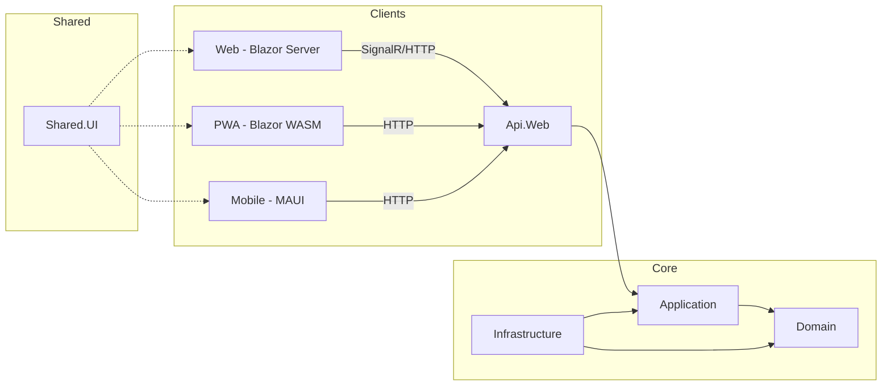

# 🏛️ 00 - الهيكل المعماري الشامل لنظام RubikCare

**لمحة سريعة**: وثيقة مرجعية للبنية التحتية للمشروع.
**آخر تحديث**: 29 أغسطس 2026
**المؤلف**: فريق RubikCare
**الحالة**: ✅ محدثة لتشمل جميع المشاريع التسعة (بما فيها PWA)

---

## 📌 مقدمة: فلسفة البناء

نظام RubikCare هو منصة صحية متكاملة، صُممت لتوحيد إدارة المرضى، ومقدمي الرعاية (أطباء، صيادلة، مندوبين)، وبرامج الدعم (PSP) في منظومة رقمية واحدة. يعتمد النظام على **Clean Architecture** لضمان فصل واضح للمسؤوليات، وقابلية عالية للتطوير، وسهولة في الصيانة والاختبار.

تمتد المنصة عبر **تسعة مشاريع برمجية**، تنقسم إلى طبقات أساسية (Core) وتطبيقات طرفية (Clients)، جميعها تشترك في مكونات UI موحدة وتتواصل عبر واجهة برمجية (API) مركزية.

---

## 🗺️ الخريطة المعمارية للمشاريع التسعة

```mermaid
graph TD
    subgraph "الطبقات الأساسية (Core Layers)"
        A[RubikCare.Domain<br/>الطبقة الأساسية (Entities, Enums, Interfaces)]
        B[RubikCare.Application<br/>طبقة التطبيق (Use Cases, DTOs, Services)]
        C[RubikCare.Infrastructure<br/>طبقة البنية التحتية (DbContext, Repositories, Migrations)]
    end

    subgraph "طبقة العرض والخدمات (Presentation & APIs)"
        D[RubikCare.Api.Web<br/>نقطة الدخول المركزية (REST API)]
    end

    subgraph "التطبيقات العميلة (Client Applications)"
        E[RubikCare.Web<br/>تطبيق الويب (Blazor Server)]
        F[RubikCare.PWA<br/>تطبيق الويب التقدمي (Blazor WASM)]
        G[RubikCare.Mobile<br/>تطبيق الموبايل (MAUI)]
    end

    subgraph "المكونات والاختبارات المشتركة (Shared & Testing)"
        H[RubikCare.Shared.UI<br/>مكتبة المكونات المشتركة (RCL)]
        I[RubikCare.Tests<br/>اختبارات الوحدة والتكامل]
    end

    B --> A
    C --> B & A
    D --> B & C

    E -- "SignalR / HTTP" --> D
    F -- "HTTP / REST" --> D
    G -- "HTTP / REST" --> D

    H -.-> E & F & G
    I -.-> A & B & C & D & E & F & G & H
```

---

## 📊 الجدول التنفيذي للمشاريع

| المشروع | التقنية الأساسية | المسؤولية الرئيسية | يعتمد على (مباشر) |
| :--- | :--- | :--- | :--- |
| **Domain** | .NET 10 Class Library | الكيانات الأساسية، التعدادات، وواجهات النطاق المجردة. | لا يعتمد على أي مشروع. |
| **Application** | .NET 10 Class Library | منطق الأعمال، حالات الاستخدام (Use Cases)، وخدمات التطبيق. | `Domain` فقط. |
| **Infrastructure** | .NET 10, EF Core 10, SQL Server | تنفيذ واجهات الـ `Application`، الوصول للبيانات، الترحيلات (Migrations). | `Application` و `Domain`. |
| **Api.Web** | ASP.NET Core 10 | نقطة النهاية الموحدة (REST API) لجميع العملاء. | `Application` و `Infrastructure`. |
| **Web** | Blazor Server 10 | تطبيق الويب الرئيسي (تفاعلي مع SignalR). | `Api.Web` (ضمنياً) و `Shared.UI`. |
| **PWA** | Blazor WebAssembly 10 | تطبيق ويب تقدمي يعمل في المتصفح (بديل لـ Web على أجهزة معينة). | `Api.Web` (عبر HTTP) و `Shared.UI`. |
| **Mobile** | .NET MAUI 10 | تطبيق الهواتف الذكية (Android, iOS). | `Api.Web` (عبر HTTP) و `Shared.UI`. |
| **Shared.UI** | Razor Class Library (RCL) | مكونات Razor قابلة لإعادة الاستخدام (جداول، أزرار، تخطيطات). | لا يعتمد على تطبيقات محددة. |
| **Tests** | xUnit, Moq | اختبارات الوحدة والتكامل والمعمارية. | جميع المشاريع (حسب الحاجة). |

---

## 🧩 مسؤوليات كل مشروع بالتفصيل

### 1. `RubikCare.Domain` - القلب النابض 🫀
**أكثر طبقة استقراراً ونقاءً.**
لا تعرف هذه الطبقة شيئاً عن قواعد البيانات، أو واجهات المستخدم، أو حتى كيفية نقل البيانات. همها الوحيد هو تمثيل مفاهيم العمل (Business Concepts).
*   **المحتويات**: الكيانات (Entities) مثل `ApplicationUser`, `Patient`, `Medication`، التعدادات (Enums)، كائنات القيمة (Value Objects) كـ `Address`، وأحداث النطاق (Domain Events).
*   **قاعدة ذهبية**: **ممنوع** إضافة أي مرجعيات لـ Entity Framework أو مكتبات خارجية متعلقة بالبيانات.

### 2. `RubikCare.Application` - عقل النظام 🧠
**هنا يُتخذ القرار.**
تحتوي على حالات الاستخدام (Use Cases) التي تمثل متطلبات المستخدم الفعلية (مثل: `EnrollPatientInPspUseCase`). تقوم بتنسيق تدفق البيانات بين الـ `Api.Web` والـ `Infrastructure`، وتطبق منطق الأعمال.
*   **المحتويات**: الخدمات (Services)، واجهات للبنية التحتية (Interfaces)، كائنات نقل البيانات (DTOs)، محولات (Mappers)، ومُحققّات (Validators) باستخدام FluentValidation.
*   **قاعدة ذهبية**: لا تعتمد إلا على `Domain` ولا تعرف كيف أو من أين تأتي البيانات (مستودع، خدمة خارجية، إلخ).

### 3. `RubikCare.Infrastructure` - الجسر إلى العالم الخارجي 🌉
**التفاصيل التقنية هنا.**
هذا هو مكان تنفيذ الواجهات المجردة التي عرّفها الـ `Application`. مسؤول عن التواصل مع قواعد البيانات، وإرسال البريد الإلكتروني، والخدمات السحابية.
*   **المحتويات**: `BusinessDbContext` (EF Core)، تنفيذ المستودعات (Repositories)، ملفات الترحيل (Migrations)، وخدمات خارجية (مثل `EmailService`).
*   **قاعدة ذهبية**: يُسمح لها بالاعتماد على `Application` و `Domain` فقط، ولا يُستدعى مباشرة من قبل التطبيقات العميلة (Web, PWA, Mobile).

### 4. `RubikCare.Api.Web` - بوابة النظام الموحدة 🚪
**نقطة الدخول الوحيدة للبيانات.**
هي واجهة برمجية (REST API) مركزية تخدم جميع العملاء (Web, PWA, Mobile). تتولى المصادقة (JWT)، والتحقق من الصلاحيات، وتنسيق الطلبات.
*   **المحتويات**: وحدات التحكم (Controllers)، `Program.cs`، وMiddleware (معالجة الأخطاء، التسجيل).
*   **قاعدة ذهبية**: وحدات التحكم يجب أن تكون **رفيعة جداً** (Thin Controllers)؛ كل المنطق يُفوض إلى الخدمات في طبقة `Application`.

### 5. `RubikCare.Web` - التطبيق التفاعلي الغني 💻
**تطبيق Blazor Server.**
يُستخدم في بيئات الإدارة واللوحات التي تتطلب تفاعلاً فورياً. يحافظ على اتصال مستمر (SignalR) مع الخادم، مما يوفر تجربة مستخدم سلسة.
*   **المحتويات**: صفحات (Pages)، مكونات خاصة بالويب، وخدمات محلية لإدارة الحالة.
*   **قاعدة ذهبية**: يتواصل مع الـ `Api.Web`، ولا يتفاعل مباشرة مع قواعد البيانات.

### 6. `RubikCare.PWA` - التطبيق الخفيف متعدد المنصات 📱
**تطبيق Blazor WebAssembly (التطبيق الأحدث).**
تمت إضافته ليكون بديلاً لتطبيق الويب (Blazor Server) على الأجهزة التي لا تتعامل بكفاءة مع SignalR (مثل أجهزة iPhone)، وأيضاً ليكون حلّاً سريعاً ومستقراً للوصول إلى النظام من أي متصفح.
*   **طبيعة التشغيل**: يعمل كلياً داخل متصفح المستخدم بعد تحميل ملفات `WebAssembly`. يُنشر كملفات **ثابتة** (Static Files) على خادم ويب (مثل IIS).
*   **المحتويات**: صفحات Razor مكافئة لـ `RubikCare.Web`، وخدمات للتواصل مع الـ API (مثل `WebApiService`).
*   **الحالة**: قيد التطوير النشط، مع خارطة طريق واضحة لنقل المكونات من `Shared.UI`.
*   **الرابط المرجعي**: [دليل PWA](https://github.com/Rubikans-Egy/Rubikcare-docs/blob/main/docs/22-RubikCare.PWA.md).

### 7. `RubikCare.Mobile` - تجربة الهواتف الذكية 📲
**تطبيق MAUI الأصلي.**
يستخدم `BlazorWebView` لعرض مكونات `Shared.UI`، مما يسمح بإعادة استخدام كبير للكود مع تطبيقات الويب. يوفر إمكانية الوصول إلى ميزات الجهاز (الكاميرا، GPS، الإشعارات المحلية).
*   **المحتويات**: صفحات XAML، ViewModels، وخدمات خاصة بالمنصة (مثل `MauiLocalNotificationService`).
*   **قاعدة ذهبية**: لا يعتمد على أي مشروع آخر باستثناء `Shared.UI`؛ يتواصل مع النظام حصراً عبر `Api.Web` باستخدام HTTP.

### 8. `RubikCare.Shared.UI` - مستودع المكونات المشتركة 🧩
**اللبنة الأساسية لواجهات المستخدم.**
مكتبة تحتوي على كل المكونات البصرية والخدمات المساعدة التي تستخدمها التطبيقات العميلة الثلاثة (Web, PWA, Mobile)، مما يضمن توحيد الشكل والأداء.
*   **المحتويات**: 66+ مكون Razor (مثل `RubikSmartTable`، `RubikButton`)، أكثر من 120 ملف CSS، و23 خدمة/واجهة مشتركة (مثل `ITranslationService`).
*   **قاعدة ذهبية**: تحتوي على **مكونات** قابلة لإعادة الاستخدام، وليس صفحات كاملة، لتجنب تعقيد التبعيات.

### 9. `RubikCare.Tests` - شبكة الأمان الجودة 🛡️
**ضمان استقرار المعمارية.**
يحتوي على اختبارات الوحدة (Unit Tests) لكل طبقة، واختبارات تكامل (Integration Tests) بين الطبقات، بالإضافة إلى اختبارات معماريّة باستخدام `NetArchTest` للتأكد من عدم كسر قواعد التبعية.
*   **قاعدة ذهبية**: جزء لا يتجزأ من عملية التطوير.

---

## 🧭 شجرة القرار المعماري (دليل المطور)

مع وجود ثلاثة تطبيقات عميلة وطبقات متعددة، قد يحتار المطور في النهج الصحيح لتطوير صفحة جديدة. هذا القسم يوفر إرشادات عملية.

### مستويات "النقاء المعماري" (من العملي إلى النظري)

| المستوى | الوصف | النهج |
| :--- | :--- | :--- |
| **LVL 1** | **مقبول للصفحات القديمة جداً** (يُنصح بالترقية). | `Blazor Page` ← `DbContext` مباشرة. |
| **LVL 2** | **مناسب للعمليات البسيطة (CRUD)**. | `Blazor Page` ← `IGenericService<T>` ← `DbContext`. |
| **LVL 3** | **الموصى به للعمليات المعقدة والجديدة**. | `Blazor/MAUI/PWA Page` ← `UseCase` (في `Application`) ← `Repository` (في `Infrastructure`). |
| **LVL 4** | **الأنقى للعمليات المشتركة بين العملاء**. | `Client (Web/PWA/Mobile)` → (HTTP) → `Api.Web` → `UseCase`. |

### القاعدة الذهبية: اختر النهج حسب التعقيد والمشاركة

| نوع الصفحة/الوظيفة | النهج الأمثل | مثال تطبيقي |
| :--- | :--- | :--- |
| **CRUD بسيط** (إضافة/تعديل/حذف لكيان واحد) | **LVL 2**: `IGenericService<T>` | عرض قائمة الأدوية، تعديل ملف المستخدم. |
| **منطق أعمال معقد** (متعدد الخطوات والشروط) | **LVL 3**: `UseCase` (في `Application`) | تسجيل مريض في برنامج دعم (PSP)، عملية مزامنة مع نظام خارجي. |
| **وظيفة مشتركة بين Web و PWA و Mobile** | **LVL 4**: `UseCase` (في `Application`) + `API` | إرسال إشعار، إنشاء تقرير، البحث المتقدم. |
| **عمليات حساسة جداً** (مالية، مصادقة) | **LVL 4**: `UseCase` + `API` مع تحقق إضافي (Validation). | معالجة الدفع، تغيير كلمة المرور. |
| **استعلامات تقارير معقدة** (قراءة فقط) | **استخدام** `DbContextFactoryService` مباشرة في الصفحة (مع الحذر). | لوحة التحكم (Dashboard) بإحصائيات متعددة. |

### ⚠️ تحذيرات معمارية صارمة

*   **لا تكسر تبعية الطبقات**: ممنوع استدعاء `Infrastructure` أو `DbContext` مباشرة من `Web` أو `PWA` أو `Mobile`.
*   **الـ `API` للجميع**: تطبيقات `Mobile` و `PWA` **لا تعتمد** على أي مشروع آخر (`Domain`, `Application`...)، وتتواصل فقط مع `Api.Web` عبر HTTP.
*   **`Shared.UI` للمكونات**: لا تضع صفحات كاملة (مثل `Dashboard.razor`) في `Shared.UI`، بل ضعها في المشاريع العميلة نفسها (`Web`, `PWA`, `Mobile`).
*   **استخدم DTOs**: لا تُرجع كائنات `Domain` (Entities) مباشرة من الـ `API`، استخدم DTOs لمنع تسرب تفاصيل النطاق وتقليل حجم البيانات.

---

## 📋 ملخص: العلاقات والتبعيات (بصيغة مبسطة)



**خلاصة القاعدة**: السهم يشير إلى "يعتمد على". التطبيقات العميلة تعتمد على الـ API، والـ API يعتمد على الـ Application، والـ Application على الـ Domain، والـ Infrastructure على الـ Application والـ Domain. `Shared.UI` في المنتصف يستخدمه الجميع.

---

## 🔗 روابط ذات صلة (المرشد الشامل)

للتعمق في جوانب محددة، راجع الوثائق التالية:

*   **[01 - Program.cs والتسجيلات الأساسية](./01-program-cs-foundation.md)**: لفهم كيفية تسجيل الخدمات والحقن.
*   **[02 - نظام الهوية والمصادقة](./02-identity-system.md)**: لإدارة المستخدمين والأدوار.
*   **[09 - دليل الـ API](./09-api-guide.md)**: لمعرفة كيفية استخدام وبناء نقاط النهاية.
*   **[10 - دليل تطوير MAUI](./10-maui-development-guide.md)**: لنشر وتطوير تطبيق الموبايل.
*   **[12 - دليل النشر الشامل](./12%20-%20%D8%AF%D9%84%D9%8A%D9%84%20%D8%A7%D9%84%D9%86%D8%B4%D8%B1%20%D9%88%D8%A7%D9%84%D8%A5%D9%86%D8%AA%D8%A7%D8%AC%20%D8%A7%D9%84%D8%B4%D8%A7%D9%85%D9%84%20(Deployment%20Guide).md)**: لإعداد البيئات والنشر على IIS.
*   **[22 - دليل RubikCare.PWA](./22-RubikCare.PWA.md)**: للنشر وحالة التطوير الخاصة بـ PWA.
*   **[24 - جرد هيكلة المشاريع وحالة PWA](./24-Project%20Structure%20Inventory%20%26%20PWA%20Migration%20Status.md)**: لمعرفة المكونات المنقولة والمتبقية في PWA.

---

## 📝 سجل التحديثات (Changelog)

| التاريخ | التغيير | السبب |
| :--- | :--- | :--- |
| 29 أغسطس 2026 | **إعادة كتابة شاملة للوثيقة**. | دمج مشروع PWA وهيكل المشاريع الجديد (9 مشاريع). |
| 29 أغسطس 2026 | إضافة **شجرة القرار المعماري** و **جداول المقارنة**. | توجيه المطورين لاختيار النهج الصحيح (UseCase vs GenericService). |
| 18 يوليو 2026 | إضافة قسم "شجرة القرار المعماري". | حل التناقض بين الوثائق وتوحيد الممارسات. |
| 18 يوليو 2026 | تحديث العلاقات وقواعد Shared.UI. | توضيح الفرق بين المكونات والصفحات في المكتبة المشتركة. |

---

**خاتمة**: هذه الوثيقة هي البوصلة المعمارية لـ RubikCare. أي تغيير جوهري في الهيكل أو إضافة مشروع جديد يجب أن ينعكس هنا أولاً، لتظل المرجعية الأساسية للفريق.
