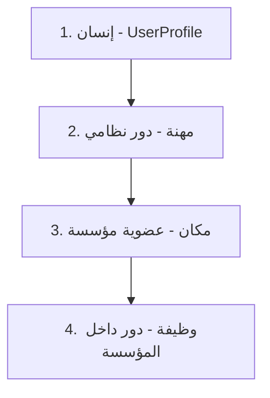
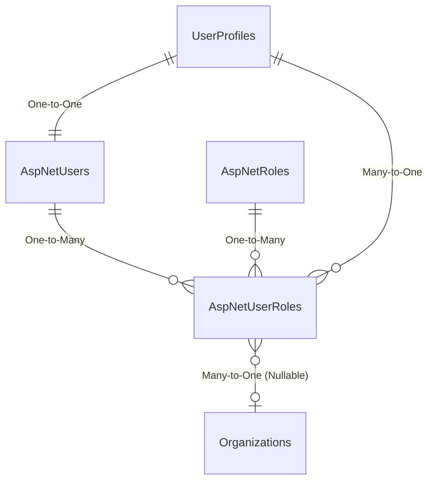
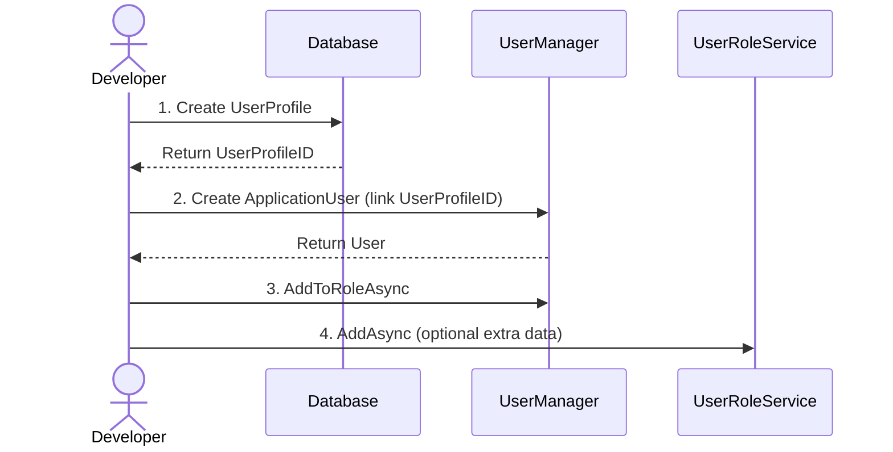

## 📝 ملف `02-identity-system.md` بعد التحديث:

# 02 - نظام الهوية والمصادقة (Identity System)

**آخر تحديث: 24 مايو 2026**

---

## مقدمة

نظام الهوية في RubikCare هو **أكثر الأجزاء حساسية** في المشروع. أي خطأ هنا يعني أن المستخدمين لن يستطيعوا الدخول، أو سيرون بيانات لا تخصهم. هذا المرجع يشرح الفلسفة، البنية، والقواعد الصارمة التي يجب اتباعها.

---

## فلسفة النظام: "الهوية قبل الدور"

### المبدأ الأساسي



### التدرج في الخدمات

- **المستوى 0:** مستخدم عادي (قائمة شخصية فقط)
- **المستوى 1:** صاحب مهنة (يمكنه إنشاء مؤسسة غير موثقة)
- **المستوى 2:** مؤسسة موثقة (خدمات متقدمة)

### فصل النظام عن المؤسسات

- **النظام يدير:** 3 أدوار فقط (Admin, Doctor, Pharmacist)
- **المؤسسات تدير:** موظفيها وأدوارهم الداخلية

---

## الهيكل المعماري لجداول قاعدة البيانات

### مخطط العلاقات



### AspNetUsers (من Microsoft Identity + تعديلاتنا)

| العمود | النوع | الوصف |
|--------|-------|-------|
| Id | PK, nvarchar(450) | GUID |
| UserName, NormalizedUserName | nvarchar | |
| Email, NormalizedEmail | nvarchar | |
| PasswordHash, SecurityStamp | nvarchar | |
| **UserProfileID** | FK → UserProfiles | الرابط إلى البيانات الموسعة ⭐ |
| **DisplayName** | nvarchar | اسم العرض ⭐ |
| **LastActivityDate** | datetime2 | آخر نشاط ⭐ |

### AspNetRoles (الأدوار النظامية)

| العمود | النوع | الوصف |
|--------|-------|-------|
| Id | PK, nvarchar(450) | GUID |
| Name | nvarchar | "Admin", "Doctor", "Pharmacist" |
| NormalizedName | nvarchar | أحرف كبيرة |

### AspNetUserRoles (⭐ المعدل والموسع - الأهم)

| العمود | النوع | الوصف |
|--------|-------|-------|
| UserId | PK, FK → AspNetUsers | |
| RoleId | PK, FK → AspNetRoles | |
| **UserProfileID** | FK → UserProfiles | NOT NULL ⭐ |
| **RoleType** | nvarchar(50) | "System", "Professional", "Organizational" ⭐ |
| **ProfessionalLicense** | nvarchar(100) | ترخيص مهني |
| **Specialization** | nvarchar(200) | تخصص فرعي |
| **IsVerified** | bit | DEFAULT 0 |
| **VerifiedDate** | datetime2 | |
| **LicenseExpiryDate** | datetime2 | |
| **ValidFrom** | datetime2 | |
| **ValidTo** | datetime2 | |
| **IsActive** | bit | DEFAULT 1 |
| **OrganizationID** | FK → Organizations | إذا كان الدور مرتبط بمؤسسة |

### UserProfiles (البيانات الموسعة)

| العمود | النوع | الوصف |
|--------|-------|-------|
| UserProfileID | PK, int | معرف فريد |
| ApplicationUserId | FK → AspNetUsers | رابط عكسي (One-to-One) |
| FirstName, LastName | nvarchar | |
| FullNameAr, FullNameEn | nvarchar | |
| NationalID, Email, PhoneNumber | nvarchar | |
| DateOfBirth, Gender | | |
| ProfilePictureUrl | nvarchar | |
| AreaID | FK → Areas | الموقع الجغرافي |
| IsActive, CreatedDate, LastModifiedDate | | |

---

## UserRoleService - القلب النابض لنظام الأدوار

### لماذا هذه الخدمة؟

`AspNetUserRoles` هو جدول **محوري** يربط بين:
- المستخدم (`AspNetUsers`)
- الدور (`AspNetRoles`)
- البيانات الموسعة (`UserProfiles`)
- الصلاحيات الزمنية (`ValidFrom`, `ValidTo`)

بدون `UserRoleService`، كنا سنضطر لكتابة استعلامات معقدة ومتكررة في كل صفحة.

### الكود الكامل

```csharp
using Microsoft.EntityFrameworkCore;
using Rubikcare.Web.Data.Models;

namespace Rubikcare.Web.Data.Services
{
    public class UserRoleService : IUserRoleService
    {
        private readonly IDbContextFactory<BusinessDbContext> _dbContextFactory;

        public UserRoleService(IDbContextFactory<BusinessDbContext> dbContextFactory)
        {
            _dbContextFactory = dbContextFactory;
        }

        public IQueryable<UserRole> GetAll()
        {
            var context = _dbContextFactory.CreateDbContext();
            return context.UserRoles
                .Include(ur => ur.UserProfile)
                .AsNoTracking()
                .AsQueryable();
        }

        public async Task<UserRole?> GetByIdAsync(string userId, string roleId)
        {
            await using var context = await _dbContextFactory.CreateDbContextAsync();
            return await context.UserRoles
                .FirstOrDefaultAsync(ur => ur.UserId == userId && ur.RoleId == roleId);
        }

        public async Task AddAsync(UserRole userRole)
        {
            if (userRole == null) throw new ArgumentNullException(nameof(userRole));
            await using var context = await _dbContextFactory.CreateDbContextAsync();
            await context.UserRoles.AddAsync(userRole);
            await context.SaveChangesAsync();
        }

        public async Task UpdateAsync(UserRole userRole)
        {
            if (userRole == null) throw new ArgumentNullException(nameof(userRole));
            await using var context = await _dbContextFactory.CreateDbContextAsync();

            var existing = await context.UserRoles
                .FirstOrDefaultAsync(ur => ur.UserId == userRole.UserId && ur.RoleId == userRole.RoleId);

            if (existing != null)
            {
                context.Entry(existing).CurrentValues.SetValues(userRole);
                await context.SaveChangesAsync();
            }
            else
            {
                await context.UserRoles.AddAsync(userRole);
                await context.SaveChangesAsync();
            }
        }

        public async Task DeleteAsync(UserRole userRole)
        {
            if (userRole == null) throw new ArgumentNullException(nameof(userRole));
            await using var context = await _dbContextFactory.CreateDbContextAsync();

            var existing = await context.UserRoles
                .FirstOrDefaultAsync(ur => ur.UserId == userRole.UserId && ur.RoleId == userRole.RoleId);

            if (existing != null)
            {
                context.UserRoles.Remove(existing);
                await context.SaveChangesAsync();
            }
        }

        public async Task<List<UserRole>> GetRolesForUserAsync(int userProfileId)
        {
            await using var context = await _dbContextFactory.CreateDbContextAsync();
            return await context.UserRoles
                .Where(ur => ur.UserProfileID == userProfileId)
                .ToListAsync();
        }

        public async Task<List<UserRole>> GetUsersInRoleAsync(string roleId)
        {
            await using var context = await _dbContextFactory.CreateDbContextAsync();
            return await context.UserRoles
                .Include(ur => ur.UserProfile)
                .Where(ur => ur.RoleId == roleId)
                .ToListAsync();
        }

        public async Task<bool> ExistsAsync(string userId, string roleId)
        {
            await using var context = await _dbContextFactory.CreateDbContextAsync();
            return await context.UserRoles
                .AnyAsync(ur => ur.UserId == userId && ur.RoleId == roleId);
        }

        public async Task<UserProfile?> GetUserProfileWithUserAsync(int userProfileId)
        {
            await using var context = await _dbContextFactory.CreateDbContextAsync();
            return await context.UserProfiles
                .Include(up => up.ApplicationUser)
                .FirstOrDefaultAsync(up => up.UserProfileID == userProfileId);
        }
    }
}
```

### تسجيل الخدمة في Program.cs

```csharp
builder.Services.AddScoped<IUserRoleService, UserRoleService>();
```

---

## كيفية إنشاء مستخدم جديد (الطريقة الصحيحة)

### التسلسل الإلزامي (لا تغيره أبداً)



```csharp
// الخطوة 1: إنشاء UserProfile أولاً
var userProfile = new UserProfile
{
    FirstName = "أحمد",
    LastName = "محمد",
    Email = "ahmed@example.com",
    PhoneNumber = "0123456789",
};
_context.UserProfiles.Add(userProfile);
await _context.SaveChangesAsync();  // الآن لدينا UserProfileID

// الخطوة 2: إنشاء ApplicationUser وربطه بـ UserProfileID
var user = new ApplicationUser
{
    UserName = "ahmed@example.com",
    Email = "ahmed@example.com",
    UserProfileID = userProfile.UserProfileID,  // الرابط الحاسم
    PhoneNumber = "0123456789"
};
var result = await _userManager.CreateAsync(user, "Password123!");

if (result.Succeeded)
{
    // الخطوة 3: إضافة الأدوار باستخدام UserManager
    await _userManager.AddToRoleAsync(user, "Doctor");
    
    // الخطوة 4: (اختياري) إضافة بيانات إضافية في UserRole
    var userRole = new UserRole
    {
        UserId = user.Id,
        RoleId = roleId,
        UserProfileID = userProfile.UserProfileID,
        RoleType = "Professional",
        ProfessionalLicense = "MED-12345",
        IsActive = true,
        ValidFrom = DateTime.Now,
        ValidTo = DateTime.Now.AddYears(1)
    };
    await _userRoleService.AddAsync(userRole);
}
```

### ⚠️ تحذير حرج

**لا تحاول أبداً إنشاء `ApplicationUser` بدون `UserProfile` أولاً.** هذا يكسر العلاقة ويجعل النظام غير قادر على ربط حساب الدخول بالبيانات الموسعة.

---

## المحاذير والقواعد الصارمة

### 🔴 ممنوعات مطلقة

1. **لا تعدل `AspNetUserRoles` يدوياً في قاعدة البيانات** أبداً. استخدم `UserRoleService` أو `UserManager`.
2. **لا تحذف `AspNetUsers` بدون حذف `UserProfiles` أولاً** (أو العكس). التسلسل مهم.
3. **لا تستخدم `[Key]` في `UserRole.cs`** - المفتاح مركب (UserId, RoleId) ويتم تعريفه في `OnModelCreating`.
4. **لا تغير أنواع مفاتيح Identity** (تبقى `nvarchar(450)`).

### 🟡 إجراءات تتطلب حذراً

| الإجراء | الصحيح | الخطأ |
|----------|--------|-------|
| **إضافة مستخدم** | `UserProfile` ← `ApplicationUser` ← أدوار | إنشاء `ApplicationUser` بدون `UserProfile` |
| **حذف مستخدم** | أدوار ← عضويات ← `AspNetUser` ← `UserProfile` | الحذف العشوائي |
| **تعديل دور** | استخدم `UpdateAsync` في `UserRoleService` | التعديل المباشر على `AspNetUserRoles` |

### 🔵 أفضل الممارسات

1. **استخدم `UserRoleService`** لكل العمليات على `AspNetUserRoles`.
2. **استخدم `UserManager`** لعمليات Identity الأساسية (إنشاء مستخدم، إضافة لدور).
3. **تحقق من الصلاحية الزمنية** دائماً:

```csharp
var isValid = userRole.IsActive && 
              userRole.ValidFrom <= DateTime.Now && 
              (userRole.ValidTo == null || userRole.ValidTo > DateTime.Now);
```

---

## نظام إدارة الجلسات والكاش (⭐ جديد - 24 مايو 2026)

### لمحة عامة

تم توحيد نظام الكاش في `UserSessionService` كمصدر وحيد لإدارة جلسات المستخدمين. هذا يمنع مشاكل ظهور بيانات المستخدم السابق بعد تسجيل الخروج.

### ClearUserCacheUseCase

Use Case مسؤول عن مسح جميع كاشات المستخدم عند Logout:

**المسار:** `RubikCare.Application/UseCases/User/ClearUserCacheUseCase.cs`

**الوظيفة:**
- يستدعي `UserSessionService.RefreshUserSessionAndCacheAsync(userId)`
- يمسح كاشات: `UserSession_`, `UserPrefs_`, `UserBasic_`
- يستدعي `IUserMenuService.ClearCacheAsync(userId)`

**الاستخدام في AuthController.Logout:**
```csharp
[HttpPost("logout")]
[Authorize]
public async Task<IActionResult> Logout([FromServices] ClearUserCacheUseCase clearCache)
{
    var userId = User.FindFirst("userId")?.Value;
    if (!string.IsNullOrEmpty(userId))
        await clearCache.ExecuteAsync(userId);
    
    await _signInManager.SignOutAsync();
    return Ok(new { success = true, message = "تم تسجيل الخروج بنجاح" });
}
```

### هيكل الكاش الموحد

```
ClearUserCacheUseCase (Application)
    ↓
UserSessionService.RefreshUserSessionAndCacheAsync(userId)
    ↓ يمسح
    ├── UserSession_{userId}   ← بيانات الجلسة الكاملة
    ├── UserPrefs_{userId}     ← تفضيلات المستخدم
    ├── UserBasic_{userId}     ← المعلومات الأساسية
    └── قوائم المستخدم         ← عبر IUserMenuService
```

### طبقات الكاش

| الطبقة | المسؤول | المفاتيح | المدة |
|--------|---------|----------|-------|
| **Session** | `UserSessionService` | `UserSession_{userId}` | ساعتين |
| **Preferences** | `UserSessionService` | `UserPrefs_{userId}` | ساعة |
| **BasicInfo** | `UserSessionService` | `UserBasic_{userId}` | ساعة |

### ملاحظات هامة

- **الموبايل:** `CachedUserSessionService` تدير كاش محلي (`_cachedSession`) يجب مسحه عند Logout
- **الويب:** `DynamicMenuService` لم تعد تستخدم `IMemoryCache` منفصل - تمت إزالة الكاش منها
- **Logout:** يجب أن يمسح الكاش على الخادم (`AuthController.Logout`) وعلى العميل (`SecureStorage` + `_cachedSession = null`)

---

## استعلامات مفيدة للتحقق

### للتشخيص والمراقبة

```sql
-- 1. المستخدمون بدون UserProfile
SELECT COUNT(*) FROM AspNetUsers WHERE UserProfileID IS NULL;

-- 2. الأدوار المنتهية الصلاحية لا تزال نشطة
SELECT COUNT(*) FROM AspNetUserRoles 
WHERE IsActive = 1 AND ValidTo < GETDATE();

-- 3. أدوار مكررة نشطة (يجب ألا توجد)
SELECT UserProfileID, RoleType, COUNT(*) as DuplicateCount
FROM AspNetUserRoles
WHERE IsActive = 1
GROUP BY UserProfileID, RoleType
HAVING COUNT(*) > 1;

-- 4. تقرير الصحة الشهري
SELECT 
    'Active Users' AS Category,
    (SELECT COUNT(*) FROM AspNetUsers WHERE UserProfileID IS NOT NULL) AS Total,
    (SELECT COUNT(*) FROM AspNetUsers WHERE UserProfileID IS NULL) AS Issues
UNION ALL
SELECT 
    'Active Roles',
    (SELECT COUNT(*) FROM AspNetUserRoles WHERE IsActive = 1),
    (SELECT COUNT(*) FROM AspNetUserRoles WHERE IsActive = 1 AND ValidTo < GETDATE());
```

---

## CHECKLIST: عند التعامل مع الهوية

### عند إنشاء صفحة تتعامل مع المستخدمين
- [ ] هل استخدمت `UserContextService` لجلب المستخدم الحالي؟
- [ ] هل تحققت من الصلاحية الزمنية للأدوار (`ValidTo`)?
- [ ] هل استخدمت `UserRoleService` للتعامل مع `AspNetUserRoles`؟

### عند إضافة مستخدم جديد
- [ ] هل أنشأت `UserProfile` أولاً؟
- [ ] هل ربطت `ApplicationUser.UserProfileID` بقيمة `UserProfile.UserProfileID`؟
- [ ] هل أضفت الأدوار باستخدام `_userManager.AddToRoleAsync()`؟

### عند تعديل أو حذف
- [ ] هل أخذت نسخة احتياطية من قاعدة البيانات قبل التعديلات الكبيرة؟
- [ ] هل تتبعت التسلسل الصحيح للحذف؟

### عند التعامل مع الجلسات والكاش (جديد)
- [ ] هل تمسح الكاش عند Logout باستخدام `ClearUserCacheUseCase`؟
- [ ] هل تمسح `SecureStorage` و `_cachedSession` في الموبايل؟
- [ ] هل `UserSessionService` هو المصدر الوحيد للكاش؟

---

## 🔗 روابط ذات صلة

- [00 - الهيكل المعماري](00-architecture-overview.md)
- [01 - Program.cs والتسجيلات الأساسية](01-program-cs-foundation.md)
- [04 - نظام القوائم الديناميكية](04-dynamic-menus.md)
- [14 - نظام الكاش الموحد](14-caching-system.md) ⭐ جديد
- [الملحق أ - مسرد المصطلحات](../appendix-a-glossary.md)
```
