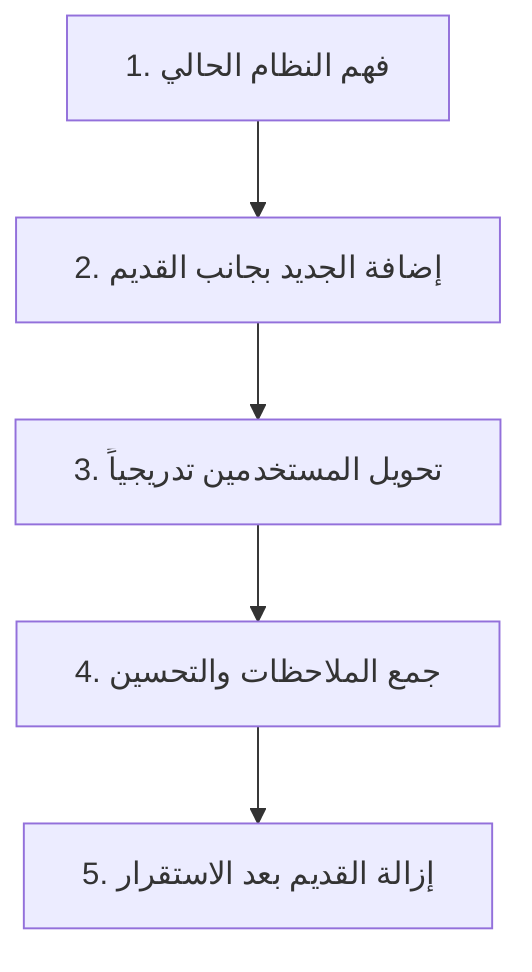
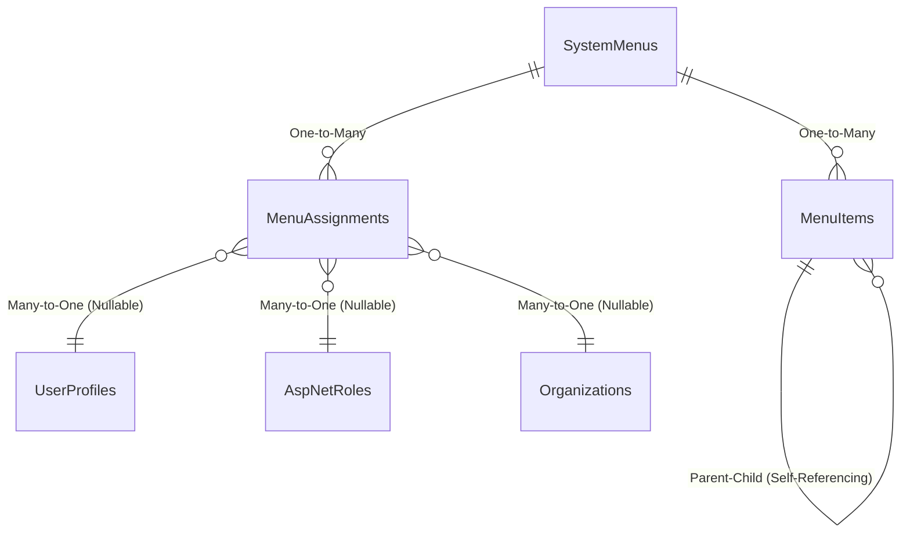
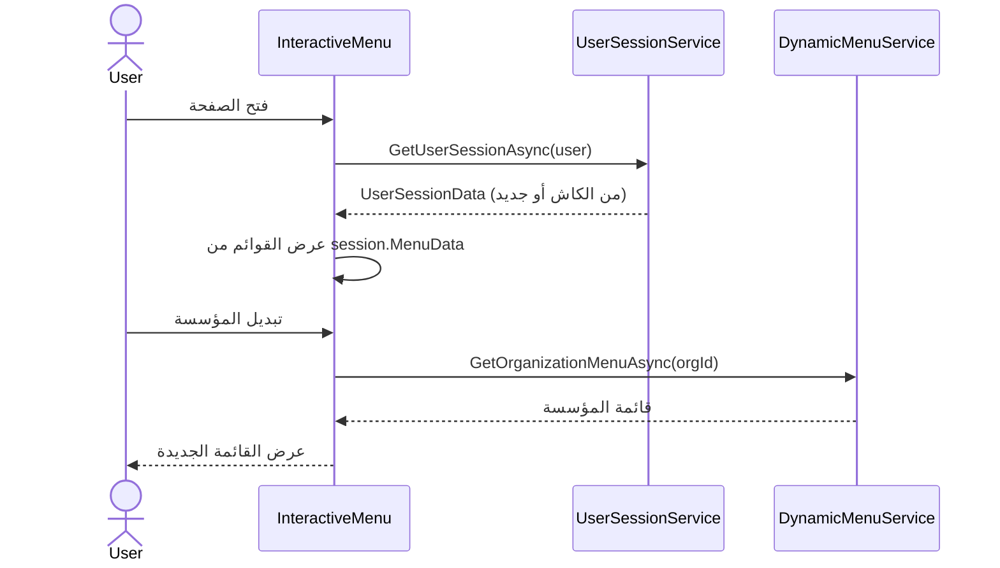

## 📝 ملف `04-dynamic-menus.md` بعد التحديث:

# 04 - نظام القوائم الديناميكية (Dynamic Menu System)

**آخر تحديث: 24 مايو 2026**

---

## مقدمة

نظام القوائم الديناميكية هو **الوجهة التي يراها المستخدم** عند دخوله إلى المنصة. واجهته ليست مجرد قائمة ثابتة، بل نظام ذكي يتكيف مع:
- من هو المستخدم؟ (UserProfile)
- ماذا يفعل؟ (الأدوار النظامية)
- أين يعمل؟ (العضويات في المؤسسات)

هذا المرجع يشرح كيفية بناء هذا النظام، وكيف نضمن أنه سريع، آمن، وسهل الصيانة.

---

## فلسفة النظام: "التطوير التراكمي الآمن"

### المبدأ الأساسي

في RubikCare، لا نؤمن بـ **"التغيير الجذري المفاجئ"**. بدلاً من ذلك، نتبع منهجية **"التطوير التراكمي الآمن"**:



**النتيجة:**
- **لا توقف في الخدمة** أبداً
- **اكتشاف المشاكل مبكراً** على نطاق محدود
- **قابلية التراجع** الفوري إذا ظهرت مشكلة

---

## الهيكل المعماري لجداول القوائم

### مخطط العلاقات



### SystemMenu - القوائم الرئيسية

```sql
-- جدول القوائم الرئيسية (مثل: USER_BASE, PHARMA_PSP, ADMIN_MENU)
CREATE TABLE SystemMenus (
    MenuID INT PRIMARY KEY IDENTITY(1,1),
    MenuCode NVARCHAR(50) NOT NULL,           -- USER_BASE, PHARMA_PSP, ADMIN_MENU
    MenuNameAr NVARCHAR(100) NOT NULL,         -- القائمة الشخصية، برامج دعم المرضى
    MenuNameEn NVARCHAR(100) NULL,             -- Personal Menu, PSP Programs
    MenuType NVARCHAR(20) NOT NULL,             -- BASE, ROLE_BASED, ORG_BASED
    SortOrder INT NOT NULL DEFAULT 100,
    Description NVARCHAR(500) NULL,
    IsActive BIT NOT NULL DEFAULT 1,
    CreatedDate DATETIME2 NOT NULL DEFAULT GETDATE()
);
```

**البيانات الحالية في النظام:**

| MenuID | MenuCode | MenuNameAr | MenuType |
|--------|----------|------------|----------|
| 6 | USER_BASE | القائمة الشخصية | BASE |
| 7 | PHARMA_PSP | برامج دعم المرضى | ROLE_BASED |
| 12 | ADMIN_MENU | لوحة تحكم الإدارة | ROLE_BASED |

### MenuItem - عناصر القوائم (مع التسلسل الهرمي)

```sql
-- جدول عناصر القوائم (يدعم Parent-Child للتسلسل الهرمي)
CREATE TABLE MenuItems (
    ItemID INT PRIMARY KEY IDENTITY(1,1),
    MenuID INT NOT NULL FOREIGN KEY REFERENCES SystemMenus(MenuID),
    ParentItemID INT NULL FOREIGN KEY REFERENCES MenuItems(ItemID),  -- ⭐ للتسلسل الهرمي
    ItemNameAr NVARCHAR(100) NOT NULL,
    ItemNameEn NVARCHAR(100) NULL,
    Url NVARCHAR(200) NOT NULL,
    IconClass NVARCHAR(50) NULL,              -- أيقونات Bootstrap: bi-house, bi-gear
    Description NVARCHAR(500) NULL,
    SortOrder INT NOT NULL DEFAULT 100,
    RequiredPermission NVARCHAR(50) NULL,      -- صلاحية مطلوبة (اختياري)
    IsActive BIT NOT NULL DEFAULT 1,
    IsExternalLink BIT NOT NULL DEFAULT 0,
    CreatedDate DATETIME2 NOT NULL DEFAULT GETDATE()
);
```

**مثال من البيانات الحالية:**

| ItemID | MenuID | ItemNameAr | Url | IconClass | SortOrder |
|--------|--------|------------|-----|-----------|-----------|
| 17 | 12 | لوحة التحكم المركزية | /admin/dashboard | bi-speedometer2 | 1 |
| 19 | 12 | إعدادات طبية | /admin/medical | bi-heart-pulse | 2 |
| 20 | 6 | ملفي الشخصي | /profile | bi-person | 1 |

### MenuAssignment - نظام التخصيص الذكي (⭐ القلب الحقيقي)

```sql
-- جدول التخصيصات: يحدد من يرى أي قائمة
CREATE TABLE MenuAssignments (
    AssignmentID INT PRIMARY KEY IDENTITY(1,1),
    MenuID INT NOT NULL FOREIGN KEY REFERENCES SystemMenus(MenuID),
    
    -- ⭐ أربع طرق للتخصيص (واحد منها على الأقل مطلوب)
    UserProfileID INT NULL FOREIGN KEY REFERENCES UserProfiles(UserProfileID),
    RoleId NVARCHAR(450) NULL FOREIGN KEY REFERENCES AspNetRoles(Id),
    OrganizationID INT NULL FOREIGN KEY REFERENCES Organizations(OrganizationID),
    OrganizationTypeID INT NULL FOREIGN KEY REFERENCES OrganizationTypes(OrganizationTypeID),
    
    AssignmentType NVARCHAR(20) NOT NULL,      -- USER_SPECIFIC, ROLE_BASED, ORGANIZATION_BASED
    AssignedDate DATETIME2 NOT NULL DEFAULT GETDATE(),
    AssignedBy INT NULL FOREIGN KEY REFERENCES UserProfiles(UserProfileID),
    ExpiryDate DATETIME2 NULL,
    IsActive BIT NOT NULL DEFAULT 1,
    
    -- ⭐ فهرس لتحسين أداء البحث
    INDEX IX_MenuAssignments_UserProfile (UserProfileID, IsActive),
    INDEX IX_MenuAssignments_Role (RoleId, IsActive),
    INDEX IX_MenuAssignments_Organization (OrganizationID, IsActive)
);
```

**مثال حي من النظام:**

| AssignmentID | MenuID | UserProfileID | RoleId | OrganizationID | OrganizationTypeID |
|--------------|--------|---------------|--------|----------------|--------------------|
| 6 | 12 | NULL | Admin | NULL | NULL |
| 7 | 7 | 12 | NULL | NULL | NULL |
| 8 | 7 | NULL | NULL | 5 | NULL |

---

## 🔑 الاكتشاف الحاسم: فصل القوائم الثلاثة

**المشكلة:** كيف نفصل بين القائمة الشخصية، قوائم المؤسسات، وقائمة الإدارة؟

**الحل:** جعل `OrganizationID` في `MenuAssignment` **قابلاً للـ Null**:

```csharp
public class MenuAssignment
{
    // ...
    public int? OrganizationID { get; set; }  // ⭐ من int إلى int?
    public virtual Organization? Organization { get; set; }
}
```

**النتيجة:**
- **القائمة الشخصية (USER_BASE):** `OrganizationID = NULL` ← تظهر للجميع
- **قائمة المؤسسات:** مرتبطة بـ `OrgMemberships.IsActive` للمستخدم
- **قائمة الإدارة (ADMIN_MENU):** `OrganizationID = 1` (مؤسسة روبيك كير) ← تظهر فقط لمن في هذه المؤسسة

---
## 🟡 وضع المندوب (Rep Mode)

المندوب ليس له دور نظامي منفصل، بل هو `UserProfile` مع `OrgMembership` في منظمة من نوع "شركة أدوية" (OrganizationTypeID = 2).

### إضافة قائمة للمندوب

1. أضف سجلاً في `SystemMenus` مع `MenuCode` جديد (مثل `REP_MENU`)
2. أضف `MenuAssignment` مع `RoleId` = `Rep` (أو `UserProfileID` محدد)
3. تأكد من أن `OrganizationID = NULL` للقوائم العامة
4. 
## DynamicMenuService - قلب النظام (⭐ محدث - 24 مايو 2026)

### ⚠️ تغيير مهم: إزالة الكاش المحلي

**اعتباراً من 24 مايو 2026:** تمت إزالة `IMemoryCache` من `DynamicMenuService`. إدارة الكاش أصبحت مركزية بالكامل في `UserSessionService` (راجع [14 - نظام الكاش الموحد](14-caching-system.md)).

**الموقع:** `Rubikcare.Web/Data/Services/Navigation/DynamicMenuService.cs`

**الوظائف الرئيسية:**
- `GetUserMenuAsync(ClaimsPrincipal user)` - جلب قوائم المستخدم (بدون كاش)
- `GetMenuDataAsync(ClaimsPrincipal user)` - جلب بيانات القوائم المنفصلة (شخصية، Admin، مؤسسات)
- `GetOrganizationMenuFromDatabaseAsync(int organizationId)` - جلب قوائم مؤسسة محددة
- `ClearCacheAsync(string userId)` - **دالة فارغة (no-op)** - تم نقل مسؤولية الكاش لـ `UserSessionService`

**الاعتماديات:**
- `IDbContextFactoryService` - للوصول لقاعدة البيانات
- `UserContextService` - لجلب بيانات المستخدم
- `ILogger<DynamicMenuService>` - للتسجيل

**ملاحظة:** `DynamicMenuService` تُستخدم فقط في تطبيق Blazor Web. تطبيق الموبايل يستخدم `UserSessionService` مباشرة.

---

## InteractiveMenu.razor - واجهة المستخدم (الويب)

### تدفق المكون (محدث)



**تغيير مهم:** `InteractiveMenu.razor` الآن يعتمد على `UserSessionService` للحصول على بيانات القوائم (عبر `session.MenuData`)، وليس على `DynamicMenuService` مباشرة.

---


## استعلامات مفيدة للتحقق والمراقبة

```sql
-- 1. عرض جميع القوائم مع أنواعها
SELECT MenuCode, MenuNameAr, MenuType, IsActive
FROM SystemMenus
ORDER BY SortOrder;

-- 2. عرض عناصر قائمة محددة (مثال: ADMIN_MENU)
SELECT mi.ItemNameAr, mi.Url, mi.SortOrder
FROM MenuItems mi
INNER JOIN SystemMenus sm ON mi.MenuID = sm.MenuID
WHERE sm.MenuCode = 'ADMIN_MENU' AND mi.IsActive = 1
ORDER BY mi.SortOrder;

-- 3. معرفة من يرى أي قائمة
SELECT 
    sm.MenuNameAr AS القائمة,
    CASE 
        WHEN ma.UserProfileID IS NOT NULL THEN 'مستخدم محدد'
        WHEN ma.RoleId IS NOT NULL THEN 'دور: ' + r.Name
        WHEN ma.OrganizationID IS NOT NULL THEN 'منظمة: ' + o.OrganizationNameAr
        WHEN ma.OrganizationTypeID IS NOT NULL THEN 'نوع منظمة'
        ELSE 'عامة'
    END AS مخصصة_لـ,
    ma.IsActive,
    ma.ExpiryDate
FROM MenuAssignments ma
INNER JOIN SystemMenus sm ON ma.MenuID = sm.MenuID
LEFT JOIN AspNetRoles r ON ma.RoleId = r.Id
LEFT JOIN Organizations o ON ma.OrganizationID = o.OrganizationID
WHERE ma.IsActive = 1;

-- 4. التحقق من عدم وجود تكرار في التخصيصات
SELECT UserProfileID, RoleId, OrganizationID, COUNT(*) as DuplicateCount
FROM MenuAssignments
WHERE IsActive = 1
GROUP BY UserProfileID, RoleId, OrganizationID
HAVING COUNT(*) > 1;
```

---


## المحاذير والأخطاء الشائعة

### 🔴 ممنوعات مطلقة

1. **لا تستخدم `DbContext` مباشرة في `DynamicMenuService`.** استخدم `DbContextFactory`.
2. **لا تضع `OrganizationID = 0` للقوائم العامة.** استخدم `NULL` كما هو موثق.
3. **لا تكرر نفس القائمة لنفس المستخدم بطرق متعددة.**
4. **لا تضف `IMemoryCache` لـ `DynamicMenuService`** - الكاش مركزي في `UserSessionService`.

### 🟡 أخطاء شائعة وحلولها

| المشكلة | السبب | الحل |
|----------|-------|-------|
| القائمة لا تظهر لبعض المستخدمين | `MenuAssignment` غير مضبوط | تحقق من `UserProfileID`, `RoleId`, `OrganizationID` |
| القائمة تظهر لمن لا يجب أن تظهر له | عدم تحديد `OrganizationID` بشكل صحيح | تأكد من أن `OrganizationID = NULL` للقوائم العامة فقط |
| منظمات المستخدم لا تظهر في الموبايل | `AppShellViewModel` لم يُستدعَ | تأكد من استدعاء `appShell.RefreshUserDataAsync()` من `DashboardPage.OnAppearing` |
| ظهور بيانات المستخدم السابق | الكاش لم يُمسح عند Logout | استخدم `ClearUserCacheUseCase` في `AuthController.Logout` |

---

## CHECKLIST: عند إضافة قائمة جديدة

### الخطوة 1: إضافة القائمة الرئيسية
- [ ] هل القائمة جديدة كلياً؟ أضف سجلاً في `SystemMenus` مع `MenuCode` فريد
- [ ] هل تحددت `MenuType` المناسب (BASE, ROLE_BASED, ORGANIZATION_BASED)؟

### الخطوة 2: إضافة عناصر القائمة
- [ ] هل أضفت كل عنصر في `MenuItems` مع `MenuID` الصحيح؟
- [ ] هل رتبت العناصر باستخدام `SortOrder`؟
- [ ] هل اخترت أيقونة مناسبة من Bootstrap Icons؟

### الخطوة 3: تخصيص الظهور (MenuAssignment)
- [ ] لمن تظهر هذه القائمة؟
    - [ ] للجميع؟ → `OrganizationID = NULL`
    - [ ] لدور محدد؟ → `RoleId` محدد
    - [ ] لمستخدم محدد؟ → `UserProfileID` محدد
    - [ ] لمؤسسة محددة؟ → `OrganizationID` محدد
- [ ] هل للقائمة صلاحية زمنية؟ اضبط `ExpiryDate`

### الخطوة 4: الاختبار
- [ ] اختبر مع مستخدمين مختلفين (عادي، Admin، عضو في المؤسسة)
- [ ] تأكد من أن القائمة تظهر فقط لمن يفترض أن تظهر له
- [ ] تأكد من أن الروابط تعمل بشكل صحيح

---

## 🔗 روابط ذات صلة

- [00 - الهيكل المعماري](00-architecture-overview.md)
- [01 - Program.cs والتسجيلات الأساسية](01-program-cs-foundation.md)
- [02 - نظام الهوية والمصادقة](02-identity-system.md)
- [05 - إنشاء الصفحات والمكونات](05-page-creation-checklist.md)
- [14 - نظام الكاش الموحد](14-caching-system.md) ⭐ جديد
```
