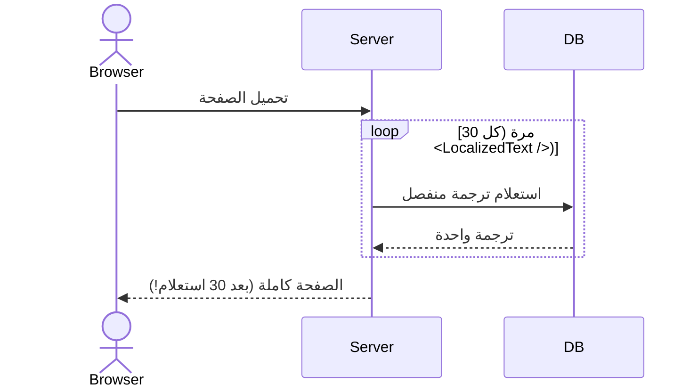
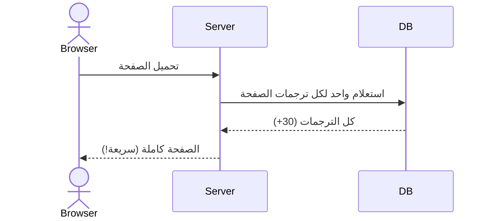

# 05 - إنشاء الصفحات والمكونات (Core Chapter)

**آخر تحديث: 17 مايو 2026**

---

## مقدمة

هذا هو **أهم مرجع في الدليل**، لأنه يجيب على السؤال العملي الأكثر تكراراً: **"كيف أبني صفحة جديدة بالطريقة الصحيحة؟"**

سنغطي هنا:
- **🔴 مشكلة الأداء الحالية** في الصفحات المترجمة وكيفية حلها نهائياً
- **📋 CHECKLIST شاملة** لإنشاء أي صفحة جديدة (Static أو Interactive)
- **💡 أنماط وحلول متقدمة** مستفادة من تجارب حقيقية
- **📚 مرجع سريع** لخصائص جميع المكونات الذكية

---

## 🔴 تحذير عاجل - مشكلة الأداء الحالية في الترجمة

### وصف المشكلة

**الأعراض:**
- الصفحات المترجمة تعاني من **بطء شديد في التحميل** (قد يصل إلى 5-10 ثواني)
- **توقف عن العمل** عند محاولة أي تفاعل (نقر زر، كتابة في حقل بحث)
- في Developer Tools -> Network، نرى **عشرات الطلبات** لنفس API

### التشخيص: مشكلة N+1 Queries



**السبب الجذري:**
```razor
{{!-- ❌ هذا هو سبب المشكلة --}}
<h1><LocalizedText Key="PAGE.TITLE" /></h1>
<p><LocalizedText Key="PAGE.DESCRIPTION" /></p>
<label><LocalizedText Key="COMMON.NAME" /></label>

{{!-- كل سطر = استعلام منفصل لقاعدة البيانات --}}
{{!-- 30 نصاً في الصفحة = 30 استعلام = بطء شديد --}}
```

### الحل الجذري: تحميل الترجمات دفعة واحدة



```csharp
// ✅ الحل: تحميل كل ترجمات الصفحة في استعلام واحد
var translations = await Localizer.GetPageTranslationsAsync("PAGE_DOMAIN");
var commonTranslations = await Localizer.GetPageTranslationsAsync("COMMON");

// دمجها في قاموس واحد
_allTranslations = commonTranslations.Concat(translations)
    .ToDictionary(kvp => kvp.Key, kvp => kvp.Value);

// دالة مساعدة للوصول السريع
private string T(string key) => 
    _allTranslations.TryGetValue(key, out var value) ? value : key;
```

ثم في الـ HTML:
```razor
<h1>@T("TITLE")</h1>        {{!-- أسرع بـ 30 مرة --}}
<p>@T("DESCRIPTION")</p>    {{!-- لا استعلامات إضافية --}}
<label>@T("NAME")</label>   {{!-- يستخدم القاموس المحلي --}}
```

---

## 📋 CHECKLIST الشاملة لإنشاء صفحة جديدة

### الخطوة 0: تحديد نوع الصفحة

قبل كتابة أي سطر كود، اسأل:

- [ ] هل الصفحة **Static** (مثل Login, Register, ExternalLogin)؟  
  *هذه الصفحات لا تدعم الـ InteractiveServer Mode وتعتمد على HTML و JavaScript مباشر.*
  
- [ ] هل الصفحة **Interactive** (باقي الصفحات الإدارية والتطبيق)؟  
  *هذه الصفحات تعمل مع Blazor InteractiveServer وتدعم دوال C# الكاملة.*

**لماذا هذا التحديد مهم؟** لأن طريقة الترجمة تختلف تماماً بين النوعين.

---

### الخطوة 1: الإعدادات الأساسية (لكل الصفحات)

#### ✅ حقن الخدمات الأساسية

```csharp
@* في أعلى الصفحة *@
@inject ILocalizationService Localizer
@inject TranslationStateService TranslationState
@inject IUserContextService UserContext
```

#### ✅ اختيار نمط الوراثة المناسب

- **لصفحات CRUD الجديدة:**
  ```csharp
  @inherits BaseFactoryCrudPage<MyEntity>
  ```
- **للصفحات البسيطة:**
  ```csharp
  @code {
      // لا حاجة لوراثة خاصة
  }
  ```

#### ✅ إضافة مفاتيح الترجمة في قاعدة البيانات

```sql
-- ⭐ مهم جداً: استخدم N'' prefix للعربية
INSERT INTO Resources (ResourceKey, ResourceValueAr, ResourceValueEn, Module)
VALUES 
    (N'MY_PAGE.TITLE', N'عنوان الصفحة', N'Page Title', N'MY_MODULE'),
    (N'MY_PAGE.SUBMIT', N'إرسال', N'Submit', N'MY_MODULE');

-- بدون N'' تظهر النصوص العربية كـ ??????
```

---

### الخطوة 2: تنفيذ نظام الترجمة الصحيح (حسب نوع الصفحة)

#### للصفحات Static (مثل Login, Register, ExternalLogin)

**النمط الكامل:**

```csharp
@page "/Account/ExternalLogin"
@using System.Text.Encodings.Web
@using System.Text.Json

@inject ILocalizationService Localizer
@inject IHttpContextAccessor HttpContextAccessor

@{
    // قراءة اللغة من QueryString أو Cookie
    var queryLang = Context.Request.Query["lang"].ToString();
    var cookieLang = Context.Request.Cookies["lang"];
    var currentLang = !string.IsNullOrEmpty(queryLang) ? queryLang :
                     !string.IsNullOrEmpty(cookieLang) ? cookieLang : "ar";

    // تحميل الترجمات للصفحة
    var loginTrans = await Localizer.GetPageTranslationsAsync("LOGIN", currentLang);
    var commonTrans = await Localizer.GetPageTranslationsAsync("COMMON", currentLang);
    var externalTrans = await Localizer.GetPageTranslationsAsync("EXTERNAL_LOGIN", currentLang);
    
    // دمج جميع الترجمات
    var allTranslations = new Dictionary<string, string>();
    foreach (var t in commonTrans.Concat(loginTrans).Concat(externalTrans))
    {
        allTranslations[t.Key] = t.Value;
    }
}

<!DOCTYPE html>
<html lang="@currentLang" dir="@(currentLang == "ar" ? "rtl" : "ltr")">
<head>
    <meta charset="UTF-8">
    <meta name="viewport" content="width=device-width, initial-scale=1.0">
    <title>@(allTranslations.GetValueOrDefault("LOGIN.TITLE", "تسجيل الدخول"))</title>
    
    <!-- ⭐ حقن الترجمات في JavaScript بطريقة آمنة -->
    <script>
        window.__initialTranslations = @Html.Raw(JsonSerializer.Serialize(
            allTranslations,
            new JsonSerializerOptions { 
                Encoder = JavaScriptEncoder.UnsafeRelaxedJsonEscaping
            }));
        window.__currentLang = "@currentLang";
    </script>
    
    <!-- ⭐ تحميل ملف الترجمة الخاص بالصفحات الثابتة -->
    <script src="/Assets/js/login-localization.js"></script>
</head>
<body>
    <h1 data-translate="EXTERNAL_LOGIN.TITLE"></h1>
    <p data-translate="EXTERNAL_LOGIN.DESCRIPTION"></p>
    
    <button onclick="toggleLanguageSimple()" class="lang-btn-simple">
        @(currentLang == "ar" ? "English" : "العربية")
    </button>
</body>
</html>
```

**ملف `login-localization.js` (النسخة النهائية الصحيحة):**

```javascript
// wwwroot/Assets/js/login-localization.js

const loginLocalization = {
    updateTranslations: async function (lang) {
        try {
            console.log(`🔄 Updating translations to ${lang}...`);

            // ⭐ جلب الثلاث domains دفعة واحدة
            const [loginRes, commonRes, externalRes] = await Promise.all([
                fetch(`/api/localization/page/LOGIN?lang=${lang}`),
                fetch(`/api/localization/page/COMMON?lang=${lang}`),
                fetch(`/api/localization/page/EXTERNAL_LOGIN?lang=${lang}`)
            ]);

            if (!loginRes.ok || !commonRes.ok || !externalRes.ok) {
                throw new Error('Failed to fetch one or more translation domains');
            }

            const [loginTrans, commonTrans, externalTrans] = await Promise.all([
                loginRes.json(),
                commonRes.json(),
                externalRes.json()
            ]);

            // ⭐ دمج الترجمات
            const translations = { ...commonTrans, ...loginTrans, ...externalTrans };

            console.log(`✅ Received ${Object.keys(translations).length} translations`);

            // تحديث العناصر النصية
            document.querySelectorAll('[data-translate]').forEach(el => {
                const key = el.getAttribute('data-translate');
                const value = translations[key] 
                           || translations[key.toUpperCase()] 
                           || translations[key.toLowerCase()];
                if (value) {
                    if (el.tagName === 'INPUT' || el.tagName === 'TEXTAREA') {
                        el.value = value;
                    } else {
                        el.textContent = value;
                    }
                } else {
                    console.warn(`⚠️ Key not found: ${key}`);
                }
            });

            // تحديث placeholders
            document.querySelectorAll('[data-translate-placeholder]').forEach(el => {
                const key = el.getAttribute('data-translate-placeholder');
                if (translations[key]) el.placeholder = translations[key];
            });

            // تحديث الاتجاه
            document.documentElement.dir = lang === 'ar' ? 'rtl' : 'ltr';
            document.documentElement.lang = lang;

            this.updateButtonStyle(lang);
            localStorage.setItem('RubikCare:Language', lang);
            document.cookie = `lang=${lang}; path=/; max-age=31536000; SameSite=Lax`;

            console.log(`✅ Language switched to ${lang}`);

        } catch (err) {
            console.error('❌ Translation update failed:', err);
        }
    },

    updateButtonStyle: function (lang) {
        const button = document.querySelector('.lang-btn-simple');
        if (button) {
            button.classList.remove('lang-btn-simple-ar', 'lang-btn-simple-en');
            button.classList.add(lang === 'ar' ? 'lang-btn-simple-ar' : 'lang-btn-simple-en');
            button.title = lang === 'ar' ? 'العربية (AR)' : 'English (EN)';
            button.textContent = lang === 'ar' ? 'English' : 'العربية';
        }
    },

    init: function () {
        const savedLang = localStorage.getItem('RubikCare:Language');
        const serverLang = window.__currentLang || document.documentElement.lang || 'ar';

        if (savedLang && savedLang !== serverLang) {
            console.log(`🔄 Restoring saved language: ${savedLang} (server: ${serverLang})`);
            this.updateTranslations(savedLang);
        }
    }
};

window.loginLocalization = loginLocalization;

// ⭐ دالة تبديل اللغة
window.toggleLanguageSimple = function () {
    const current = document.documentElement.lang || window.__currentLang || 'ar';
    const newLang = current === 'ar' ? 'en' : 'ar';
    console.log(`🔀 Toggling: ${current} → ${newLang}`);
    window.loginLocalization.updateTranslations(newLang);
};

document.addEventListener('DOMContentLoaded', () => {
    window.loginLocalization.init();
});
```

---

#### للصفحات Interactive (باقي الصفحات)

**النمط الكامل مع `TranslationStateService`:**

```razor
@page "/admin/my-page"
@inherits BaseFactoryCrudPage<MyEntity>
@implements IDisposable  {{!-- ⭐ مهم جداً لإلغاء الاشتراك --}}

@inject TranslationStateService TranslationState
@inject ILocalizationService Localizer

<h1>@T("TITLE")</h1>

<SearchBar @bind-SearchTerm="SearchTerm" Placeholder="@T("SEARCH_PLACEHOLDER")" />

<RubikSmartTable Data="@CurrentPageItems" TItem="MyEntity">
    <Columns>
        <th @onclick="() => SortByColumn('Name')">@T("NAME")</th>
        <th>@T("ACTIONS")</th>
    </Columns>
    <RowTemplate Context="item">
        <td>@item.Name</td>
        <td>
            <RubikButton Text="@T("EDIT")" Icon="bi-pencil" OnClick="() => Edit(item)" />
        </td>
    </RowTemplate>
</RubikSmartTable>

@code {
    private string _currentLang = "ar";
    private Dictionary<string, string> _translations = new();
    private string _pageDomain = "MY_PAGE";

    protected override async Task OnInitializedAsync()
    {
        await base.OnInitializedAsync();
        
        _currentLang = TranslationState.CurrentLanguage ?? "ar";
        
        // ⭐ الاشتراك في أحداث تغيير اللغة
        TranslationState.OnLanguageChanged += HandleLanguageChanged;
        
        await LoadTranslations(_currentLang);
    }

    private async void HandleLanguageChanged()
    {
        _currentLang = TranslationState.CurrentLanguage ?? "ar";
        await LoadTranslations(_currentLang);
        await InvokeAsync(StateHasChanged);
    }

    private async Task LoadTranslations(string lang)
    {
        // ⭐ تحميل كل الترجمات دفعة واحدة
        var pageTrans = await Localizer.GetPageTranslationsAsync(_pageDomain, lang);
        var commonTrans = await Localizer.GetPageTranslationsAsync("COMMON", lang);
        
        _translations.Clear();
        
        foreach (var item in commonTrans) _translations[item.Key] = item.Value;
        foreach (var item in pageTrans) _translations[item.Key] = item.Value;
    }

    // ⭐ دالة مساعدة سريعة
    private string T(string key) =>
        _translations.TryGetValue(key, out var value) ? value : key;

    // ⭐ إلزامي: إلغاء الاشتراك عند التخلص من الصفحة
    public void Dispose()
    {
        TranslationState.OnLanguageChanged -= HandleLanguageChanged;
    }
}
```

**⚠️ تحذيرات مهمة:**

1. **`var` خارج الدوال ممنوع:**
   ```csharp
   @code {
       // ❌ خطأ: CS0103
       var x = 5;
       
       // ✅ صحيح
       protected override void OnInitialized()
       {
           var x = 5;
       }
   }
   ```

2. **لا تنسى `Dispose()`:** أي صفحة تستخدم `TranslationStateService` يجب أن تنفذ `IDisposable` وإلا سيحدث **تسريب في الذاكرة (Memory Leak)**.

---

### الخطوة 3: استخدام المكونات الذكية

#### متى تستخدم أي مكون

| المكون | متى تستخدمه |
|--------|-------------|
| **`RubikSmartTable`** | عند عرض بيانات في جدول (مع Sorting, تفاصيل إضافية) |
| **`SearchBar`** | عند الحاجة لفلترة البيانات (مع Debounce 300ms) |
| **`Pagination`** | عند وجود أكثر من 20-30 سجل |
| **`GenericModal`** | عند الحاجة لنافذة منبثقة (إضافة، تعديل) |
| **`DataOperationsModal`** | عند الحاجة لاستيراد/تصدير Excel |
| **`RubikDropdown`** | عند الحاجة لقائمة منسدلة (بديل MudBlazor) |
| **`RubikButton`** | للأزرار الموحدة في النظام |
| **`AlertMessage`** | لعرض رسائل نجاح/خطأ/تحذير |

#### مثال متكامل من صفحة الأمراض

```razor
@* Diseases.razor - النموذج المرجعي *@

<div class="rubik-main-content">
    <!-- شريط الأدوات -->
    <div class="d-flex justify-content-between align-items-center mb-3">
        <h2>@T("TITLE")</h2>
        <div class="d-flex gap-2">
            <RubikButton Icon="bi-file-earmark-excel" 
                        ColorClass="btn-outline-success"
                        OnClick="ToggleDataModal">
                @T("EXPORT_IMPORT")
            </RubikButton>
            <RubikButton Icon="bi-plus-lg" 
                        ColorClass="btn-primary"
                        OnClick="OpenAddModal">
                @T("ADD_NEW")
            </RubikButton>
        </div>
    </div>

    <!-- بحث -->
    <SearchBar @bind-SearchTerm="SearchTerm" 
              Placeholder="@T("SEARCH_PLACEHOLDER")"
              OnSearch="ExecuteSearch"
              DebounceDelay="300" />

    <!-- الجدول الذكي -->
    <RubikSmartTable Data="@CurrentPageItems.ToList()" TItem="Disease"
                    EnableSorting="true"
                    SortColumn="@_sortColumn"
                    SortAscending="@_sortAscending"
                    OnSortChanged="HandleSortChanged">
        <Columns>
            <th style="width: 50px">#</th>
            <th @onclick="() => SortByColumn('DiseaseNameAr')">
                @T("NAME_AR")
                @if (_sortColumn == "DiseaseNameAr")
                {
                    <i class="bi @(_sortAscending ? "bi-sort-alpha-down" : "bi-sort-alpha-up-alt")"></i>
                }
            </th>
            <th>@T("TYPE")</th>
            <th class="text-center">@T("STATUS")</th>
            <th class="text-center">@T("ACTIONS")</th>
        </Columns>
        <RowTemplate Context="disease">
            <td>@((CurrentPage - 1) * PageSize + context.Index + 1)</td>
            <td>@disease.DiseaseNameAr</td>
            <td>@disease.DiseaseType?.TypeNameAr</td>
            <td class="text-center">
                <span class="badge @(disease.IsActive ? "bg-success" : "bg-secondary")">
                    @(disease.IsActive ? T("ACTIVE") : T("INACTIVE"))
                </span>
            </td>
            <td class="text-center">
                <RubikButton Icon="bi-pencil" 
                            ColorClass="btn-sm btn-outline-primary"
                            OnClick="() => PrepareEdit(disease.DiseaseID)"
                            Tooltip="@T("EDIT")" />
                <RubikButton Icon="bi-trash" 
                            ColorClass="btn-sm btn-outline-danger"
                            OnClick="() => ConfirmDelete(disease)"
                            Tooltip="@T("DELETE")" />
            </td>
        </RowTemplate>
        <DetailTemplate Context="disease">
            <div class="p-3 bg-light">
                <h6>@T("DETAILS")</h6>
                <p>@disease.Description</p>
                <small>@T("CREATED"): @disease.CreatedDate?.ToString("yyyy-MM-dd")</small>
            </div>
        </DetailTemplate>
    </RubikSmartTable>

    <!-- Pagination -->
    <Pagination CurrentPage="@CurrentPage"
               TotalPages="@TotalPages"
               PageSize="@PageSize"
               TotalRecords="@TotalItems"
               OnPageChanged="HandlePageChange"
               ShowProgressBar="true" />

    <!-- مودال الإضافة/التعديل -->
    <GenericModal @bind-IsVisible="_showModal"
                 Title="@(_isEditMode ? T("EDIT_TITLE") : T("ADD_TITLE"))"
                 OnSave="HandleSave"
                 OnCancel="CloseModal">
        <EditForm Model="@CurrentItem" OnValidSubmit="HandleSave">
            <div class="mb-3">
                <label class="form-label">@T("NAME_AR")</label>
                <InputText class="form-control" @bind-Value="CurrentItem.DiseaseNameAr" />
            </div>
        </EditForm>
    </GenericModal>

    <!-- مودال عمليات Excel -->
    <DataOperationsModal @bind-IsVisible="_showDataModal"
                        OnClose="ToggleDataModal"
                        OnExport="ExportToExcel"
                        OnImport="ImportFromExcel"
                        OnDownloadTemplate="DownloadTemplate" />

    <!-- Alert Messages -->
    <AlertMessage @ref="_alertRef" />
</div>
```

---

### الخطوة 4: الاختبار النهائي

#### اختبارات إلزامية

- [ ] **الاختبار بالعربية:** هل كل النصوص تظهر بشكل صحيح؟
- [ ] **الاختبار بالإنجليزية:** هل كل النصوص تظهر بشكل صحيح؟
- [ ] **التبديل بين اللغتين:** هل يعمل بسلاسة دون إعادة تحميل الصفحة؟
- [ ] **الأداء:** افتح Developer Tools -> Network، تأكد من:
    - [ ] عدد قليل من الطلبات (1-2) وليس 20-30
    - [ ] وقت التحميل أقل من ثانيتين
- [ ] **عمليات CRUD:** هل الإضافة، التعديل، الحذف تعمل بعد الترجمة؟
- [ ] **المكونات:** هل `RubikDropdown` و `RubikSmartTable` تعرض البيانات بشكل صحيح؟

---

## 💡 أنماط وحلول متقدمة

### مشكلة Case Sensitivity في المفاتيح

**المشكلة:**
```
COMMON.SUCCESS  ← مخزن في DB بحروف كبيرة
Success         ← مستخدم في data-translate بحرف كبير أول فقط
```

**الحل في JavaScript:**
```javascript
const value = translations[key]
           || translations[key.toUpperCase()]
           || translations[key.toLowerCase()];
```

### مشكلة Encoding في SQL

```sql
-- ❌ خطأ: يحفظ ???? بدلاً من عربي
UPDATE Resources SET ResourceValueAr = 'نجاح' WHERE ResourceKey = 'COMMON.SUCCESS';

-- ✅ صحيح: N prefix ضروري للعربية
UPDATE Resources SET ResourceValueAr = N'نجاح' WHERE ResourceKey = N'COMMON.SUCCESS';
```

### مشكلة `CS0111` عند لصق الكود

**المشكلة:** عند استرجاع الكود من GitHub أو وثيقة، يظهر خطأ `CS0111 already defines a member`.

**السبب:** وجود نسختين من نفس الدالة في الملف.

**الحل:** احذف النسخة المكررة واحتفظ بالنسخة في السطر الأقل رقماً.

---

## 📚 مرجع سريع لخصائص المكونات

### GenericModal

| الخاصية | الوصف | مثال |
|----------|-------|-------|
| `IsVisible` | عرض/إخفاء النافذة | `@bind-IsVisible="showModal"` |
| `Title` | عنوان النافذة | `Title="إضافة جديد"` |
| `ModalSize` | الحجم (Small, Large, XLarge) | `ModalSize="ModalSize.Large"` |
| `OnSave` | حدث عند حفظ | `OnSave="HandleSave"` |
| `OnCancel` | حدث عند إلغاء | `OnCancel="CloseModal"` |

### RubikDropdown

| الخاصية | الوصف | مثال |
|----------|-------|-------|
| `Items` | قائمة العناصر | `Items="@categories"` |
| `SelectedItem` | العنصر المحدد | `@bind-SelectedItem="selectedCategory"` |
| `ItemTextSelector` | استخراج النص | `ItemTextSelector="@(c => c.NameAr)"` |
| `ShowSearch` | تفعيل البحث | `ShowSearch="true"` |

### AlertMessage

| الخاصية | الوصف | مثال |
|----------|-------|-------|
| `MessageType` | نوع الرسالة | `MessageType="AlertType.Success"` |
| `ShowAutoClose` | إغلاق تلقائي | `ShowAutoClose="true"` |
| `AutoCloseDuration` | مدة الإغلاق (ms) | `AutoCloseDuration="3000"` |

### SearchBar

| الخاصية | الوصف | مثال |
|----------|-------|-------|
| `SearchTerm` | نص البحث | `@bind-SearchTerm="searchText"` |
| `DebounceDelay` | تأخير البحث (ms) | `DebounceDelay="300"` |
| `Placeholder` | نص توجيهي | `Placeholder="ابحث..."` |

### Pagination

| الخاصية | الوصف | مثال |
|----------|-------|-------|
| `CurrentPage` | الصفحة الحالية | `CurrentPage="@page"` |
| `TotalPages` | إجمالي الصفحات | `TotalPages="@totalPages"` |
| `PageSize` | عدد العناصر بالصفحة | `PageSize="20"` |
| `OnPageChanged` | تغيير الصفحة | `OnPageChanged="LoadPage"` |

### RubikSmartTable

| الخاصية | الوصف | مثال |
|----------|-------|-------|
| `Data` | بيانات الجدول | `Data="@items"` |
| `EnableSorting` | تفعيل الترتيب | `EnableSorting="true"` |
| `SortColumn` | عمود الترتيب | `SortColumn="@sortColumn"` |
| `OnSortChanged` | تغيير الترتيب | `OnSortChanged="HandleSort"` |

### RubikButton

| الخاصية | الوصف | مثال |
|----------|-------|-------|
| `Text` | نص الزر | `Text="حفظ"` |
| `Icon` | أيقونة Bootstrap | `Icon="bi-save"` |
| `ColorClass` | لون الزر | `ColorClass="btn-primary"` |
| `OnClick` | حدث النقر | `OnClick="SaveData"` |

### DataOperationsModal

| الخاصية | الوصف | مثال |
|----------|-------|-------|
| `IsVisible` | عرض/إخفاء | `@bind-IsVisible="showModal"` |
| `OnExport` | تصدير Excel | `OnExport="ExportData"` |
| `OnImport` | استيراد Excel | `OnImport="ImportData"` |
| `OnDownloadTemplate` | تحميل قالب | `OnDownloadTemplate="GetTemplate"` |

---

## ✅ ملخص الفصل

في هذا المرجع، تعلمنا:

1. **🔴 مشكلة الأداء الحالية:** سببها N+1 Queries والحل هو تحميل الترجمات دفعة واحدة
2. **📋 CHECKLIST من 4 خطوات:** من تحديد نوع الصفحة إلى الاختبار النهائي
3. **💡 أنماط متقدمة:** حلول لمشاكل Case Sensitivity، Encoding، و `CS0111`
4. **📚 مرجع سريع:** لجميع المكونات الذكية في النظام

**النتيجة:** أي صفحة جديدة تتبع هذه الإرشادات ستكون:
- ✅ **سريعة** (بدون استعلامات زائدة)
- ✅ **مترجمة بشكل صحيح** (عربي/إنجليزي)
- ✅ **متسقة** مع بقية النظام
- ✅ **قابلة للصيانة** بسهولة

---

## 🔗 روابط ذات صلة

- [00 - الهيكل المعماري](00-architecture-overview.md)
- [01 - Program.cs والتسجيلات الأساسية](01-program-cs-foundation.md)
- [03 - دليل التصميم والنمط البصري](03-style-guide.md)
- [06 - منهجية حل المشاكل](06-troubleshooting-methodology.md)
```
