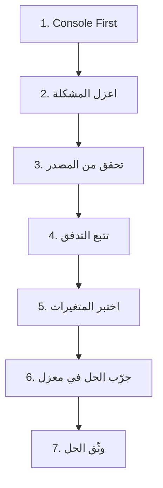

# 06 - منهجية موحدة لتتبع وحل المشاكل (Troubleshooting)

**آخر تحديث: 17 مايو 2026**

---

## مقدمة

في رحلة تطوير روبيك كير، واجهنا العديد من المشاكل التقنية. من مشاكل الترجمة في `ExternalLogin` إلى مشاكل الأداء في الصفحات المترجمة، تعلمنا أن **المشكلة الحقيقية ليست في الخطأ نفسه، بل في كيفية تتبعه وحله**.

هذا المرجع يقدم **منهجية موحدة من 7 خطوات** يمكن تطبيقها على **أي مشكلة** في المشروع.

---

## 🎯 فلسفة حل المشاكل: "Console First"

### المبدأ الأساسي

```
قبل أن تغير أي كود، قبل أن تضيف أي سطر، قبل أن تفكر في الحل:
                ⭐ افتح Console المتصفح (F12) ⭐
```

**لماذا؟**
- 90% من المشاكل تظهر أخطاءها في Console
- الـ Network Tab يظهر كل طلبات API
- الـ Elements Tab يظهر بنية HTML الفعلية

---

## 📋 الخطوات السبع الذهبية لتتبع المشاكل



---

### الخطوة 1: Console First - ابدأ هنا دائماً

```javascript
// في أي صفحة تواجه مشكلة، ابدأ بهذه الأوامر في Console

// 1. هل هناك أخطاء حمراء؟
// انظر إلى Console مباشرة - أي خطأ أحمر هو دليل مباشر

// 2. هل الدوال المطلوبة موجودة؟
console.log('toggleLanguageSimple:', typeof window.toggleLanguageSimple);
console.log('loginLocalization:', typeof window.loginLocalization);
console.log('updateTranslations:', typeof window.loginLocalization?.updateTranslations);

// 3. هل البيانات المطلوبة موجودة؟
console.log('__initialTranslations:', window.__initialTranslations);
console.log('__currentLang:', window.__currentLang);

// 4. تحقق من Network Tab
// انتقل إلى Network tab -> XHR -> شاهد الطلبات والاستجابات
```

**نتيجة متوقعة:**
```
toggleLanguageSimple: function
loginLocalization: object
updateTranslations: function
__initialTranslations: {Success: "نجاح", Email: "البريد الإلكتروني", ...}
__currentLang: "ar"
```

---

### الخطوة 2: اعزل المشكلة - هل هي في Server أم Client؟

#### اختبار API مباشرة

```javascript
// بدلاً من افتراض أن المشكلة في HTML، اختبر API مباشرة

// لصفحات الترجمة
fetch('/api/localization/page/LOGIN?lang=en')
    .then(r => r.json())
    .then(d => console.log('LOGIN API response:', d));

fetch('/api/localization/page/COMMON?lang=en')  
    .then(r => r.json())
    .then(d => console.log('COMMON API response:', d));

// للبيانات العادية
fetch('/api/medications?page=1&pageSize=10')
    .then(r => r.json())
    .then(d => console.log('Data API response:', d));
```

**التحقق:**
- ✅ إذا عادت البيانات بشكل صحيح ← المشكلة في Client (HTML/JavaScript)
- ❌ إذا فشلت أو عادت بيانات خاطئة ← المشكلة في Server (API/قاعدة البيانات)

---

### الخطوة 3: تحقق من البيانات في المصدر (قاعدة البيانات)

إذا تأكدت أن المشكلة في Server، انتقل إلى قاعدة البيانات:

```sql
-- 1. هل البيانات موجودة أصلاً؟
SELECT ResourceKey, ResourceValueAr, ResourceValueEn, Module, IsActive
FROM Resources
WHERE ResourceKey IN ('COMMON.SUCCESS', 'LOGIN.TITLE', 'EXTERNAL_LOGIN.VerifiedVia');

-- 2. هل هناك مشكلة في التشفير (???)
-- إذا رأيت ???? فهذا يعني أنك نسيت N' prefix

-- 3. هل المفتاح حساس لحالة الأحرف؟
SELECT * FROM Resources 
WHERE LOWER(ResourceKey) = LOWER('COMMON.SUCCESS');

-- 4. هل البيانات نشطة (IsActive = 1)؟
SELECT * FROM Resources WHERE IsActive = 0;
```

---

### الخطوة 4: تتبع التدفق - أضف logs في كل خطوة

#### في الـ Server (C#)

```csharp
// في خدمة الترجمة
public async Task<Dictionary<string, string>> GetPageTranslationsAsync(string pageDomain, string language)
{
    Console.WriteLine($"📥 GetPageTranslationsAsync called for {pageDomain} in {language}");
    
    var cacheKey = $"page_{language}_{pageDomain}";
    if (_cache.TryGetValue(cacheKey, out Dictionary<string, string> cached))
    {
        Console.WriteLine($"✅ Found in cache: {cached.Count} items");
        return cached;
    }
    
    Console.WriteLine("🔄 Not in cache, loading from database...");
    
    var result = await _dbFactory.ExecuteWithNewContextAsync(async context =>
    {
        var resources = await context.Resources
            .Where(r => r.ResourceKey.StartsWith(pageDomain) && r.IsActive)
            .ToListAsync();
            
        Console.WriteLine($"📊 Database returned {resources.Count} records");
        
        // ... باقي الكود
    });
    
    Console.WriteLine($"📤 Returning {result.Count} translations");
    return result;
}
```

#### في الـ Client (JavaScript)

```javascript
// في login-localization.js
const loginLocalization = {
    updateTranslations: async function (lang) {
        console.log(`🔄 Starting translation update to ${lang}...`);
        console.time('translation-update');
        
        try {
            console.log(`🌐 Fetching from APIs...`);
            const [loginRes, commonRes, externalRes] = await Promise.all([
                fetch(`/api/localization/page/LOGIN?lang=${lang}`),
                fetch(`/api/localization/page/COMMON?lang=${lang}`),
                fetch(`/api/localization/page/EXTERNAL_LOGIN?lang=${lang}`)
            ]);
            
            console.log(`📡 API responses:`, {
                login: loginRes.status,
                common: commonRes.status, 
                external: externalRes.status
            });
            
            // ... باقي الكود
            
            console.timeEnd('translation-update');
            console.log(`✅ Translation update completed`);
            
        } catch (err) {
            console.error('❌ Translation update failed:', err);
        }
    }
};
```

---

### الخطوة 5: اختبر المتغيرات المشتركة (localStorage, Cookies, HTML attributes)

```javascript
// في Console

// 1. localStorage
console.log('🔄 localStorage contents:');
console.log('- Language:', localStorage.getItem('RubikCare:Language'));
console.log('- Direction:', localStorage.getItem('RubikCare:Direction'));
console.log('- Menu Mode:', localStorage.getItem('RubikCare:MenuMode'));

// 2. Cookies
console.log('🍪 Cookies:', document.cookie);

// 3. HTML attributes
console.log('📄 HTML attributes:');
console.log('- lang:', document.documentElement.lang);
console.log('- dir:', document.documentElement.dir);

// 4. Body classes
console.log('🎨 Body classes:', document.body.className);
```

**مصفوفة الحلول السريعة:**

| المشكلة | الحل |
|----------|------|
| localStorage به قيمة خاطئة | `localStorage.removeItem('RubikCare:Language')` |
| Cookies قديمة | `document.cookie = "lang=; expires=Thu, 01 Jan 1970 00:00:00 UTC; path=/;"` |
| HTML dir خاطئ | `document.documentElement.dir = 'rtl'` |
| Body classes زائدة | `document.body.className = ''` |

---

### الخطوة 6: جرّب الحل في معزل (Isolate and Test)

#### لصفحات الترجمة

```javascript
// جرّب تحديث الترجمة يدوياً في Console
await window.loginLocalization.updateTranslations('en');

// إذا نجحت، جرّب العربية
await window.loginLocalization.updateTranslations('ar');

// إذا نجحت، المشكلة في زر اللغة أو ربط الأحداث
```

#### للاستعلامات البطيئة

```sql
-- جرّب الاستعلام مباشرة في SSMS
SELECT TOP 10 * FROM Medications WITH (NOLOCK) WHERE MedicationNameAr LIKE N'%test%';

-- لاحظ وقت التنفيذ في الأسفل
-- إذا كان بطيئاً، أضف فهرساً
```

#### للمكونات

```razor
@* أنشئ صفحة تجريبية بسيطة بنفس المكون *@
@page "/test/dropdown"

<RubikDropdown Items="@testItems" 
               @bind-SelectedItem="selectedItem"
               ShowSearch="true" />

@code {
    private List<string> testItems = new() { "خيار 1", "خيار 2", "خيار 3" };
    private string selectedItem;
}
```

---

### الخطوة 7: وثّق الحل (Document the Fix)

بعد أن تجد الحل، **لا تتركه يضيع**. وثّقه فوراً:

```markdown
## 📝 سجل المشاكل والحلول

### المشكلة: [تاريخ] [وصف مختصر]

**الخطأ:** [ما الذي كان يحدث؟]

**التشخيص:** [كيف تتبعت المشكلة؟ ما هي الخطوات التي اتبعتها؟]

**السبب الجذري:** [لماذا حدثت المشكلة؟]

**الحل:** [كيف حُلّت؟ كود محدد، إعدادات، تعديل في قاعدة البيانات]

**الأوامر المستخدمة في التشخيص:** [Console commands, SQL queries]

**الملفات المتأثرة:** [أسماء الملفات التي تم تعديلها]

**الدروس المستفادة:** [كيف نمنع حدوثها مستقبلاً؟]
```

#### مثال حقيقي من تجربة ExternalLogin

```markdown
## 📝 سجل المشاكل والحلول

### المشكلة: 21 فبراير 2026 - ترجمة صفحة ExternalLogin

**الخطأ:** عند الضغط على زر تغيير اللغة، بعض النصوص لا تترجم، و"Success" تبقى إنجليزية.

**التشخيص:**
1. فتحت Console → وجدت خطأ: `Uncaught SyntaxError: Invalid or unexpected token`
2. الخطأ كان في السطر `window.__initialTranslations = @JsonSerializer.Serialize(_translations);`
3. تحققت من Network Tab → طلبات API تذهب لـ LOGIN فقط، ليس لـ COMMON أو EXTERNAL_LOGIN
4. بحثت في `login-localization.js` → وجدت نسختين متعارفتين من `loginLocalization`

**السبب الجذري:**
1. `const loginLocalization` عُرّف مرتين في نفس الملف
2. الـ API كان يجلب domain واحد فقط (LOGIN) بدلاً من الثلاثة
3. مشكلة Case Sensitivity: COMMON.SUCCESS في DB، "Success" في `data-translate`

**الحل:**
1. دمج النسختين في `login-localization.js` في نسخة واحدة
2. تعديل `updateTranslations` لجلب الثلاث domains دفعة واحدة
3. إضافة بحث case-insensitive في JavaScript
4. استخدام `JavaScriptEncoder.UnsafeRelaxedJsonEscaping` لحل SyntaxError

**الأوامر المستخدمة في التشخيص:**
```javascript
typeof window.loginLocalization
fetch('/api/localization/page/COMMON?lang=en').then(r => r.json()).then(console.log)
localStorage.clear()
document.cookie = "lang=; expires=Thu, 01 Jan 1970 00:00:00 UTC; path=/;"
```

**الملفات المتأثرة:**
- `Pages/Account/ExternalLogin.cshtml`
- `wwwroot/Assets/js/login-localization.js`

**الدروس المستفادة:**
1. دائماً ابدأ بـ Console logs
2. اختبر الـ API مباشرة قبل افتراض المشكلة في HTML
3. استخدم `JavaScriptEncoder.UnsafeRelaxedJsonEscaping` لحقن JSON في JavaScript
4. أضف بحث case-insensitive للمفاتيح
```

---

## 📊 نموذج تتبع المشاكل (جاهز للنسخ)

انسخ هذا النموذج في ملف `Problem-Log.md` وسجّل كل مشكلة تواجهك:

```markdown
## 🐛 [التاريخ] - [عنوان المشكلة]

### 🔍 الملخص
- **الصفحة/المكون:** 
- **الأعراض:** 
- **التأثير:** (عالي/متوسط/منخفض)

### 📋 خطوات التشخيص
1. [ ] Console logs:
2. [ ] Network Tab:
3. [ ] Database check:
4. [ ] Isolated test:

### 🎯 النتائج
- **Console:** 
- **Network:** 
- **Database:** 
- **Isolated test:** 

### 💡 الحل النهائي
```csharp
// الكود أو الإجراء الذي حل المشكلة
```

### ✅ التحقق
- [ ] المشكلة لم تعد تظهر
- [ ] الاختبار على المتصفحات المختلفة
- [ ] التوثيق مكتمل

### 📚 الدروس المستفادة
-
-
```

---

## 🚀 أمثلة تطبيق المنهجية على مشاكل حقيقية

### مثال 1: مشكلة الترجمة في صفحة ExternalLogin

| الخطوة | التطبيق |
|---------|---------|
| **1. Console First** | `Uncaught SyntaxError: Invalid or unexpected token` |
| **2. اعزل المشكلة** | `fetch('/api/localization/page/COMMON?lang=en')` ← يعود ببيانات صحيحة |
| **3. تحقق من المصدر** | `SELECT * FROM Resources WHERE ResourceKey LIKE '%SUCCESS%'` ← موجود |
| **4. تتبع التدفق** | أضف logs في `login-localization.js` ← وجدت نسختين متعارفتين |
| **5. اختبر المتغيرات** | `window.__initialTranslations` ← undefined بسبب SyntaxError |
| **6. جرّب الحل في معزل** | أنشئ صفحة HTML تجريبية بنفس الكود ← نفس المشكلة |
| **7. وثّق الحل** | سجلت الحل في سجل المشاكل |

### مثال 2: مشكلة الأداء في الصفحات المترجمة

| الخطوة | التطبيق |
|---------|---------|
| **1. Console First** | لا أخطاء، لكن Network Tab يظهر 30 طلب ترجمة |
| **2. اعزل المشكلة** | اختبر صفحة بدون ترجمة ← سريعة، مع ترجمة ← بطيئة |
| **3. تحقق من المصدر** | SQL Profiler يظهر 30 استعلام منفصل لكل `<LocalizedText>` |
| **4. تتبع التدفق** | أضف logs في `LocalizationService` ← كل استعلام يأخذ 50ms |
| **5. اختبر المتغيرات** | Cache فارغ في أول تحميل |
| **6. جرّب الحل في معزل** | نفذ استعلام واحد يجلب 30 سجلاً ← 50ms بدلاً من 1500ms |
| **7. وثّق الحل** | سجلت الحل: استخدام `GetPageTranslationsAsync` بدلاً من الاستعلامات المنفردة |

---

## ⚠️ تحذيرات ومحاذير

### 🔴 ممنوعات مطلقة أثناء حل المشاكل

1. **لا تغير الكود عشوائياً** - كل تغيير يجب أن يكون مبنيًا على تشخيص
2. **لا تحذف ملفات الـ Migration** - استخدم `Add-Migration` جديد
3. **لا تعدل قاعدة البيانات مباشرة** - استخدم Code-First
4. **لا تهمل Console** - 90% من المشاكل تظهر هناك أولاً

### 🟡 ممارسات سيئة

| الممارسة السيئة | لماذا؟ | الأفضل |
|------------------|--------|--------|
| "أظن أن المشكلة في كذا" | بدون دليل | اختبر الفرضية أولاً |
| تغيير 10 أسطر دفعة واحدة | لا تعرف أي سطر حل المشكلة | غيّر سطراً واحداً واختبر |
| إضافة `!important` عشوائياً | يسبب مشاكل توريث لاحقاً | ابحث عن السبب الحقيقي |
| تجاهل Cache المتصفح | قد تحل المشكلة وحدها | `Ctrl+Shift+R` للتحديث الكامل |

---

## 📚 أدوات التشخيص الموصى بها

| الأداة | الاستخدام | اختصار |
|--------|-----------|--------|
| **Console (F12)** | الأخطاء، logs، اختبار الدوال | `F12` ← Console |
| **Network Tab** | مراقبة طلبات API، وقت الاستجابة | `F12` ← Network |
| **Elements Tab** | فحص بنية HTML، الـ CSS المطبق | `F12` ← Elements |
| **Application Tab** | localStorage، cookies، session | `F12` ← Application |
| **SQL Server Profiler** | تتبع استعلامات قاعدة البيانات | أدوات SQL Server |
| **Postman** | اختبار APIs بمعزل عن التطبيق | تطبيق منفصل |

---

## ✅ CHECKLIST: عند مواجهة أي مشكلة

- [ ] **الخطوة 1:** فتح Console (F12) ← هل هناك أخطاء حمراء؟
- [ ] **الخطوة 2:** Network Tab ← هل الطلبات تذهب للأماكن الصحيحة؟
- [ ] **الخطوة 3:** Application Tab ← هل localStorage و cookies صحيحة؟
- [ ] **الخطوة 4:** اختبر API مباشرة (fetch في Console)
- [ ] **الخطوة 5:** أضف logs في الكود (Server و Client)
- [ ] **الخطوة 6:** اختبر في صفحة معزولة (isolated)
- [ ] **الخطوة 7:** ابحث عن المشكلة في سجل المشاكل السابقة
- [ ] **الخطوة 8:** جرّب `Ctrl+Shift+R` (تحديث كامل مع مسح cache)
- [ ] **الخطوة 9:** إذا وجدت الحل، وثّقه فوراً

---

## 🔗 روابط ذات صلة

- [05 - إنشاء الصفحات والمكونات](05-page-creation-checklist.md)
- [07 - نظام برامج دعم المرضى](07-psp-system.md)
- [Problem Log](../problem-log.md)
```

## ⭐ مشكلة: JavaProxyThrowable عند زر الرجوع للخلف (Android)

تاريخ الحل: 25 مايو 2026

### الأعراض
- ضغط زر الرجوع في Android يغلق التطبيق بدلاً من الرجوع للصفحة السابقة
- عند إعادة فتح التطبيق بعد الإغلاق يظهر الخطأ:
  ```
  Android.Runtime.JavaProxyThrowable
  Method not found: void Microsoft.Maui.LifecycleEvents.LifecycleEventService.RemoveEvent
  ```

### التشخيص
الخطأ `Method not found` يشير إلى أن حزمة `Microsoft.AspNetCore.Components.WebView.Maui` تحاول استدعاء دالة `RemoveEvent` في `LifecycleEventService` غير موجودة في إصدار `Microsoft.Maui.Controls` المثبت.

السبب: تعارض إصدارات حزم MAUI:
```
Microsoft.Maui.Controls                           10.0.20
Microsoft.AspNetCore.Components.WebView.Maui      10.0.51  ← إصدار مختلف
```

### الحل

**الخطوة 1**: توحيد إصدار `WebView.Maui` مع `Microsoft.Maui.Controls` في ملف `.csproj`:

```xml
<PackageReference Include="Microsoft.Maui.Controls" Version="10.0.20" />
<PackageReference Include="Microsoft.AspNetCore.Components.WebView.Maui" Version="10.0.20" />
```

**الخطوة 2**: إضافة معالج لزر الرجوع في `AppShell.xaml.cs`:

```csharp
protected override bool OnBackButtonPressed()
{
    var currentPage = Current.CurrentPage;
    if (currentPage == null) return false;

    // إذا كان هناك صفحات في المكدس، ارجع للصفحة السابقة
    if (currentPage.Navigation.NavigationStack.Count > 1)
    {
        MainThread.BeginInvokeOnMainThread(async () =>
        {
            await currentPage.Navigation.PopAsync();
        });
        return true;
    }

    // إذا كان في وضع مهني، ارجع للوضع الشخصي
    if (_viewModel.CurrentMode != AppMode.Personal)
    {
        _viewModel.SwitchToPersonalModeCommand.Execute(null);
        return true;
    }

    return true;
}
```

### القاعدة الذهبية

> `Microsoft.AspNetCore.Components.WebView.Maui` يجب أن يكون **دائماً** على نفس إصدار `Microsoft.Maui.Controls`. عند تحديث أي منهما، تأكد من تحديث الآخر لنفس الإصدار.

### الوقاية

- راجع ملف `.csproj` عند كل تحديث للحزم
- تأكد من تطابق إصدارات جميع حزم MAUI في المشروع

---
### ⭐ مشكلة: Ambiguous Routes (تضارب المسارات) في MAUI Shell

**تاريخ الحل:** 26 مايو 2026
**الخطأ:** `System.ArgumentException: Ambiguous routes matched for: //.../pageName matches found: ...`
**الأعراض:** يحدث هذا الخطأ غالبًا مع `JavaProxyThrowable` عند محاولة العودة إلى صفحة سابقة. قد يؤدي إلى تعطل التطبيق.

**التشخيص:**
1.  **ابحث عن التسجيل المزدوج:** افحص `AppShell.xaml` و `AppShell.xaml.cs`. إذا وجدت نفس الصفحة مسجلة في كليهما، فهذا هو السبب.
2.  **تتبع مسار الخطأ:** اقرأ رسالة الخطأ كاملة. المسار الذي يظهر (`//.../pageName`) يمكن أن يدلك على الصفحة التي تسبب المشكلة.

**السبب الجذري:** تسجيل نفس الصفحة (Route) في كل من `ShellContent` داخل `AppShell.xaml` و `Routing.RegisterRoute` في `AppShell.xaml.cs`.

**الحل:** اعتماد هيكلة صارمة للملاحة:
*   **القاعدة:** الصفحات الرئيسية (Root) تسجل في `AppShell.xaml` فقط. كل ما عداها يسجل في `AppShell.xaml.cs`.
*   **التطبيق:** راجع [دليل تطوير MAUI - القسم 7](10-maui-development-guide.md#7--مشكلة-نظام-الملاحة-navigation---الحل-النهائي-تم-حلها---26-مايو-2026) لمعرفة التطبيق الكامل لهذه القاعدة.

**الوقاية:** عند إضافة أي صفحة جديدة، اسأل نفسك: "هل هي صفحة رئيسية (Root)؟" إذا كانت الإجابة لا، سجلها في `AppShell.xaml.cs` فقط ولا تستخدم `//` للتنقل إليها.


الحمد لله! 🎉

### توثيق خطأ `jumpToEnd` وأخطاء `///` المرتبطة

أقترح توثيق هذه المشكلة في **وثيقة `06-troubleshooting-methodology.md`** الموجودة بالفعل، لأنها منهجية تتبع وحل مشاكل. أضف قسماً جديداً بعد قسم `Ambiguous Routes` الحالي.

---

### 📝 المحتوى المقترح إضافته للوثيقة

```markdown
### ⭐ مشكلة: No view found for id 0x7f0800ff (jumpToEnd) - انهيار Fragment

**تاريخ الحل:** 29 مايو 2026 / 6 يونيو 2026

**الأعراض:**
- يظهر الخطأ بعد Splash Screen مباشرة ويتوقف التطبيق
- لا يتم تحميل أي صفحة
- يحدث فجأة بعد تعديلات في ملفات XAML أو حذف كود معلق

**الخطأ:**
```
Java.Lang.IllegalArgumentException: No view found for id 0x7f0800ff 
(Rubikcare.com:id/jumpToEnd) for fragment 
NavigationRootManager_ElementBasedFragment
```

**الأسباب المحتملة (مرتبة حسب الأولوية):**

| # | السبب | مثال |
|---|-------|------|
| 1 | استخدام `///` مع صفحة رئيسية | `GoToAsync("///ClinicDashboardPage")` |
| 2 | استخدام مسار نسبي مع صفحة رئيسية | `GoToAsync("MainDashboard")` بدل `//MainDashboard` |
| 3 | حذف كود XAML معلق دون تنظيف عميق | ترك `xmlns` references مكسورة |
| 4 | تسجيل صفحة رئيسية في `AppShell.xaml.cs` | `Routing.RegisterRoute("MainDashboard", ...)` |

**التشخيص:**
1. **افحص `AppShellViewModel.cs`** - ابحث عن أي `GoToAsync` يستخدم `///`
2. **افحص `AppShell.xaml`** - تأكد أن الصفحات الرئيسية فقط هي المسجلة (6 صفحات)
3. **افحص `AppShell.xaml.cs`** - تأكد أن لا توجد صفحة رئيسية مسجلة هنا

**الحل:**
1. **القاعدة الذهبية:** الصفحات الرئيسية تستدعى بـ `//Route` فقط، لا `///` ولا نسبي
2. **بعد أي تعديل هيكلي:** تنظيف عميق
   ```bash
   rmdir /s /q bin
   rmdir /s /q obj
   # احذف التطبيق من الهاتف
   dotnet restore
   dotnet build -f net10.0-android -c Debug -t:Install
   ```

**الفرق بين `//` و `///`:**

| الرمز | المعنى | يستخدم مع | التأثير |
|-------|--------|-----------|---------|
| `//Route` | Absolute - يستبدل الصفحة الحالية | الصفحات الرئيسية | ✅ صحيح |
| `///Route` | Absolute - يمسح كل المكدس | لا شيء حالياً | ❌ يسبب `jumpToEnd` |
| `Route` | Relative - يضيف للمكدس | الصفحات الفرعية | ✅ صحيح |
| `..` | رجوع للخلف | أي صفحة | ✅ صحيح |

**الوقاية:**
- لا تستخدم `///` أبداً في المشروع
- الصفحات الرئيسية = `//Route`
- الصفحات الفرعية = `Route`
- بعد حذف أي كود XAML معلق = تنظيف عميق
```
