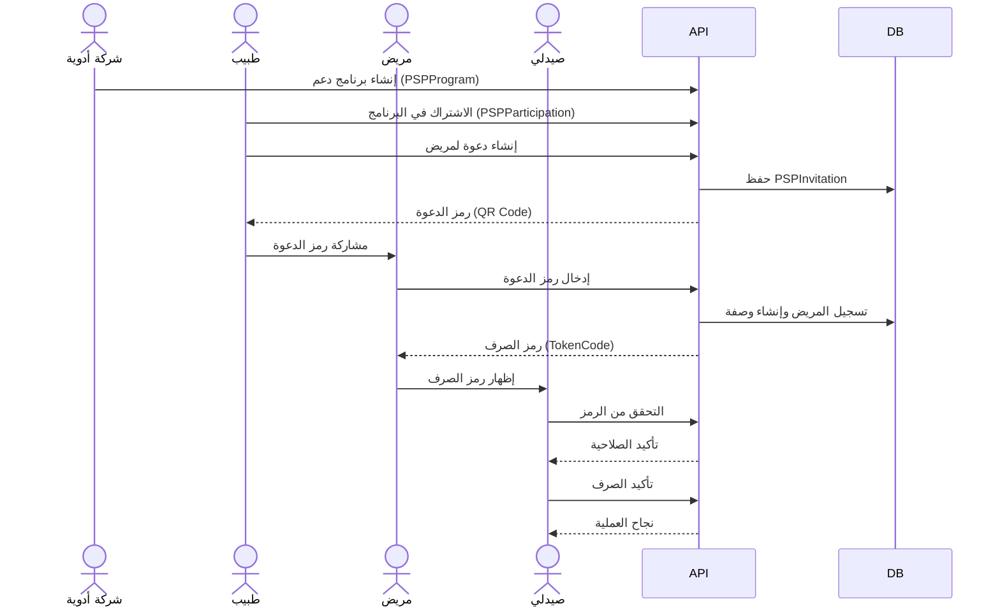
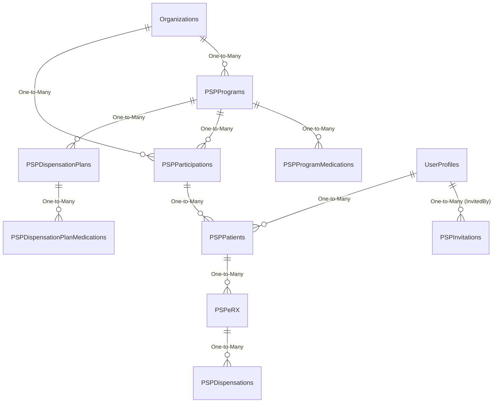

# 07 - نظام برامج دعم المرضى (Patient Support Programs - PSP)

**آخر تحديث: 17 مايو 2026**

---

## مقدمة

نظام PSP في RubikCare هو **قلب المنصة**، حيث يتفاعل فيه:
- **شركات الأدوية** (تنشئ برامج الدعم)
- **الأطباء** (يشتركون في البرامج ويدعون المرضى)
- **المرضى** (يستفيدون من الدعم ويصرفون الأدوية)
- **الصيادلة** (يؤكدون الصرف ويسجلون العمليات)

هذا المرجع يوثق **كل شيء** عن نظام PSP.

---

## الدورة الكاملة



---

## جداول قاعدة البيانات (هيكل PSP الكامل)

### مخطط العلاقات



### PSPPrograms (برامج الدعم)

| العمود | النوع | الوصف |
|--------|-------|-------|
| ProgramID | INT PK | المفتاح الأساسي |
| ProgramNameAr | NVARCHAR(200) | اسم البرنامج بالعربية |
| ProgramNameEn | NVARCHAR(200) | اسم البرنامج بالإنجليزية |
| ProgramCode | NVARCHAR(50) | رمز البرنامج (مثل INF، ANF، HCP) |
| DescriptionAr | NVARCHAR(MAX) | وصف البرنامج بالعربية |
| DescriptionEn | NVARCHAR(MAX) | وصف البرنامج بالإنجليزية |
| CompanyID | INT FK | الشركة المالكة (Organizations) |
| MaxDiscountPercentage | DECIMAL(18,2) | أقصى نسبة خصم |
| IsActive | BIT | هل البرنامج نشط؟ |
| StartDate | DATETIME2 | تاريخ بدء البرنامج |
| EndDate | DATETIME2 | تاريخ انتهاء البرنامج |
| CreatedDate | DATETIME2 | تاريخ الإنشاء |

### PSPProgramMedications (أدوية البرامج)

| العمود | النوع | الوصف |
|--------|-------|-------|
| ProgramMedicationID | INT PK | المفتاح الأساسي |
| ProgramID | INT FK | معرف البرنامج |
| MedicationID | INT FK | معرف الدواء |
| DefaultQuantity | INT | الكمية الافتراضية |
| DefaultDaysSupply | INT | عدد الأيام الافتراضي |
| DiscountPercentage | DECIMAL(18,2) | نسبة الخصم |
| IsActive | BIT | نشط؟ |

### PSPParticipations (مشاركة العيادات في البرامج)

| العمود | النوع | الوصف |
|--------|-------|-------|
| ParticipationID | INT PK | المفتاح الأساسي |
| ProgramID | INT FK | معرف البرنامج |
| OrganizationID | INT FK | معرف العيادة/المؤسسة |
| UserProfileID | INT FK | معرف الطبيب المشترك |
| Status | NVARCHAR(20) | ACTIVE, INACTIVE, PENDING |
| EnrollmentDate | DATETIME2 | تاريخ الاشتراك |
| EndDate | DATETIME2 | تاريخ انتهاء الاشتراك |
| IsActive | BIT | نشط؟ |

### PSPInvitations (الدعوات) - ⭐ القلب

| العمود | النوع | الوصف |
|--------|-------|-------|
| InvitationID | INT PK | المفتاح الأساسي |
| ProgramID | INT FK | معرف البرنامج |
| InvitedByUserID | INT FK | معرف الطبيب الداعي |
| InvitedOrganizationID | INT FK | معرف العيادة الداعية |
| ReferralUserID | INT FK | معرف المندوب المحيل (اختياري) |
| Status | NVARCHAR(20) | PENDING, ACCEPTED, EXPIRED, USED |
| InvitationToken | NVARCHAR(50) | رمز الدعوة الفريد (مثل INV-5CWEFHEJ) |
| SourceType | NVARCHAR(20) | QR, SMS, EMAIL, DIRECT, REP_TO_DOCTOR |
| InvitationMessage | NVARCHAR(500) | نص الدعوة |
| InvitationDate | DATETIME2 | تاريخ الإرسال |
| ResponseDate | DATETIME2 | تاريخ الرد |
| ExpiryDate | DATETIME2 | تاريخ انتهاء الصلاحية |
| UsedByUserID | INT FK | المريض الذي استخدم الدعوة |
| UsedDate | DATETIME2 | تاريخ الاستخدام |
| ResultingParticipationID | INT FK | رابط إلى PSPPatients بعد القبول |
| IsActive | BIT | نشط؟ |

### PSPPatients (المرضى المسجلين)

| العمود | النوع | الوصف |
|--------|-------|-------|
| PatientID | INT PK | المفتاح الأساسي |
| ParticipationID | INT FK | مشاركة العيادة في البرنامج |
| PatientProfileID | INT FK | معرف المريض (UserProfile) |
| InvitedByUserID | INT FK | الطبيب الداعي |
| InvitedByOrganizationID | INT FK | العيادة الداعية |
| EnrollmentDate | DATETIME2 | تاريخ التسجيل |
| Status | NVARCHAR(20) | ACTIVE, INACTIVE, COMPLETED |
| IsActive | BIT | نشط؟ |

### PSPeRX (الوصفات الإلكترونية)

| العمود | النوع | الوصف |
|--------|-------|-------|
| ERxID | INT PK | المفتاح الأساسي |
| PatientID | INT FK | معرف المريض |
| DoctorID | INT FK | معرف الطبيب |
| ProgramID | INT FK | معرف البرنامج |
| ProgramMedicationID | INT FK | معرف الدواء في البرنامج |
| QuantityPerDispense | INT | الكمية لكل صرف |
| TotalDispensesAllowed | INT | إجمالي عدد مرات الصرف |
| DispensesRemaining | INT | عدد مرات الصرف المتبقية |
| Status | NVARCHAR(20) | ACTIVE, COMPLETED, EXPIRED |
| PrescriptionDate | DATETIME2 | تاريخ الوصفة |
| ExpiryDate | DATETIME2 | تاريخ انتهاء الوصفة |

### PSPDispensationPlans (خطط الصرف)

| العمود | النوع | الوصف |
|--------|-------|-------|
| PlanID | INT PK | المفتاح الأساسي |
| ProgramID | INT FK | معرف البرنامج |
| PlanNameAr | NVARCHAR(200) | اسم الخطة بالعربية |
| PlanNameEn | NVARCHAR(200) | اسم الخطة بالإنجليزية |
| TotalDurationDays | INT | المدة الإجمالية بالأيام |
| IsActive | BIT | نشط؟ |

### PSPDispensationPlanMedications (تفاصيل الأدوية في خطة الصرف)

| العمود | النوع | الوصف |
|--------|-------|-------|
| PlanMedicationID | INT PK | المفتاح الأساسي |
| PlanID | INT FK | معرف خطة الصرف |
| ProgramMedicationID | INT FK | معرف الدواء في البرنامج |
| NumberOfTokens | INT | عدد رموز الصرف |
| DaysBetweenDispense | INT | عدد الأيام بين كل صرف |
| QuantityPerDispense | INT | الكمية لكل صرف |
| DiscountPercentage | DECIMAL(18,2) | نسبة الخصم |
| IsActive | BIT | نشط؟ |

### PSPDispensations (رموز الصرف) - ⭐ نقطة التقاء المريض والصيدلي

| العمود | النوع | الوصف |
|--------|-------|-------|
| DispensationID | INT PK | المفتاح الأساسي |
| ERxID | INT FK | معرف الوصفة |
| TokenCode | NVARCHAR(50) | رمز الصرف (مثل RC-20260323-XXXX) |
| TokenType | NVARCHAR(20) | INITIAL, RENEWAL |
| TokenStatus | NVARCHAR(20) | ACTIVE, USED, EXPIRED |
| TokenExpiryDate | DATETIME2 | تاريخ انتهاء صلاحية الرمز |
| TokenUsed | BIT | هل تم استخدامه؟ |
| TokenUsedBy | NVARCHAR(50) | من استخدمه (معرف الصيدلي) |
| TokenUsedDate | DATETIME2 | تاريخ الاستخدام |
| PharmacyID | INT FK | الصيدلية التي صرفت الدواء |
| DispensedQuantity | INT | الكمية التي تم صرفها |
| CreatedDate | DATETIME2 | تاريخ إنشاء الرمز |

---

## APIs الخاصة بنظام PSP

### create-invitation (إنشاء دعوة)

**Endpoint:** `POST /api/psp/create-invitation`

**Request:**
```json
{
    "programId": 2,
    "clinicId": 1245
}
```

**Response:**
```json
{
    "success": true,
    "invitationId": 12,
    "invitationToken": "INV-5CWEFHEJ",
    "message": "تم إنشاء الدعوة بنجاح"
}
```

**المنطق:**
1. التحقق من أن الطبيب مشترك في البرنامج
2. توليد رمز فريد (INV-XXXXXX)
3. إنشاء سجل في `PSPInvitations` (Status = PENDING)
4. إرجاع الرمز للطبيب

---
## 🟡 دعوات المندوب (REP Invitations)

### أنواع الدعوات

| SourceType | المعنى |
|------------|--------|
| `REP_TO_DOCTOR` | مندوب يدعو عيادة (طبيب) |
| `REP_TO_PHARMACY` | مندوب يدعو صيدلية |

### تدفق دعوة المندوب

1. المندوب يختار برنامج دعم
2. ينشئ دعوة (PENDING) عبر `POST api/rep/invitations/create`
3. الطبيب/الصيدلي يستقبل الكود
4. بعد إنشاء الحساب والمؤسسة، يستخدم الكود في `POST api/psp/entry`
5. يتم إنشاء `PSPParticipation` وربطها بالدعوة عبر `InvitationID`
6. تحديث الدعوة إلى `ACCEPTED` أو `USED`

### العلاقة بين الجداول

PSPInvitations (الدعوة)
    ├── InvitedByUserID → المندوب
    ├── InvitedOrganizationID → العيادة/الصيدلية المدعوة
    └── ResultingParticipation → PSPParticipations

PSPParticipations (المشاركة)
    ├── ParticipantOrganizationID → العيادة/الصيدلية المشاركة
    └── InvitationID → رابط عكسي إلى PSPInvitations
    
### entry (نقطة دخول المريض)

**Endpoint:** `POST /api/psp/entry`

**Request:**
```json
{
    "invitationCode": "INV-5CWEFHEJ"
}
```

**Response (حالات مختلفة):**

**حالة 1: مستخدم ليس لديه برامج نشطة ويدخل كود صالح**
```json
{
    "status": "NEW_ENROLLMENT",
    "message": "تم الاشتراك بنجاح في البرنامج",
    "newProgram": {
        "programId": 2,
        "programName": "Infertility Support Program",
        "tokenCode": "RC-20260323-1234",
        "tokenExpiryDate": "2026-04-22T...",
        "patientId": 7,
        "eRxId": 5
    }
}
```

**حالة 2: مستخدم لديه برامج نشطة**
```json
{
    "status": "ACTIVE_PROGRAMS",
    "message": "لديك برنامج نشط",
    "activePrograms": [...]
}
```

**حالة 3: مستخدم مسجل بالفعل في هذا البرنامج**
```json
{
    "status": "ALREADY_ENROLLED",
    "message": "أنت مسجل بالفعل في هذا البرنامج"
}
```

**حالة 4: كود غير صالح**
```json
{
    "status": "CODE_INVALID",
    "message": "كود الدعوة غير صالح أو منتهي الصلاحية"
}
```

**حالة 5: كود منتهي الصلاحية**
```json
{
    "status": "CODE_EXPIRED",
    "message": "انتهت صلاحية كود الدعوة"
}
```

---

### patient-details (تفاصيل برنامج المريض)

**Endpoint:** `GET /api/psp/patient-details?patientId={patientId}`

**Response:**
```json
{
    "programId": 2,
    "programName": "Infertility Support Program",
    "programDescription": "برنامج دعم لمرضى العقم...",
    "tokenCode": "RC-20260323-1234",
    "tokenExpiryDate": "2026-04-22T00:00:00",
    "medications": [
        {
            "medicationName": "Oxy Free",
            "quantity": 20,
            "instructions": "مرتين يومياً"
        }
    ],
    "dispensesRemaining": 3,
    "totalDispenses": 4
}
```

---

### validate-token (التحقق من صحة رمز الصرف - للصيدلي)

**Endpoint:** `POST /api/dispense/validate-token`

**Request:**
```json
{
    "tokenCode": "RC-20260323-1234"
}
```

**Response (حالة صالحة):**
```json
{
    "isValid": true,
    "tokenStatus": "ACTIVE",
    "patientName": "أحمد محمد",
    "programName": "Infertility Support Program",
    "medicationName": "Oxy Free",
    "quantity": 20,
    "expiryDate": "2026-04-22T00:00:00",
    "dispensationId": 42
}
```

**Response (حالة غير صالحة):**
```json
{
    "isValid": false,
    "message": "الرمز غير صالح أو منتهي الصلاحية"
}
```

---

### confirm-dispense (تأكيد صرف الدواء)

**Endpoint:** `POST /api/dispense/confirm`

**Request:**
```json
{
    "dispensationId": 42,
    "pharmacyId": 1260
}
```

**Response:**
```json
{
    "success": true,
    "message": "تم صرف الدواء بنجاح",
    "dispensedQuantity": 20,
    "remainingDispenses": 2
}
```

---

## التدفق في تطبيق الموبايل

### صفحات الطبيب

| الصفحة | المسار | الوظائف |
|--------|--------|---------|
| `InvitePatientPage` | `Mobile/Features/PSP/Doctor/Views/` | عرض رمز الدعوة، QR Code، مشاركة عبر واتساب |

### صفحات المريض

| الصفحة | المسار | الوظائف |
|--------|--------|---------|
| `PspEntryPage` | `Mobile/Features/PSP/Patient/Views/` | إدخال كود الدعوة، مسح QR، عرض البرامج النشطة |
| `PspDetailPage` | `Mobile/Features/PSP/Patient/Views/` | عرض رمز الصرف، تاريخ الانتهاء، شريط التقدم |

### صفحات الصيدلي

| الصفحة | المسار | الوظائف |
|--------|--------|---------|
| `ScanTokenPage` | `Mobile/Features/Pharmacist/Views/` | مسح QR Code، إدخال رمز يدوياً |
| `VerifyTokenPage` | `Mobile/Features/Pharmacist/Views/` | عرض بيانات المريض، تأكيد الصرف |

---

## ملخص حالات الـ API (entry)

| الحالة | الكود | الرسالة |
|--------|-------|---------|
| مستخدم جديد، كود صالح | `NEW_ENROLLMENT` | تم الاشتراك بنجاح |
| مستخدم لديه برنامج نشط | `ACTIVE_PROGRAMS` | لديك برنامج نشط |
| مستخدم مسجل مسبقاً | `ALREADY_ENROLLED` | أنت مسجل بالفعل |
| كود غير صالح | `CODE_INVALID` | كود الدعوة غير صالح |
| كود منتهي الصلاحية | `CODE_EXPIRED` | انتهت صلاحية الكود |
| لم يدخل كوداً | `NO_CODE` | الرجاء إدخال الكود |

---

## 🔗 روابط ذات صلة

- [00 - الهيكل المعماري](00-architecture-overview.md)
- [02 - نظام الهوية والمصادقة](02-identity-system.md)
- [09 - دليل API](09-api-guide.md)
- [10 - دليل تطوير MAUI](10-maui-development-guide.md)
```
