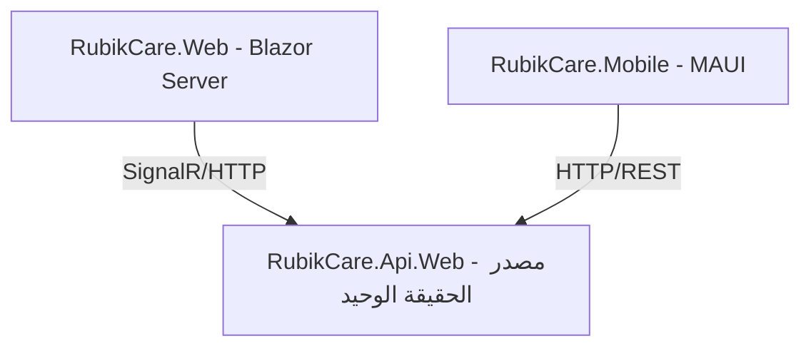
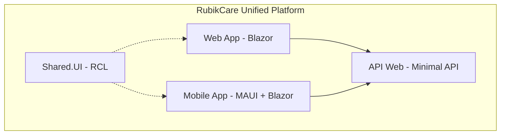

# 08 - خريطة التطوير والوضع الحالي (Roadmap)

**آخر تحديث: 17 مايو 2026**

---

## مقدمة

هذا المرجع يقدم **صورة واضحة** عن:
- ما تم إنجازه فعلياً
- **القرارات المعمارية الكبرى** (Blazor Hybrid، توحيد API)
- **الرؤية المستقبلية** لمنصة RubikCare
- الأولويات والخطة الزمنية

---

## القرارات المعمارية الكبرى

### القرار 1: اعتماد Blazor Hybrid في الموبايل

**التاريخ:** أبريل 2026

**السبب:**
- تجنب مشاكل XAML المتكررة (Binding، InvalidCastException، UI Thread)
- تسريع التطوير (HTML/CSS بدلاً من XAML)
- مشاركة المكونات بين Web و Mobile

**التنفيذ:**
- الصفحات الجديدة تكتب بـ Blazor (Razor Components)
- الصفحات المستقرة حالياً تبقى XAML
- الكاميرا والمسح تبقى XAML (لأداء أفضل)

**الحالة:** ⚠️ **قيد الدراسة والتخطيط**

---

### القرار 2: توحيد API لخدمة Web و Mobile معاً

**التاريخ:** مارس 2026

**المبدأ:**



**الفوائد:**
- ✅ لا تكرار في منطق الأعمال
- ✅ تحديث واحد ينفع المنصتين
- ✅ تجربة مستخدم متسقة
- ✅ سهولة الصيانة والتطوير

**الحالة:** ✅ **تم التنفيذ**

---

### القرار 3: التماثل والتماسك بين Web و Mobile

**الرؤية:**

```
┌─────────────────────────────────────────────────────────────────┐
│                    تجربة مستخدم موحدة (Unified UX)               │
├─────────────────────────────────────────────────────────────────┤
│                                                                  │
│   📱 Mobile                    💻 Web                           │
│   ┌─────────────┐              ┌─────────────┐                  │
│   │ نفس الشاشات │◄────────────►│ نفس الشاشات │                  │
│   │ نفس البيانات│              │ نفس البيانات│                  │
│   │ نفس التدفق  │              │ نفس التدفق  │                  │
│   └─────────────┘              └─────────────┘                  │
│                                                                  │
│   ⭐ الفرق الوحيد: التفاعل مع العتاد (كاميرا، مسح، إشعارات)     │
└─────────────────────────────────────────────────────────────────┘
```

**الحالة:** 🏗️ **قيد التنفيذ التدريجي**

---

## الوضع الحالي للإنجازات

### 📱 الموبايل (MAUI)

| الشاشة/الميزة | الحالة | ملاحظة |
|---------------|--------|--------|
| تسجيل مستخدم جديد | ✅ مكتمل | |
| تسجيل الدخول | ✅ مكتمل | |
| اختيار الدور المهني (ProRolePage) | ✅ مكتمل | |
| إنشاء عيادة (ClinicSetupPage) | ⚠️ **لا تعمل** | تحتاج إصلاح |
| البحث عن برامج الدعم (PspSearchPage) | ✅ مكتمل | |
| تفاصيل البرنامج (ProgramDetailsPage) | ✅ مكتمل | |
| إرسال دعوة لمريض (InvitePatientPage) | ✅ مكتمل | مع QR Code |
| استقبال المريض للدعوة (PspEntryPage) | ✅ مكتمل | |
| عرض تفاصيل البرنامج للمريض (PspDetailPage) | ✅ مكتمل | مع رمز الصرف |
| إنشاء صيدلية (PharmacyProfilePage) | ✅ مكتمل | |
| استقبال رمز الصرف (ScanTokenPage) | ✅ مكتمل | |
| التحقق من الرمز وتأكيد الصرف (VerifyTokenPage) | ✅ مكتمل | |

### 🌐 الويب (Blazor Server)

| المجال | الميزة/الصفحة | الحالة |
|--------|---------------|--------|
| **🏗️ البنية التحتية** | 7 مشاريع Clean Architecture | ✅ |
| | GenericService مع autoInclude | ✅ |
| | DbContextFactoryService | ✅ |
| | UserContextService | ✅ |
| | نظام الترجمة (Localization) | ✅ |
| | نظام القوائم الديناميكية | ✅ |
| | JWT Authentication | ✅ |
| **🔐 المصادقة** | Login, Register, Google Login | ✅ |
| | Forgot/Reset Password | ✅ |
| | إدارة الأدوار والصلاحيات | ✅ |
| **👤 الملف الشخصي** | عرض وتعديل الملف الشخصي | ✅ |
| | تغيير كلمة المرور | ✅ |
| **🏢 المنظمات** | إنشاء وتعديل المنظمات | ✅ |
| | إدارة العضويات (OrgMemberships) | ✅ |
| **💊 نظام PSP** | إدارة برامج الدعم (للشركة) | ✅ |
| | إنشاء دعوات المرضى (للطبيب) | ✅ |
| | استقبال الدعوات (للمريض) | ✅ |
| | تأكيد الصرف (للصيدلي) | ✅ |
| **📊 التقارير** | تقارير برامج الدعم والصرف | ✅ |
| | تصدير إلى Excel | ✅ |
| **🎨 المكونات** | RubikSmartTable, RubikDropdown | ✅ |
| | GenericModal, DataOperationsModal | ✅ |
| | SearchBar, Pagination, AlertMessage | ✅ |

### 🔌 الـ API

| الـ API | الطريقة | الحالة |
|--------|--------|--------|
| `/api/auth/login` | POST | ✅ |
| `/api/auth/register` | POST | ✅ |
| `/api/user/profile` | GET/PUT | ✅ |
| `/api/psp/programs` | GET | ✅ |
| `/api/psp/create-invitation` | POST | ✅ |
| `/api/psp/entry` | POST | ✅ |
| `/api/psp/patient-details` | GET | ✅ |
| `/api/dispense/validate-token` | POST | ✅ |
| `/api/dispense/confirm` | POST | ✅ |
| `/api/pharmacy/register` | POST | ✅ |

---

## المشاكل الحالية التي تحتاج حل

| المشكلة | الوصف | الأولوية |
|---------|-------|----------|
| **ClinicSetupPage** | حفظ العيادة لا يعمل في الموبايل | 🔴 عالية |
| **توثيق APIs في Swagger** | بعض الـ APIs غير موثقة | 🟡 متوسطة |

---

## الرؤية المستقبلية: التماثل بين Web و Mobile

### الهدف النهائي



### خريطة الطريق للتماثل

| المرحلة | الوصف | الجدول الزمني |
|---------|-------|---------------|
| **المرحلة 1** | Web و Mobile يستخدمان نفس API | ✅ منجزة |
| **المرحلة 2** | إنشاء RCL للمكونات المشتركة | 🏗️ قيد التخطيط |
| **المرحلة 3** | تحويل صفحات الموبايل إلى Blazor Hybrid | 📅 قادم |
| **المرحلة 4** | توحيد تجربة المستخدم | 📅 قادم |
| **المرحلة 5** | إطلاق المنصة الموحدة | 📅 مستقبلاً |

---

## مؤشرات النجاح

| المؤشر | القياس الحالي | الهدف |
|--------|---------------|-------|
| نسبة إعادة استخدام الكود بين Web و Mobile | ~30% | >70% |
| وقت تطوير صفحة جديدة (موبايل) | 4-6 ساعات | 2-3 ساعات |
| عدد الأخطاء في Binding | عالي | منخفض جداً |
| رضا المطور عن تجربة التطوير | متوسط | عالي |

---

## 🔗 روابط ذات صلة

- [00 - الهيكل المعماري](00-architecture-overview.md)
- [07 - نظام PSP](07-psp-system.md)
- [09 - دليل API](09-api-guide.md)
- [11 - دليل BlazorWebView](11-blazor-webview-guide.md)
```

---

