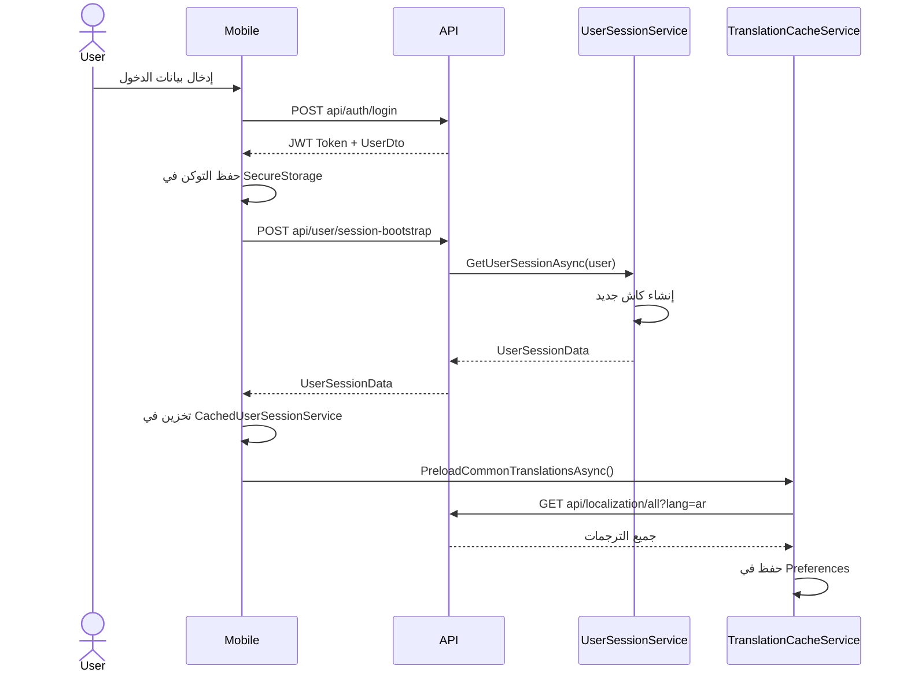
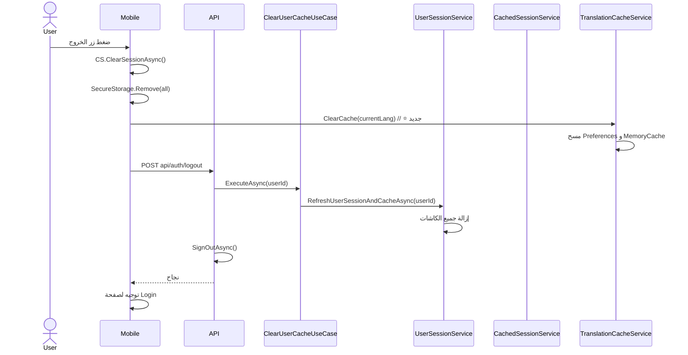

# 14 - نظام الكاش الموحد (Unified Caching System)

**تاريخ الإنشاء: 24 مايو 2026** | **آخر تحديث: 14 يونيو 2026** | **الأولوية: 🟢 نظام تأسيسي**

---

## 📌 مقدمة

تم تصميم نظام الكاش الموحد لحل مشاكل **تضارب البيانات** و **ظهور معلومات المستخدم السابق** التي كانت تحدث بسبب تعدد مصادر الكاش في النظام. هذا المرجع يوثق الهيكل الجديد، القواعد، وطريقة الاستخدام.

---

## 🎯 فلسفة النظام: "مصدر واحد للكاش"

### المبدأ الأساسي

```
قبل الإصلاح (❌):
UserSessionService ← كاش 1
DynamicMenuService ← كاش 2
CachedUserSessionService ← كاش 3 (الموبايل)
SecureStorage ← تخزين 4
MobileTranslationService ← Preferences (تخزين 5) ← لم يكن موثقاً!

بعد الإصلاح (✅):
UserSessionService ← الكاش الوحيد (الخادم)
CachedUserSessionService ← كاش محلي (الموبايل، يعتمد على UserSessionService)
SecureStorage ← تخزين التوكن فقط
MobileTranslationService + TranslationCacheService ← يدير Preferences للترجمات
```

---

## 🏗️ هيكل الكاش الموحد

### طبقات الكاش

```mermaid
graph TD
    A[ClearUserCacheUseCase] --> B[UserSessionService]
    B --> C[UserSession_{userId}]
    B --> D[UserPrefs_{userId}]
    B --> E[UserBasic_{userId}]
    
    F[AuthService.LogoutAsync] --> G[SecureStorage]
    F --> H[CachedUserSessionService]
    F --> I[POST api/auth/logout]
    I --> A
    
    J[TranslationCacheService] --> K[Preferences: translations_all_ar]
    J --> L[Preferences: translations_all_en]
    J --> M[MemoryCache: all_translations_{lang}]
```

### جدول الطبقات (محدث)

| الطبقة | المسؤول | الموقع | المفاتيح | المدة |
|--------|---------|--------|----------|-------|
| **الجلسة** | `UserSessionService` | الخادم | `UserSession_{userId}` | ساعتين |
| **التفضيلات** | `UserSessionService` | الخادم | `UserPrefs_{userId}` | ساعة |
| **المعلومات الأساسية** | `UserSessionService` | الخادم | `UserBasic_{userId}` | ساعة |
| **الكاش المحلي** | `CachedUserSessionService` | الموبايل | `_cachedSession` | ساعتين |
| **التخزين الآمن** | `SecureStorage` | الموبايل | `auth_token`, `userProfileId` | دائم |
| **ترجمات الموبايل (⭐ جديد)** | `TranslationCacheService` | الموبايل | `translations_all_{lang}` | دائم (حتى Logout) |

---

## 📁 الملفات الرئيسية

| الملف | المسار | الوظيفة |
|-------|--------|---------|
| `UserSessionService.cs` | `RubikCare.Application/Services/Session/` | الكاش المركزي الوحيد |
| `ClearUserCacheUseCase.cs` | `RubikCare.Application/UseCases/User/` | Use Case لمسح الكاش |
| `InfrastructureExtensions.cs` | `RubikCare.Infrastructure/` | ⭐ تسجيل جميع الخدمات |
| `CachedUserSessionService.cs` | `RubikCare.Mobile/Infrastructure/Services/` | كاش محلي للموبايل |
| `AuthService.cs` | `RubikCare.Mobile/Infrastructure/Services/` | المصادقة وLogout |
| `AuthController.cs` | `Api.Web/Controllers/` | Logout API |
| `DynamicMenuService.cs` | `Rubikcare.Web/Data/Services/Navigation/` | قوائم (بدون كاش) |
| `MobileTranslationService.cs` (⭐ جديد) | `RubikCare.Mobile/Services/` | إدارة ترجمات الموبايل |
| `TranslationCacheService.cs` (⭐ جديد) | `RubikCare.Mobile/Services/` | تخزين الترجمات في Preferences |

---

## 🔄 تدفق العمليات

### تسجيل الدخول



### تسجيل الخروج (Logout) (⭐ محدث)



---

## 📝 القواعد الإلزامية

### 🔴 ممنوعات

1. **لا تستخدم `IMemoryCache` مباشرة في أي مكان غير `UserSessionService`**
2. **لا تنشئ كاش منفصل في `DynamicMenuService` أو أي خدمة Web**
3. **لا تمسح كاش الخادم من الموبايل مباشرة - استخدم `api/auth/logout`**
4. **لا تترك `_cachedSession` بدون مسح عند Logout**
5. **⭐ لا تترك `Preferences` للترجمات بدون مسح عند Logout** (مشكلة تسرب بيانات)

### 🟢 أنماط إلزامية

| الإجراء | الطريقة الصحيحة |
|---------|-----------------|
| **مسح الكاش عند Logout** | `ClearUserCacheUseCase.ExecuteAsync(userId)` |
| **مسح الكاش المحلي** | `_cachedSessionService.ClearSessionAsync()` |
| **مسح التخزين** | `SecureStorage.RemoveAll()` |
| **⭐ مسح كاش الترجمة** | `_translationCacheService.ClearCache(currentLang)` |
| **تحديث الجلسة** | `UserSessionService.RefreshUserSessionAsync(userId)` |
| **⭐ تحميل الترجمات مسبقاً** | `await _translationService.PreloadCommonTranslationsAsync()` |

---

## 🧪 استعلامات التحقق

### التحقق من الكاش على الخادم

لا توجد استعلامات مباشرة للـ In-Memory Cache، لكن يمكن مراقبة السلوك:

```csharp
// في أي Controller، أضف هذا للتحقق:
var session = await _userSessionService.GetUserSessionAsync(User);
Debug.WriteLine($"Session UserId: {session.UserId}, ProfileId: {session.UserProfileId}");
```

### التحقق من الكاش المحلي في الموبايل

```csharp
// في AppShellViewModel:
var cached = _cachedSessionService.GetCachedSession();
Debug.WriteLine($"Cached Session: {cached?.FullNameAr ?? "null"}");
```

### التحقق من كاش الترجمة (⭐ جديد)

```csharp
// في أي صفحة Blazor:
var cacheService = new TranslationCacheService(new MemoryCache(new MemoryCacheOptions()));
var cached = await cacheService.GetCachedAsync("ar");
Debug.WriteLine($"Cached translations: {cached?.Count ?? 0}");
```

---

## ⚠️ أخطاء شائعة وحلولها

| المشكلة | السبب | الحل |
|---------|-------|------|
| بيانات المستخدم السابق تظهر بعد Logout | الكاش لم يُمسح | تأكد من استدعاء `ClearUserCacheUseCase` في `AuthController.Logout` |
| منظمات المستخدم لا تظهر في الموبايل | `AppShellViewModel` لم يُستدعَ | أضف `appShell.RefreshUserDataAsync()` في `DashboardPage.OnAppearing` |
| كارت "تسجيل دور مهني" يظهر لمستخدم مسجل | `HasClinic`/`HasPharmacy` خاطئة | استخدم `Memberships` مع `OrganizationTypeInfo.TypeId` |
| الكاش لا يمسح عند Logout في الموبايل | `AuthService.LogoutAsync` لا يستدعي API | أضف `await _apiService.PostAsync<object>("api/auth/logout", null)` |
| **⭐ ظهور مفاتيح ترجمة بدلاً من النصوص** | `Preferences` لم يتم تحميلها مسبقاً | استدعِ `PreloadCommonTranslationsAsync()` عند بدء التطبيق |
| **⭐ تغيير اللغة لا يؤثر على الصفحة الحالية** | نسيان `InvokeAsync(StateHasChanged)` | أضف `await InvokeAsync(StateHasChanged);` في `HandleLanguageChanged` |
| **⭐ تسرب ذاكرة في صفحات Blazor** | نسيان `Dispose()` | أضف `TranslationState.OnLanguageChanged -= HandleLanguageChanged;` |

---

## 🟠 المشاكل المعروفة في نظام الكاش (⭐ جديد)

### 9.1 ترجمات الموبايل لا تظهر في أول فتح للتطبيق

**السبب:** `GetPageTranslationsAsync` يبحث في `Preferences` ولكنها فارغة.

**الحل:** استدعاء `PreloadCommonTranslationsAsync()` عند بدء التطبيق أو في `AppShell`:

```csharp
// في MauiProgram.cs أو AppShell.xaml.cs
var translationService = services.GetRequiredService<IMobileTranslationService>();
await translationService.PreloadCommonTranslationsAsync();
```

### 9.2 بعد Logout، تبقى الترجمات القديمة في Preferences

**السبب:** لم يتم مسح `Preferences` للترجمات.

**الحل:** أضف هذا السطر في `AuthService.LogoutAsync`:

```csharp
var cacheService = IPlatformApplication.Current?.Services?.GetRequiredService<TranslationCacheService>();
cacheService?.ClearAllCache();
```

### 9.3 `@onclick` مع دالة تأخذ معامل لا يعمل

**السبب:** تداخل علامات التنصيص المزدوجة.

**الحل:** استخدم علامات التنصيص المفردة:

```razor
<button @onclick='() => MyFunction("value")'>نص</button>
```

---

## 📋 CHECKLIST: عند التعامل مع الكاش (⭐ محدث)

- [ ] هل `UserSessionService` هو المصدر الوحيد للكاش على الخادم؟
- [ ] هل `ClearUserCacheUseCase` يُستدعى عند Logout؟
- [ ] هل `CachedUserSessionService.ClearSessionAsync()` يُستدعى في الموبايل؟
- [ ] هل `SecureStorage` يُمسح بالكامل عند Logout؟
- [ ] هل `DynamicMenuService` خالية من `IMemoryCache`؟
- [ ] هل الكاش المحلي يُمسح قبل تحميل بيانات مستخدم جديد؟
- [ ] **⭐ هل `TranslationCacheService.ClearCache()` يُستدعى عند Logout؟**
- [ ] **⭐ هل `PreloadCommonTranslationsAsync()` يُستدعى عند بدء التطبيق؟**
- [ ] **⭐ هل صفحات Blazor تنفذ `IDisposable` وتلغي الاشتراك؟**
- [ ] **⭐ هل `InvokeAsync(StateHasChanged)` موجود في `HandleLanguageChanged`؟**

---

## 🔗 روابط ذات صلة

- [02 - نظام الهوية والمصادقة](02-identity-system.md)
- [04 - نظام القوائم الديناميكية](04-dynamic-menus.md)
- [10 - دليل تطوير MAUI](10-maui-development-guide.md)
- [13 - إصلاح Clean Architecture](13-clean-architecture-enforcement.md)
- [15 - نظام ترجمة الموبايل (⭐ جديد)](15-mobile-translation-system.md)

---

**آخر تحديث:** 14 يونيو 2026
**الملف:** `14-caching-system.md`
```

---

## ✅ **ملخص التحديثات على هذه الوثيقة:**

| القسم | التغيير |
|-------|---------|
| المبدأ الأساسي | إضافة `MobileTranslationService` و `TranslationCacheService` |
| طبقات الكاش | إضافة صف الترجمة |
| مخطط التدفق | إضافة `PreloadCommonTranslationsAsync` و `ClearCache` |
| الممنوعات | إضافة #5: مسح Preferences للترجمات |
| الأنماط الإلزامية | إضافة سطرين لمسح كاش الترجمة وتحميله مسبقاً |
| أخطاء شائعة | إضافة 3 أخطاء جديدة متعلقة بالترجمة |
| المشاكل المعروفة | قسم جديد (9.1, 9.2, 9.3) |
| CHECKLIST | إضافة 4 بنود جديدة |
| روابط ذات صلة | إضافة رابط إلى `15-mobile-translation-system.md` |
| تاريخ التحديث | تغيير إلى 14 يونيو 2026 |

