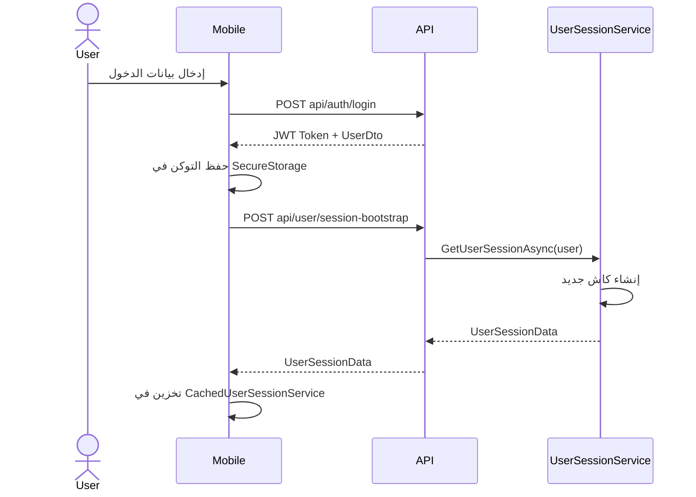
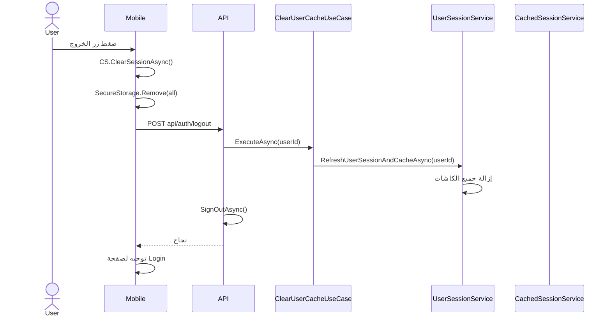

# 14 - نظام الكاش الموحد (Unified Caching System)

**تاريخ الإنشاء: 24 مايو 2026** | **آخر تحديث: 25 مايو 2026** | **الأولوية: 🟢 نظام تأسيسي**

---

## 📌 مقدمة

تم تصميم نظام الكاش الموحد لحل مشاكل **تضارب البيانات** و **ظهور معلومات المستخدم السابق** التي كانت تحدث بسبب تعدد مصادر الكاش في النظام. هذا المرجع يوثق الهيكل الجديد، القواعد، وطريقة الاستخدام.

---

## 🎯 فلسفة النظام: "مصدر واحد للكاش"

### المبدأ الأساسي

```
قبل الإصلاح (❌):
UserSessionService ← كاش 1
DynamicMenuService ← كاش 2
CachedUserSessionService ← كاش 3 (الموبايل)
SecureStorage ← تخزين 4

بعد الإصلاح (✅):
UserSessionService ← الكاش الوحيد (الخادم)
CachedUserSessionService ← كاش محلي (الموبايل، يعتمد على UserSessionService)
SecureStorage ← تخزين التوكن فقط
```

---

## 🏗️ هيكل الكاش الموحد

### طبقات الكاش

```mermaid
graph TD
    A[ClearUserCacheUseCase] --> B[UserSessionService]
    B --> C[UserSession_{userId}]
    B --> D[UserPrefs_{userId}]
    B --> E[UserBasic_{userId}]
    
    F[AuthService.LogoutAsync] --> G[SecureStorage]
    F --> H[CachedUserSessionService]
    F --> I[POST api/auth/logout]
    I --> A
```

### جدول الطبقات

| الطبقة | المسؤول | الموقع | المفاتيح | المدة |
|--------|---------|--------|----------|-------|
| **الجلسة** | `UserSessionService` | الخادم | `UserSession_{userId}` | ساعتين |
| **التفضيلات** | `UserSessionService` | الخادم | `UserPrefs_{userId}` | ساعة |
| **المعلومات الأساسية** | `UserSessionService` | الخادم | `UserBasic_{userId}` | ساعة |
| **الكاش المحلي** | `CachedUserSessionService` | الموبايل | `_cachedSession` | ساعتين |
| **التخزين الآمن** | `SecureStorage` | الموبايل | `auth_token`, `userProfileId` | دائم |

---

## 📁 الملفات الرئيسية

| الملف | المسار | الوظيفة |
|-------|--------|---------|
| `UserSessionService.cs` | `RubikCare.Application/Services/Session/` | الكاش المركزي الوحيد |
| `ClearUserCacheUseCase.cs` | `RubikCare.Application/UseCases/User/` | Use Case لمسح الكاش |
| `InfrastructureExtensions.cs` | `RubikCare.Infrastructure/` | ⭐ تسجيل جميع الخدمات (بما فيها الكاش) |
| `CachedUserSessionService.cs` | `RubikCare.Mobile/Infrastructure/Services/` | كاش محلي للموبايل |
| `AuthService.cs` | `RubikCare.Mobile/Infrastructure/Services/` | المصادقة وLogout |
| `AuthController.cs` | `Api.Web/Controllers/` | Logout API |
| `DynamicMenuService.cs` | `Rubikcare.Web/Data/Services/Navigation/` | قوائم (بدون كاش) |

---

## 🔄 تدفق العمليات

### تسجيل الدخول



### تسجيل الخروج (Logout)



---

## 📝 القواعد الإلزامية

### 🔴 ممنوعات

1. **لا تستخدم `IMemoryCache` مباشرة في أي مكان غير `UserSessionService`**
2. **لا تنشئ كاش منفصل في `DynamicMenuService` أو أي خدمة Web**
3. **لا تمسح كاش الخادم من الموبايل مباشرة - استخدم `api/auth/logout`**
4. **لا تترك `_cachedSession` بدون مسح عند Logout**

### 🟢 أنماط إلزامية

| الإجراء | الطريقة الصحيحة |
|---------|-----------------|
| **مسح الكاش عند Logout** | `ClearUserCacheUseCase.ExecuteAsync(userId)` |
| **مسح الكاش المحلي** | `_cachedSessionService.ClearSessionAsync()` |
| **مسح التخزين** | `SecureStorage.Remove("auth_token")` |
| **تحديث الجلسة** | `UserSessionService.RefreshUserSessionAsync(userId)` |

---

## 🧪 استعلامات التحقق

### التحقق من الكاش على الخادم

لا توجد استعلامات مباشرة للـ In-Memory Cache، لكن يمكن مراقبة السلوك:

```csharp
// في أي Controller، أضف هذا للتحقق:
var session = await _userSessionService.GetUserSessionAsync(User);
Debug.WriteLine($"Session UserId: {session.UserId}, ProfileId: {session.UserProfileId}");
```

### التحقق من الكاش المحلي في الموبايل

```csharp
// في AppShellViewModel:
var cached = _cachedSessionService.GetCachedSession();
Debug.WriteLine($"Cached Session: {cached?.FullNameAr ?? "null"}");
```

---

## ⚠️ أخطاء شائعة وحلولها

| المشكلة | السبب | الحل |
|---------|-------|------|
| بيانات المستخدم السابق تظهر بعد Logout | الكاش لم يُمسح | تأكد من استدعاء `ClearUserCacheUseCase` في `AuthController.Logout` |
| منظمات المستخدم لا تظهر في الموبايل | `AppShellViewModel` لم يُستدعَ | أضف `appShell.RefreshUserDataAsync()` في `DashboardPage.OnAppearing` |
| كارت "تسجيل دور مهني" يظهر لمستخدم مسجل | `HasClinic`/`HasPharmacy` خاطئة | استخدم `Memberships` مع `OrganizationTypeInfo.TypeId` |
| الكاش لا يمسح عند Logout في الموبايل | `AuthService.LogoutAsync` لا يستدعي API | أضف `await _apiService.PostAsync<object>("api/auth/logout", null)` |

---

## 📋 CHECKLIST: عند التعامل مع الكاش

- [ ] هل `UserSessionService` هو المصدر الوحيد للكاش على الخادم؟
- [ ] هل `ClearUserCacheUseCase` يُستدعى عند Logout؟
- [ ] هل `CachedUserSessionService.ClearSessionAsync()` يُستدعى في الموبايل؟
- [ ] هل `SecureStorage` يُمسح بالكامل عند Logout؟
- [ ] هل `DynamicMenuService` خالية من `IMemoryCache`؟
- [ ] هل الكاش المحلي يُمسح قبل تحميل بيانات مستخدم جديد؟

---

## 🔗 روابط ذات صلة

- [02 - نظام الهوية والمصادقة](02-identity-system.md)
- [04 - نظام القوائم الديناميكية](04-dynamic-menus.md)
- [10 - دليل تطوير MAUI](10-maui-development-guide.md)
- [13 - إصلاح Clean Architecture](13-clean-architecture-enforcement.md)
```
